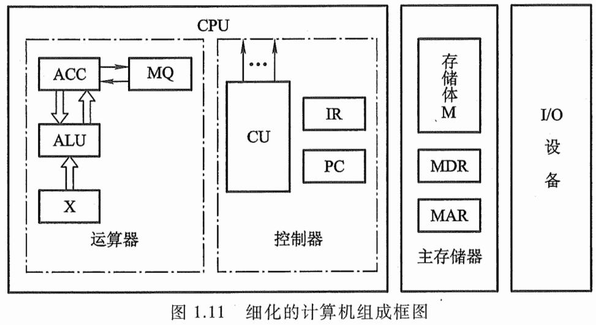
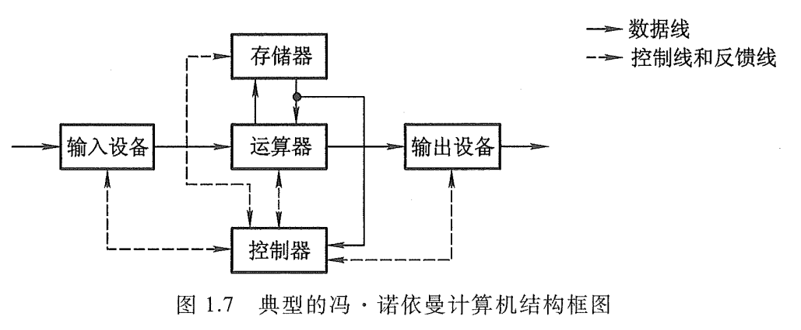
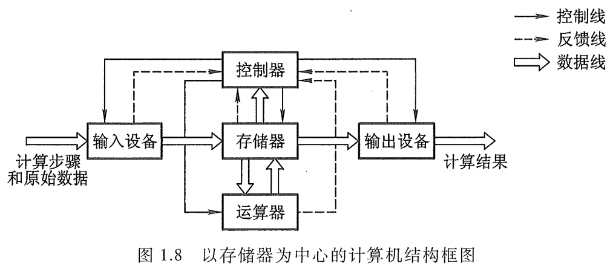

# 计算机组成原理
## 第一章 计算机系统概述
### 1.1 计算机发展历程
#### 1.1.1 计算机硬件发展
##### 发展变化
  - 第一代：电子管时代
    - 使用机器语言编程
    - 容量小，体积大，成本高，性能低
  - 第二代：晶体管时代
    - 速度提升
    - 软件使用高级语言
    - 形成操作系统雏形
  - 第三代：中小规模集成电路时代
    - 使用半导体存储器
    - 操作系统继续发展，出现分时操作系统
    - 高级语言开始发展
  - 第四代：超大规模继承电路时代
    - 微处理器的出现
    - 并行，流水线，高速缓存，虚拟存储器出现
##### 元件的更新变化
  - 摩尔定律：18 个月晶体管数量翻一倍
  - 半导体存储器不断地发展
  - 微处理器不断地发展
#### 1.1.2 计算机软件的发展
  - 面向机器
    - 机器语言
    - 汇编语言
  - 面向问题的高级语言
    - FORTRAN -> PASCAL -> C++ -> Java
#### 1.1.3 计算机的分类与发展方向
  - 电子计算机
    - 电子模拟计算机
    - 电子数字计算机
  - 数字计算机
    - 专用计算机
    - 通用计算机
    - *根据效率、速度、价格、运行的经济性与适应性划分*
  - 通用计算机
    - 巨型机
    - 大型机
    - 中型机
    - 小型机
    - 微型机
    - 单片机
    - *体积、功耗、性能、数据存储量、指令复杂度、价格 -> 依次递减*
  - 按指令和数据流分类
    - 单指令流和单数据流系统【SISD】
      - 传统冯诺依曼体系结构
    - 单指令流和多数据流系统【SIMD】
      - 阵列处理器和向量处理器系统
    - 多指令流和单数据流系统【MISD】
      - 不存在
    - 多指令流和多数据流系统【MIMD】
      - 多处理器和多计算机系统
    - *微型计算机：体积小 高性能 多用途*
    - *巨型机：更大 超高速 并行处理 更智能*
### 1.2 计算机系统结构
#### 1.2.1 计算机系统构成
  - 硬件
  - 软件
  - *硬件与软件在逻辑上是等效的*
  - 功能实现
      - 1 功能使用频繁
      - 2 硬件实现成本低
      - 综上使用硬件实现
      - 特点： 硬件实现效率要高于软件实现
  - 
#### 1.2.2 计算机硬件的基本组成
##### 早期 冯诺依曼机
  - 组成：运算器、**存储器**、控制器、输入设备和输出设备组成
  - 指令和数据以同等地位（二进制形式）存储在存储器中，并可按地址寻访，CPU通过寻址方式区分
  - 指令组成：操作码和地址码
    - 操作码代表操作
    - 地址吗表示操作数存储位置
  - 指令顺序存放，顺序执行（特定条件可改变执行顺序）
  - 以运算器为中心，I/O通过运算器和存储器传送数据
  - “存储程序”：将指令以二进制的形式事先输入计算机的主存储器，然后按其在存储器中的首地址执行程序的第一条指令，以后就按该程序的规定顺序执行其他指令，直至程序结束
  - 
##### 现代计算机结构
  - 以存储器为中心
  - I/O 操作尽可能绕开 CPU， 实现 I/O 设备存储器直接完成，从而提高运行效率
  - 
#### 1.2.3 计算机软件的分类
  - 以功能进行分类
    - 系统软件
      - OS、数据库管理系统【DBMS】、语言处理程序、分布式软件系统、网络软件系统、标准库程序、服务性程序
    - 应用软件
  - 语言分类
    - 机器语言（二进制代码语言）是计算机唯一可以直接识别和执行的语言
    - 汇编语言：利用英文单词代替二进制指令代码，方便记忆（必须经过汇编程序对其进行翻译）
    - 方便程序设计人员使用的语言
      - 高级语言 -> 汇编语言 -> 机器语言或者高级语言 -> 机器语言
    - *最后一定会变成机器语言，只有机器语言能够被识别和执行*
#### 1.2.4 计算机工作过程
  - 具体步骤
    - 程序、数据装入主存
    - 从程序的起始地址开始执行
    - 程序首地址取出指令 -> 指令译码、指令执行 -> 完成功能并计算下一条指令地址
    - 新得到的指令地址读出下一条指令，直至程序结束
  - 信息流程
    - 取指令
      - PC -> MAR -> M(存储器) -> MDR -> IR
    - 分析指令
      - OP(IR) -> CU
    - 执行指令
      - Ad(IR) -> MAR -> M -> MDR -> ACC
    - *此外，取完指令 `PC + 1` 自动形成下一条地址*
#### 1.2.5 计算机系统的多级层次结构
  - 虚拟机器（高级语言机器）
    - 用汇编程序翻译成汇编语言程序
  - 虚拟机器（汇编语言机器）
    - 汇编程序翻译成机器语言程序
  - 虚拟机器（操作系统机器）
    - 机器语言解释操作系统
  - 软硬件交互界面 --------------------------------
  - 传统机器（使用机器语言的机器）
    - 微程序解释机器指令
  - 微程序机器（微指令系统）
    - 硬件直接执行微指令
#### 各硬部件
  - 主存
    - 存储体
      - 存储元：存储二进制的电子元件，每个存储元存储 1 bit
      - 存储单元：每个存储单元存放一串二进制代码
      - 存储字（Word）：存储单元二进制代码的组合
      - 存储字长：存储单元二进制代码的位数
      - 地址：数据所在的位置
    - MAR
      - 地址寄存器，用于指明要读/写哪个存储单元，其位数反映存储单元数量
    - MDR
      - 数据寄存器，用于暂存要读/写的数据，其 `位数 = 存储字长`
  - 运算器
    - ACC
      - 累加计数器，存放操作数、运算的结果
    - MQ
      - 乘商寄存器，进行乘除法时用到
    - X
      - 通用寄存器，存放操作数
    - ALU
      - 算数逻辑单元，用电路实现各种算数运算、逻辑运算
  - 控制器
    - PC
      - 程序计数器，存放下一条指令的地址
    - IR
      - 指令寄存器，存放当前执行的指令
    - CU
      - 控制单元，分析指令，给出控制信号
  - 工作过程
    - 初始：指令、数据存入主存，PC指向第一条指令
    - 从主存中取指令放入 IR、PC 自动加1、CU 分析指令、CU 指挥其他部件执行指令
### 1.3 计算机性能指标
#### 1.3.1 计算机的主要性能指标
##### 机器字长
  - 计算机进行一次整数运算（即定点整数运算）所能处理的二进制数据的位数
    - 受到 CPU 寄存器位数，加法器影响
    - 机器字长一般等于内部寄存器的大小
    - 字长越长，数的表示范围越大，计算精度越高
    - *计算机字长一般为字节的整数倍，2/4/8 倍*
    - 指令字长（与机器字长对比）
      - 一个指令中包含的二进制代码的位数
    - 存储字长（与机器字长对比）
      - 一个存储单元存储的二进制代码的长度
##### 数据通路带宽
  - 数据总线一次所能并行传送信息的位数
  - *此处数据通路时指外部数据总线宽度，与 CPU 内部的数据总线宽度可能不同*
##### 主存容量
  - 主存储器能存储信息的最大容量，通常用字节(B)衡量

    - 字数×字长（例 512K×16位）
    - **MAR的位数反映存储单元个数，其反映可寻址范围的最大值**

      - MAR16位 表示有2^16=65536个存储单元 （称64K内存）
    MDR32位 则存储容量 64K×32位

    - n位地址 -> $2^n$个存储单元
    最大容量= $2^n×存储字长$
    - 总容量=存储单元个数×存储字长      bit单位
    总容量=存储单元个数×存储字长/8       Byte单位

  ##### 运算速度
  - 吞吐量
    - 系统单位时间内处理请求的数量
    - 取决于主存的存储周期
  - 响应时间
    - 用户向计算机发送一个请求，到系统做出相应并获得所需结果的等待时间
      - 通常包括CPU时间（允许一个程序所花时间）和等待时间（磁盘范围、存储器访问、I/O操作、操作系统开销等）
  - CPU 时钟周期
    - 通常为节拍脉冲或T周期，即主频的倒数
    - 是CPU中最小的时间单位，每个动作至少需要1个时钟周期

  - 主频（CPU时钟频率）
    - 机器内部主时钟的频率
      - **CPU时钟周期=1/主频**
    
    - 单位 Hz   1Hz表示每秒1次

  - CPI
    - 执行一条指令所需要的时钟周期数

  - CPU 执行时间
    - 运行一个程序所花费的时间
    - 影响因素
      - 主频
      - 每条指令的执行周期数
      - 指令条数
    - **CPU执行时间=CPU时钟周期数/主频=（指令条数 × CPI）/ 主频**

  - 计算能力
    - MIPS：每秒执行多少百万条指令
      - **MIPS=指令条数/（执行时间×10^6）=主频/CPI**

    - MFLOPS：每秒执行多少百万次浮点运算
      - MFLOPS=浮点操作次数/（执行时间×10^6）

    - GFLOPS：每秒执行多少十亿次浮点运算
      - GFLOPS=浮点操作次数/（执行时间×10^9）

    - TFLOPS：每秒执行多少万亿次运算
      - TFLOPS=浮点操作次数/（执行时间×10^12）
    - *浮点数的运算能力可以用来衡量用于科学计算的计算机的系统性能*
  - 常用数量单位
    - 1位（b）= 1比特（bit），1字 = 2字节，1字节 = 8位 = 8比特
    - 描述存储容量、文件大小时：$K = 2^{10}$ $M = 2^{20}$ $G = 2^{30}$ $T = 2^{40}$
    - 描述频率、速率时：$K = 10^{3} $ $M = 10^{6} $ $G = 10^{9}$ $T = 10^{12}$
#### 1.3.2 专业术语
  - 系列机
    - 相同的体系结构，使用基本指令系统的多个不同型号的计算机组成的一个产品系列
  - 兼容
    - 计算机软件与硬件的通用性
  - 软件可移植性
   - 某个系列的计算机中软件，直接或者进行很少的修改然后运行在另一个系列计算机的可能性
  - 固件
    - 将程序固定在 ROM 中的组成部分称为固件
      - 拥有软件特性的硬件，性能介于硬件与固件之间，是软硬结合产物
      - 速度快于软件，灵活性高于硬件
    - *后期类似这种结合产物还有  段位表*
## 第二章 数据表示和运算
### 2.1 数制和编码
#### 2.1.1 进制计数制及其相互转换
  - 基本概念
    - 常用种类：十进制、二进制、八进制、十六进制
    - 特点：逢 `X` 进一 （X 进制）
  - 种类特点
    - 二进制
      - 计算机使用最多  0、1组成
      - 任意数位的权值为 $2^i$，i 为从右起的位数（注意：i 是从零开始计数）
    - 八进制
      - 0 - 7 组成
      - 二进制的一种书写形式，二进制的 3 位数码编为一组就是八进制编码（3 位二进制最大为 7）
      - 任意数位的权值为 $8^i$，i 为从右起的位数（注意：i 是从零开始计数）
    - 十六进制
      - 0 - 9 A - F 组成； A - F 分别表示 10 - 15
      - 二进制的 4 组编码编为一组就是十六进制数码（4位二进制最大为 15）
  - 进制转换
    - 二进制转换为八进制/十六进制
      - 只需要将二进制的 3/4 位编为一组即可
    - 八进制与十六进制相互转换
      - 先转成二进制再转换
    - 任意进制转换为十进制
      - 任意进制数码与权值相乘，然后再将乘积相加
    - 十进制转换为任意进制
      - 整数部分：除基取余法
      - 小数部分：乘基取余法
        - 任意二进制小数都可以用十进制表示，但并不是每个十进制小数都能用二进制表示（如 0.3）
    - *注意补位：整数在高位补，小数在低位补*
#### 2.1.2 真值和机器数
  - 真值：符合人类习惯的数字
  - 机器数：数字在机器中的表示，常用最高位 0 表示正 1 代表负
#### 2.1.3 BCD码
  - 8421码（有权码）
    - 两个码相加之和 `<= 9`（10进制），不需要修正
    - 两个码相加之和 `>= 10`（10进制），加6（10进制）修正
  - 余3码（无权码）
    - 8421码基础上加3，因为每个数都多 3 ，因此称为余 3 码  8 -> 1011
  - 2421码
    - `>= 5` 的 4 位二进制数最高位位1，`< 5 `的最高位为 0  5 -> 1011
#### 2.1.4 字符与字符串
  - 字符串编码 ASCII 码：7 位二进制编码，实际存入计算机会在最高位补0，凑足1B
  - 汉字的表示和编码
    - 每个编码用两个字节表示
    - 种类
      - 输入编码
        - 计算机输入
      - 汉字内码
        - 计算机内部处理
      - 汉字字形码
        - 计算机输出
  - 字符串存放
    - 小端模式
      - 从低位字节向高位字节顺序存放
    - 大端模式
      - 从高位字节向低位字节顺序存放
   - 从低地址到高地址逐个字符存储，常使用 `\0` 作为结尾标志 
#### 2.1.5 校验码
  - 概念：能够发现或者自动纠错的数据编码
  - 原理：通过添加一些冗余码，实现检错或纠错编码
  - 分类
    - 奇偶校验码
    - 海明码
    - CRC （循环冗余码）

### 2.2 定点数的表示和运算
### 2.3 浮点数的表示和运算
### 2.4 算术逻辑单元（ALU）
## 第三章 存储系统
## 第四章 指令系统
## 第五章 中央处理器
## 第六章 总线
## 第七章 IO 系统