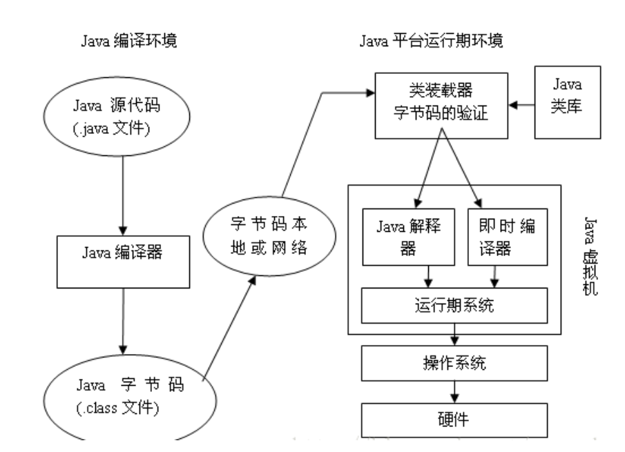

# Java 入门失败

## 1. Java 简介

### 1.1 Java 的特性

- 简单

- 面向对象

- 可移植性

- 分布式

- 安全性

- 多线程

- 健壮性

- 高性能

### 1.2 JVM、JRE、JDK

JVM： Java Virtual Machine **Java 虚拟机**

JRE： Java Runtime Environmen	**Java 运行时**

JDK： Java Development Kit **Java 开发工具包**

#### 1.2.1 JVM 的作用

Java虚拟机，是JRE的⼀部分。负责解释执行字节码⽂件，是可运⾏Java字节码(.class)文件的虚拟计算机

#### 1.2.2 JRE 的作用

Java运⾏环境，⽤于解释执⾏Java的字节码⽂件。

#### 1.2.3 JDK 的作用

Java标准开发包，它提供了编译、运⾏Java程序所需的各种⼯具和资源，包括Java编译器、Java运⾏时环境，以及常⽤的Java类库等。

#### 1.2.4 JVM JRE JDK 的关系

JDK 包含 JRE，JDK 和 JRE 中都包含 JVM。JDK不仅包含JRE还包含⼀些常⽤开发⼯具和基础类库

JDK ⽤于开发，JRE ⽤于运⾏Java程序

JVM 是 Java 编程语⾔的核⼼并且具有平台独立性。

简单而言，使用 JDK 开发程序，交给 JRE 去运行程序

### 1.2.3 Java 工作原理



编译器的作用：编译源代码，检查错误

### 1.2.4 Java 跨平台

- Java 虚拟机 JVM 屏蔽掉了不同平台的差异，为上层的字节码提供了一个统一的运行环境
- 虚拟机是为了给字节码提供统一的执行平台。每种操作系统所用的虚拟机是不同的，是为了统一 Java 字节码的解析执行方式，
- 如果没有虚拟机，在一种操作系统上写了 Java 代码，编译成字节码后只能在本操作系统上运行，但是换一个操作系统的话就要重新再写一遍 Java 代码然后重新编译，所以虚拟机提高了代码的复用性，实现了一次编写，多处使用的优点。

### 1.2.5 第一个 Java 程序

```java
public class Hello {
	public static void main(String[] args) {
		System.out.println("Hello World");
	}
}
```

## 2. Java 语法基础

### 2.1 Java 主类的结构

- Java是面向对象的语言，Java程序的基本组成单位是**类(class)**，所有的Java代码都需写在类中。类中代码包括两部分：**变量（或称为属性）和方法（函数）**
- 一个Java程序可以包含多个类，有无main方法均可
- 有main方法的类称为**主类**
- 一个 Java源文件 可以包含多个类，**但 public 的类只能一个，且类名必须与文件名一致**

### 2.2 标识符和关键字

#### 标识符

Java语言中用来给一个**类、变量**或**方法**命名的<u>符号</u>

#### 命名规则

1. 以字母，下划线"_"或者美元符号"$"开头

2. 可以包含字母、下划线"_"、美元符号"$"或数字字符

3. 大小写敏感

4. 不能与保留关键字冲突

5. 没有长度限制

#### 关键字

| 关键字 | 解释 |
| ------ | :--- |
| private|一种访问控制方式：私用模式|
| protected|一种访问控制方式：保护模式|
| public|一种访问控制方式：共用模式|
| abstract|表明类或者成员方法具有抽象属性|
| class|类|
| extends|表明一个类型是另一个类型的子类型，这里常见的类型有类和接口|
| final|用来说明最终属性，表明一个类不能派生出子类，或者成员方法不能被覆盖，或者成员域的值不能被改变|
| implements|表明一个类实现了给定的接口|
| interface|接口|
| native|用来声明一个方法是由与计算机相关的语言（如C/C++/FORTRAN语言）实现的|
| new|用来创建新实例对象|
| static|表明具有静态属性|
| strictfp|用来声明FP_strict（单精度或双精度浮点数）表达式遵循IEEE 754算术规范|
| synchronized|表明一段代码需要同步执行|
| transient|声明不用序列化的成员域|
| volatile|表明两个或者多个变量必须同步地发生变化|
| break|提前跳出一个块|
| continue|回到一个块的开始处|
| return|从成员方法中返回数据|
| do|用在do-while循环结构中|
| while|用在循环结构中 |
| if|条件语句的引导词|
| else|用在条件语句中，表明当条件不成立时的分支|
| for|一种循环结构的引导词|
| instanceof|用来测试一个对象是否是指定类型的实例对象|
| switch|分支语句结构的引导词|
| case|用在switch语句之中，表示其中的一个分支|
|default| 默认，例如，用在switch语句中，表明一个默认的分支|
| try|尝试一个可能抛出异常的程序块|
| catch|用在异常处理中，用来捕捉异常|
| throw|抛出一个异常|
| throws|声明在当前定义的成员方法中所有需要抛出的异常|
| import|表明要访问指定的类或包|
| package|包|
| boolean|基本数据类型之一，布尔类型|
| byte|基本数据类型之一，字节类型|
| char|基本数据类型之一，字符类型|
| double|基本数据类型之一，双精度浮点数类型|
| float|基本数据类型之一，单精度浮点数类型|
| int|基本数据类型之一，整数类型|
| long|基本数据类型之一，长整数类型|
| short|基本数据类型之一，短整数类型|
| super|表明当前对象的父类型的引用或者父类型的构造方法|
| this|指向当前实例对象的引用|
| void|声明当前成员方法没有返回值|
| goto|保留关键字，没有具体含义|
| const|保留关键字，没有具体含义|

#### 基本数据类型

| 符号 | 占用位数 | 占用字节 |
| ------ | :--- | ------ |
| boolean | 8        |1|
| char | 16       |2|
| byte | 8        |1|
| short | 16       | 2        |
| int | 32       |4|
| long | 64       |8|
| float | 32       |4|
| double | 64       |8|

1 字节 = 8 位

long类型：数据后加上L表示

float类型：数据后加上F表示

#### 自动类型转换

范围小的类型向范围大的类型提升，`byte、short、char`运算时会直接提升到`int`

```java
byte、short、char-->int-->long-->float-->double
```

#### 强制类型转换

将`取值范围大的类型`强制转换成`取值范围小的类型`

区别：自动转换由Java自动执行，而强制转换需要我们自己来执行

转换格式

```java
数据类型 变量名 = (数据类型) 被转数据值
    
eg:
// double类型数据强制转成int类型，直接去掉小数点。
int i = (int)1.5; --> i = 1
```

**强烈注意**

- 浮点转成整数，直接取消小数点，可能造成数据损失精度。
- `int`强制转成`short`砍掉2个字节，可能造成数据丢失。

#### 逻辑运算符

- && 短路与，如果左边是假的话就不再判断右边的，直接返回假
- ||  短路或，如果左边为真的话就不再判断右边的，直接返回真
- &  与，不管怎样两边都会判断，都为真才返回真
- |  或，不管怎样两边都会判断，都为假才返回假

#### 运算符优先级

最高的：(),[],.

最低的：赋值运算符

#### 权限修饰符

|| 类内部 | 本包 |子类|外部包|
|--|--|--|--|--|
|public| √ |√|√|√|
|protected| √ |√|√|×|
|default|√| √ |×|×|
|private| √ |×|×|×|


#### 程序的控制结构：

顺序结构，选择分支结构，循环结构

#####  switch 分支

- switch后括号中的值必须是int、byte、char、short、枚举类型、字符串（JDK7以后版本）类型的变量之一，其它类型的就不行了。
- 每个case后面的值必须是不相等的，而且必须是常量。
- 如果每个case冒号后面的语句执行完后没有break语句，还会继续执行后面case里的语句，所以在每个case的语句结束后加一个break。
- default代表如果和所有case后的值都不匹配，就执行这里的语句。无论default写哪都是最后执行的。

##### break

- 终止某个语句块的执行

- 若在循环体中，可以强行退出循环

- 若break；语句不出现在循环或者 switch 中时编译会出错

##### continue

在循环体中使用continue表示终止当前（一次）循环过程，即跳过循环体中continue语句后没有执行的循环，并开始下一次循环过程

##### System.exit(0)

如果系统执行到这条语句的话程序就退出了

#### ASCII 编码表

| 字符 | 数值 |
| ---- | :--- |
| 0    | 48   |
| 9    | 57   |
| A    | 65   |
| Z    | 90   |
| a    | 97   |
| z    | 122   |

- 将所有的英文字母，数字，符号都和十进制进行了对应，因此产生了世界上第一张编码表ASCII（ American Standard Code for Information Interchange 美国标准信息交换码）。
- 在char类型和int类型计算的过程中，char类型的字符先查询编码表，得到97，再和1求和，结果为98。char类型提升为了int类型。char类型内存2个字节，int类型内存4个字节。


#### 程序练习题

1. 判断某学生的成绩x属于哪个等级: ‘A’, ‘B’, ‘C’, ‘D’, ‘E’.

   ```java
   public Practice {
       public static char getGradeLevel(int grade) {
           char gradeLevel = 'E';
           switch (grade/10) {
               case 10:
               case 9:
                  	gradeLevel = 'A';
                   break;
               case 8:
                   gradeLevel = 'B';
                   break;
               case 7:
                   gradeLevel = 'C';
                   break;
               case 6:
                   gradeLevel = 'D';
                   break;
               default:
                   gradeLevel = 'E';
           }
           return gradeLevel;
       }
   }
   ```

2. 计算阶乘 1!+2!+3!+...+10!

   ```java
   public Practice {
       public static int sum() {
           int res = 0;
           for(int i = 1;i<=10;i++){
               int sum = 1;
               for(int j = 1;j<=i;j++){
                   sum *= j;
               }
               res += sum;
           }
           return res;
       }
   }

3. 输出1-200以内的质数

   ```java
   public Practice {
       public static void printPrimeNum(){
           for(int i=1;i<=200;i++){
               if(isPrimeNum(i)) {
                   System.out.println(i);
               }
           }
       }
       private static boolean isPrimeNum(int num) {
           for(int i=2;i<num;i++){
               if(num%i == 0) return false;
           }
           return true;
       }
   }
   ```

   

4. 用循环打印九九乘法表

   ```java
   public Practice {
       public static void printMulitTable(){
           for(int i=1;i<=9;i++){
               for(int j=1;j<=i;j++){
                   System.out.printf("%d × %d = %d\t",j,i,i*j);
               }
               System.out.printf("\n");
           }
       }
   }
   ```

   

## 3. 面向对象

### 3.1 对象包含几个方面

1. 对象状态（属性、特征）

2. 对象行为（功能/方法）

3. 对象的标识

### 3.2 语法

```java
[修饰符] class 类名 [extends 父类名] [implements 接⼝名] {
    [修饰符] 类型 变量名;
    [修饰符] 类型 方法名([参数列表]) {
        //代码省略...
        return 结果;
    }
}
```

### 3.3 创建对象

```java
类名 对象名 = new 类名();
```

### 3.4 调用对象成员

```java
对象名.属性名;
对象名.方法名();
```

### 3.5 方法重载与方法重写

- **重载：**同一个类中，两个或多个方法具有相同的方法名，但参数列表（参数个数、类型）不同，这些同名的方法称为方法重载
- **重写：**重写是子类对父类的允许访问的方法的实现过程进行重新编写, 返回值和形参都 不能改变。

### 3.6 构造方法

​	构造方法是用来`创建对象，并且同时给对象属性赋值`

## 4. 面向对象高级特性

1. 面向对象程序设计的四大特征：封装性、继承性、多态性、抽象性

2. 封装：把对象的私有信息与内部实现细节进行隐藏

3. 继承的关键字 —— extends

4. Java是单继承

5. **多态：**一个对象具有多种形态

6. 多态分类：编译时多态和运行时多态

7. static修饰：成员变量、成员方法、内部类

8. **为什么main()方法要声明为static？**

   - 举例：PersonTest.java
   - 程序的运行步骤
     - 启动 JVM
     - 找到 PersonTest.class
     - 载入 PersonTest.class
     - PersonTest.main();
     - main方法是程序的入口，那么在执行main方法前是执行不了任何代码的，所以获取不了这个类的对象，只有用这个类的类名来调用main方法，main方法必须位static

9. final 修饰：类、方法、成员属性、局部变量

   final 修饰则表示不可变。**在成员变量前加final，称符号常量**

10. 抽象类的关键字——abstract——不能被实例化/不能生成对象

    - 抽象方法没有方法体

    - 抽象类不能声明为静态
    - final也不能修饰抽象方法

11. 接口的关键字——interface
    - 方法只能是抽象方法 —— 默认 public abstract
    - 属性只能是常量   —— 默认 public static final
    - 接口不能被实例化
    - 接口没有构造方法

意义：解决多继承问题；高内聚，低耦合

12. 接口与类的关系与区别

    子类 extends 父类，extends (单一)

    类 implements 接口，implements （多重）

    接口 extends 接口，多重
    
    
    
13. 接口与抽象类的区别

    1. 接口要被子类实现，抽象类要被子类继承
    2. 接口中的变量全为公共静态常量，而抽象类中可以有普通变量
    3. 接口中全为方法的声明，抽象类可以有方法的实现
    4. 接口中不可以有构造函数，抽象类中可以有构造函数
    5. 接口可多实现，抽象类必须单继承
    6. 接口中的方法全为抽象方法，而抽象类中亦可以有非抽象方法


## 5. 数组

1. 数组的创建与声明

   - 声明数组时，并未在内存中开辟空间

2. 数组的初始化

   ```java
   int[] arr = {1,2,3,4};
   int[] arr = new int[]{1,2,3,4};
   ```

3. 查看数组长度

   ```java
   arr.length;
   ```

4. 数组拷贝

   ```java
   int[] arr2 = arr;
   int[] arr2 = Arrays.copyOf(arr,arr.length);
   ```

5. 数组排序

   ```java
   Arrays.sort(arr);
   ```

6. 数组转字符串

   ```java
   Arrays.toString(arr);
   ```


## 6. Object类

- Java程序中所有类的直接或间接父类，也是类库中所有类的的父类，所有的其他类都是从Object类派生。

- 构造方法：Object()

- 一般方法：

  ```java
  Object clone()  // 生成当前对象的一个拷贝。
  boolean equals(Object  obj) // 比较两个对象是否相等。
  int hashCode()   // 返回该对象的哈希码值
  Class getClass()  // 获取当前对象所属的类信息。
  String toString()  // 用来返回当前对象本身的有关信息。
  protected void finalize() // 当垃圾收集器确定对象上没有其他的引用时，调用对象上的垃圾收集器。Object类上的此方法不执行任何特定行为，仅简单返回，其子类会覆盖此方法。
  ```

## 7. 界面编程

1. 图形用户界面：GUI

2. 顶层容器：Frame, Window，Dialog以及JFrame , JWindow ，JDialog

3. 一般容器：JPanel, JScrollPane, JSplitPane, JToolBar, JTabbedPane

4. 中间容器：JPanel

5. 布局管理器：

   1. FlowLayout : 流式布局

   2. BorderLayout : 边框布局，很多顶层容器的默认布局

   3. BoxLayout : 盒式布局，swing包中

   4. GridLayout：网格布局

   5. CardLayout： 卡片布局

   6. GridBagLayout：不严格的网状布局

   7. 只有BoxLayout在swing包下，其他的布局都在awt包下。

      **重点掌握FlowLayout，BorderLayout，GridLayout**

6. 事件处理

   在事件处理的过程中，主要涉及三类对象：事件源对象，事件处理对象（事件监听者对象），事件对象

7. 事件监听器对象：事件的处理者


## 8. 异常处理

1. 异常：运行时异常、编译时异常

2. 异常——main——虚拟机——控制台

3. 异常处理机制：try-catch-finally、throws

4. 当try语句可能要抛出多种异常时，就需要多个catch块来分别处理异常

5. throws与throw的区别

   throws：总是出现在一个函数头中，用来标明该成员函数可能抛出的各种异常。

   throw：总是出现在函数体中，用来抛出一个异常。

 ## 9. 集合和泛型

1. 集合类可以分为三类：集（Set）、列表（List）、映射（Map） 

2. Set：不区分元素顺序、不包含重复元素

3. List：元素是有序的、可包含重复元素

4. Map：保存的是“键-值”对信息、不能包含重复的“键”，并且每个“键”最多只能映射一个值。

## 10. 输入输出流(该章节省略了许多代码，自己找资料去敲)

1. 数据的有序流动就是流

2. 流的分类

   1. 按流的方向分类：输入流、输出流
   2. 按流的输入输出最小单位分类：字节流、字符流

3. 输入流：从外设流入计算机的**数据序列**

   输出流：从计算机流向外设的数据序列，即把数据写入流时，该流称为输出流。

   输入输出的参考物为程序(或内存)，流入程序的数据流为输入流，流出程序的为输出流

4. 字节流与字符流

   字节流：以字节位单位进行处理（读取和写入）的流

   字符流：以字符（Unicode编码）为单位进行处理（读取和写入）

5. InputStream——输入字节流

6. 代码演示

   ByteArrayInputStream：把内存中的一个缓冲区作为 InputStream 使用

   ```java
   import java.io.ByteArrayInputStream;
   import java.io.IOException;
   
   public class  ByteArrayInputStreamDemo {
       public static void main(String[] args) throws IOException {
           byte[] src = "hello".getBytes(); // 将流的数据转为字节数组
           ByteArrayInputStream bais = new ByteArrayInputStream(src);
           byte[] buffer = new byte[2]; // 缓冲区大小为2
           int len = 0;
           // int len = bais.read(buffer); // 将字节读入到缓冲区
           while(-1 != (len = bais.read(buffer))) {
               String str = new String(buffer,0,len); //字节数据转字符串
               System.out.println(str); // 输出结果
               // len = bais.read(buffer); //读入一次继续读
           }
           bais.close(); // 完事了记得关掉
       }
   }
   ```

   FileInputStream: 把一个文件作为InputStream，实现对文件的读取操作

   ```java
   import java.io.FileInputStream;
   import java.io.IOException;
   
   public class FileInputStreamDemo {
       public static void main(String[] args) throws IOException {
           FileInputStream fis = new FileInputStream("Test.txt"); // 创建文件流
           byte[] buffer = new byte[2];
           int len = 0;
           while(-1 != (len = fis.read(buffer))) {
               System.out.println(new String(buffer,0,len));
           }
           fis.close();
       }
   }
   ```

   SequenceInputStream: 把多个InputStream合并为一个InputStream

   ```java
   public class SequenceInputStreamDemo {
       public static void main(String[] args) throws IOException {
           FileInputStream fis1 = new FileInputStream("Test.txt");
           FileInputStream fis2 = new FileInputStream("Test2.txt");
           SequenceInputStream sis = new SequenceInputStream(fis1,fis2);
           byte[] buffer = new byte[2];
           int len = 0;
           while(-1 != (len = sis.read(buffer))) {
               System.out.println(new String(buffer,0,len));
           }
           sis.close();
           fis1.close();
           fis2.close();
       }
   }
   ```

   7. 编码：字符——整数

      解码：整数——字符

   8. Reader

      ```java
      public class FileReaderDemo {
          public static void main(String[] args) throws IOException {
              FileReader fr = new FileReader("test.txt"); // 创建流对象
              char[] buffer = new char[2]; // 用于保存从流中读取的数据
              int len = 0;
              while(-1 != (len = fr.read(buffer))) {
                  String str = new String(buffer,0,len);
                  System.out.println(str);
              }
              fr.close();
          }
      }
      ```

      

   9. 字节转字符输入流——InputStreamReader

   10. ByteArrayOutputStream：把信息存入内存中的一个缓冲区中

       FileOutputStream：把信息存入文件中

## 11. 多线程

1. 线程：程序的一条执行线索
2. 创建线程的两种方法
   1. 继承 Thread 类
   2. 实现 Runnable 接口
3. 两种情况可导致线程死亡
   1. `run()`方法中最后一条语句执行完毕
   2. 当线程处于“运行”状态时，调用了`stop()`方法结束了线程的运行，即强制`run()`方法结束
4. 线程的优先级：共10个优先级
5. 主线程
6. 线程的五种状态：New、Runnable、Running、Dead、Blocked

## 12. 网络编程

1. 计算机网络形式多样，内容繁杂。网络上的计算机要互相通信，**必须遵循一定的协议**。

   目前使用最广泛的网络协议是Internet上所使用的**TCP/IP协议**。

2. Socket(套接字)

   1. Socket：网络通信的一个端点，包含IP地址和端口
   2. 基于 Socket 的通信，通过 Socket 读取和写入数据。
   3. TCP Socket 通信以流的方式读取和写入数据
      1. InputStream（输入流）：一个进程通过从与Socket相关联的输入流来读取另一个进程所写的数据
      2. OutputStream（输出流）：如果一个进程要通过网络向另一个进程发送数据，只需简单地写入与Socket相关联的输出流
   3. UDP Socket通信以 Datagram Sockets(数据报套接字)进行通信
   
3. TCP是Tranfer Control Protocol的简称，是一种面向连接的保证可靠传输的协议。
   
   通过TCP协议传输，得到的是一个顺序的无差错的数据流。

   发送方和接收方的成对的两个socket之间必须建立连接，以便在TCP协议的基础上进行通信，当一个socket
   
   （通常都是Serversocket）等待建立连接时，另一个socket可以要求进行连接，一旦这两个socket连接起来，
   
   它们就可以进行双向数据传输，双方都可以进行发送或接收操作。
   
   1. 服务器分配一个端口号，服务器使用accept()方法等待客户端的信号，信号一到打开socket连接，从socket中取得 OutputStream 和 InputStream 。
   2. 客户端提供主机地址和端口号，并使用socket端口建立连接，得到 OutputStream 和 InputStream 。
   
4. UDP Socket通信

   这种信息传输类似于发送快递，数据打包(以数据包的形式发送)。
   
   先由客户端给服务器发消息，以告诉服务器客户端的地址。

   特点：
   
   1. 基于UDP无连接协议，无需在发送方和接收方建立连接。数据报在网上可以以任何可能的路径传往目的地
   2. 不保证消息的可靠传输，数据报是否能正确地到达目的地，到达的时间，顺序，内容的正确性均没有保障
   2. 由 Java 技术中的 DatagramSocket 和 DatagramPacket 类支持
          数据报的大小是受限制的，每个数据报的大小限定在64KB以内
   4. UDP处理多客户端，不必用多线程，回信可以一封一封的回，在收发信设置为死循环

## 13. 数据库

1. 数据库是“按照数据结构来组织、存储和管理数据的仓库”。是一个长期存储在计算机内的、有组织的、可共享的、统一管理的大量数据的集合。

2. SQL：Structure Query Language, 结构化查询语言， 被广泛地应用于大多数数据库中，使用SQL语言可以方便地查询、操作、定义和控制数据库中的数据。

   按照功能可分为：DDL（数据定义语言）、DML（数据操作语言）、DCL（数据控制语言）

3. JDBC (Java Data Base Connectivity)

   指定了统一访问各种关系型数据库的标准接口

   执行SQL语句，用于Java数据库连接

   由一些接口和类构成的API

   java.sql 、javax.sql包组成
