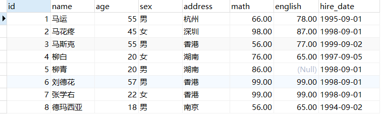

## MySQL 命令集合

### 1. 从启动到删库

#### 1. 1 启动停止

```bash
::Windows
net start mysql80
net stop mysql80

# Linux
systemctl start mysqld
systemctl stop mysqld

```

#### 1.2 命令行连接

```bash
mysql [-h 127.0.0.1] [-P 3306] -u root -p

参数：
	 -h : MySQL服务所在的主机IP
	 -P : MySQL服务端口号， 默认3306
	 -u : MySQL数据库用户名
	 -p ： MySQL数据库用户名对应的密码
```

> 注意： 使用这种方式进行连接时，需要安装完毕后配置PATH环境变量。

###  2. 数据库操作

#### 2.1 SQL通用语法

1. SQL语句可以单行或多行书写，以分号结尾。 

   `分号结尾是执行，\c结尾是结束`

2. SQL语句可以使用空格/缩进来增强语句的可读性。

3. MySQL数据库的SQL语句不区分大小写，关键字建议使用大写。

4. 注释： 

   单行注释：`-- 注释内容` 或 `# 注释内容`

   多行注释：`/* 注释内容 */`

#### 2.2 SQL分类

SQL语句，根据其功能，主要分为四类：DDL、DML、DQL、DCL。

| 分类 | 全称                       | 说明                                                    |
| ---- | -------------------------- | ------------------------------------------------------- |
| DDL  | Data Definition Language   | 数据定义语言，用来定义数据库对象(数据库，表， 字段)     |
| DML  | Data Manipulation Language | 数据操作语言，用来对数据库表中的数据进行增删改          |
| DQL  | Data Query Language        | 数据查询语言，用来查询数据库中表的记录                  |
| DCL  | Data Control Language      | 数据控制语言，用来创建数据库用户、控制数据库的 访问权限 |


#### 2.3 DDL

##### 2.3.1 数据库操作

```sql
-- 查询所有数据库
SHOW DATABASES;

-- 查询当前数据库
SELECT DATABASE();

-- 创建数据库
CREATE DATABASE [ IF NOT EXISTS ] 数据库名 [ DEFAULT CHARSET 字符集 ] [ COLLATE 排序规则 ];

-- 删库跑路
DROP DATABASE [ IF EXISTS ] 数据库名;

-- 切换数据库
USE 数据库名;
```


##### 2.3.2 表操作-查询创建

```sql
-- 查询当前数据库所有表
SHOW TABLES;

-- 查看指定表结构
DESC 表名;

-- 查询指定表的建表语句
SHOW CREATE TABLE 表名 ;

-- 创建表结构
CREATE TABLE 表名 (
    字段1 字段1类型 [COMMENT 字段1注释],
    字段2 字段2类型 [COMMENT 字段2注释],
    ...
) [ COMMENT 表注释] ;
```

> 注意:  [ . . . ]  内为可选参数，最后一个字段后面没有逗号

##### 2.3.2.1 数据类型

MySQL 支持多种类型，可以分为三类：

* 数值

  ```sql
  tinyint : 小整数型，占一个字节
  int	： 大整数类型，占四个字节
  	eg ： age int
  double ： 浮点类型
  	使用格式： 字段名 double(总长度,小数点后保留的位数)
  	eg ： score double(5,2)   
  ```

* 日期

  ```sql
  date ： 日期值。只包含年月日
  	eg ：birthday date ： 
  datetime ： 混合日期和时间值。包含年月日时分秒
  ```

* 字符串

  ```sql
  char ： 定长字符串。
  	优点：存储性能高
  	缺点：浪费空间
  	eg ： name char(10)  如果存储的数据字符个数不足10个，也会占10个的空间
  varchar ： 变长字符串。
  	优点：节约空间
  	缺点：存储性能低
  	eg ： name varchar(10) 如果存储的数据字符个数不足10个，那就数据字符个数是几就占几个的空间
  ```

> 注意：其他类型参考资料中的《MySQL数据类型.xlsx》


##### 2.3.2.2 表操作-修改

```sql
-- 添加字段
ALTER TABLE 表名 ADD 字段名 类型(长度) [COMMENT 注释] [约束];

-- 修改数据类型
ALTER TABLE 表名 MODIFY 字段名 新数据类型(长度);

-- 修改字段名和字段类型
ALTER TABLE 表名 CHANGE 旧字段名 新字段名 类型(长度) [COMMENT 注释] [约束];

-- 删除字段
ALTER TABLE 表名 DROP 字段名;

-- 修改表名
ALTER TABLE 表名 RENAME TO　新表名;
```

2.3.2.3 表操作-删除

```sql
-- 删除表
DROP TABLE [IF EXISTS] 表名;

-- 删除指定表并重新创建表
TRUECARE TABLE 表名;
```

> 注意: 在删除表的时候，表中的全部数据也都会被删除。

#### 2.4 DML

##### 2.4.1 添加数据

```sql
-- 给指定字段添加数据
INSERT INTO 表名 (字段名1,字段名2,...) VALUES (值1,值2,...);

-- 查询数据的SQL语句
select * from 表名;

-- 给全部字段添加数据 (不建议省略字段添加)
INSERT INTO 表名 VALUES (值1,值2,...);

-- 批量添加数据 (不建议省略字段添加)
INSERT INTO 表名 (字段名1, 字段名2, ...) VALUES (值1, 值2, ...), (值1, 值2, ...), (值1, 值2, ...);

INSERT INTO 表名 VALUES (值1, 值2, ...), (值1, 值2, ...), (值1, 值2, ...);

```

> 注意事项:
>
> - 插入数据时，指定的字段顺序需要与值的顺序是一一对应的。
> - 字符串和日期型数据应该包含在引号中。
> - 插入的数据大小，应该在字段的规定范围内。

##### 2.4.2 修改数据

```sql
UPDATE 表名 SET 字段名1 = 值1 , 字段名2 = 值2 , ... [ WHERE 条件 ];
```

> 注意事项：
>
> ​	修改语句的条件可以有，也可以没有，**如果没有条件，则会修改整张表的所有数据。**

##### 2.4.3 删除数据

```sql
DELETE FROM 表名 [ WHERE 条件 ];
```

> 注意事项：
>
> - DELETE 语句的条件可以有，也可以没有，**如果没有条件，则会删除整张表的所有数据。**
> - DELETE 语句不能删除某一个字段的值（可以使用UPDATE，将字段置为NULL即可）。
> - 当进行删除全部数据操作时，datagrip 会提示我们，询问是否确认删除，我们直接点击 Execute即可。

#### 2.5 DQL

##### 2.5.1 基本语法

```sql
SELECT
	字段列表
FROM
	表名列表
WHERE
	条件列表
GROUP BY
	分组字段列表
HAVING
	分组后条件列表
ORDER BY
	排序字段列表
LIMIT
	分页参数
```

##### 2.5.2 基础查询

```sql
-- 查询多个字段
SELECT 字段列表 FROM 表名;

-- 查询所有数据 不建议使用
SELECT * FROM 表名; 

-- 去除重复记录
SELECT DISTINCT 字段列表 FROM 表名;

-- 给列名起别名
AS: AS 也可省略,有空格间隔就行

eg: 
SELECT name,math as 数学成绩,english as 英语成绩 FROM stu;
```

##### 2.5.3 条件查询

```sql
SELECT 字段列表 FROM 表名 WHERE 条件列表;
```

条件列表可以使用以下运算符

| 符号             | 功能                                     |
| ---------------- | ---------------------------------------- |
| >                | 大于                                     |
| <                | 小于                                     |
| >=               | 大于等于                                 |
| <=               | 小于等于                                 |
| =                | 等于                                     |
| <> 或 !=         | 不等于                                   |
| BETWEEN...AND... | 在某个范围之内（都包含）                 |
| IN(...)          | 多选一                                   |
| LIKE 占位符      | 模糊查询    _ 单个任意字符 %多个任意字符 |
| IS NULL          | 是 NULL                                  |
| IS NOT NULL      | 不是 NULL                                |
| AND 或 &&        | 并且                                     |
| OR 或 \| \|      | 或者                                     |
| NOT 或 !         | 非，不是                                 |
| REGEXP           | 正则表达式匹配                           |


###### 条件查询练习

* 查询年龄大于20岁的学员信息

  ```sql
  select * from stu where age > 20;
  ```

* 查询年龄大于等于20岁的学员信息

  ```sql
  select * from stu where age >= 20;
  ```

* 查询年龄大于等于20岁 并且 年龄 小于等于 30岁 的学员信息

  ```sql
  select * from stu where age >= 20 &&  age <= 30;
  select * from stu where age >= 20 and  age <= 30;
  ```

  > 上面语句中 &&  和  and  都表示并且的意思。建议使用 and 。
  >
  > 也可以使用  between ... and 来实现上面需求

  ```sql
  select * from stu where age BETWEEN 20 and 30;
  ```

* 查询入学日期在'1998-09-01' 到 '1999-09-01'  之间的学员信息

  ```sql
  select * from stu where hire_date BETWEEN '1998-09-01' and '1999-09-01';
  ```

* 查询年龄等于18岁的学员信息

  ```sql
  select * from stu where age = 18;
  ```

* 查询年龄不等于18岁的学员信息

  ```sql
  select * from stu where age != 18;
  select * from stu where age <> 18;
  ```

* 查询年龄等于18岁 或者 年龄等于20岁 或者 年龄等于22岁的学员信息

  ```sql
  select * from stu where age = 18 or age = 20 or age = 22;
  select * from stu where age in (18,20 ,22);
  ```

* 查询英语成绩为 null的学员信息

  null值的比较不能使用 =  或者 != 。需要使用 is  或者 is not

  ```sql
  select * from stu where english = null; -- 这个语句是不行的
  select * from stu where english is null;
  select * from stu where english is not null;
  ```

###### 模糊查询练习

> 模糊查询使用like关键字，可以使用通配符进行占位:
>
> （1）_ : 代表单个任意字符
>
> （2）% : 代表任意个数字符

* 查询姓'马'的学员信息

  ```sql
  select * from stu where name like '马%';
  ```

* 查询第二个字是'花'的学员信息  

  ```sql
  select * from stu where name like '_花%';
  ```

* 查询名字中包含 '德' 的学员信息

  ```sql
  select * from stu where name like '%德%';

##### 2.5.4 排序查询

```sql
SELECT 字段列表 FROM 表名 ORDER BY 排序字段名1 [排序方式1],排序字段名2 [排序方式2] …;
```

上述语句中的排序方式有两种，分别是：

* ASC ： 升序排列 **（默认值）**
* DESC ： 降序排列

> 注意：如果有多个排序条件，当前边的条件值一样时，才会根据第二条件进行排序

##### 2.5.5 聚合函数

###### 2.5.5.1  概念

 ==将一列数据作为一个整体，进行纵向计算。==

如何理解呢？假设有如下表



现有一需求让我们求表中所有数据的数学成绩的总和。这就是对math字段进行纵向求和。

###### 2.5.5.2  聚合函数分类

| 函数名      | 功能                             |
| ----------- | -------------------------------- |
| count(列名) | 统计数量（一般选用不为null的列） |
| max(列名)   | 最大值                           |
| min(列名)   | 最小值                           |
| sum(列名)   | 求和                             |
| avg(列名)   | 平均值                           |

###### 2.5.5.3  聚合函数语法

```sql
SELECT 聚合函数名(列名) FROM 表;
```

> 注意：null 值不参与所有聚合函数运算

###### 2.5.5.4 练习

* 统计班级一共有多少个学生

  ```sql
  select count(id) from stu;
  select count(english) from stu;
  ```

  上面语句根据某个字段进行统计，如果该字段某一行的值为null的话，将不会被统计。所以可以在count(*) 来实现。\* 表示所有字段数据，一行中也不可能所有的数据都为null，所以建议使用 count(\*)

  ```sql
  select count(*) from stu;
  ```

* 查询数学成绩的最高分

  ```sql
  select max(math) from stu;
  ```

* 查询数学成绩的最低分

  ```sql
  select min(math) from stu;
  ```

* 查询数学成绩的总分

  ```sql
  select sum(math) from stu;
  ```

* 查询数学成绩的平均分

  ```sql
  select avg(math) from stu;
  ```

* 查询英语成绩的最低分

  ```sql
  select min(english) from stu;
  ```

##### 2.5.6 分组查询

###### 2.5.6.1 语法

```sql
SELECT 字段列表 FROM 表名 [WHERE 分组前条件限定] GROUP BY 分组字段名 [HAVING 分组后条件过滤];
```

> 注意：分组之后，查询的字段为聚合函数和分组字段，查询其他字段无任何意义

###### 2.5.6.2  练习

* 查询男同学和女同学各自的数学平均分

  ```sql
  select sex, avg(math) from stu group by sex;
  ```

  > 注意：分组之后，查询的字段为聚合函数和分组字段，查询其他字段无任何意义

  ```sql
  select name, sex, avg(math) from stu group by sex;  -- 这里查询name字段就没有任何意义
  ```

* 查询男同学和女同学各自的数学平均分，以及各自人数

  ```sql
  select sex, avg(math),count(*) from stu group by sex;
  ```

* 查询男同学和女同学各自的数学平均分，以及各自人数，要求：分数低于70分的不参与分组

  ```sql
  select sex, avg(math),count(*) from stu where math > 70 group by sex;
  ```

* 查询男同学和女同学各自的数学平均分，以及各自人数，要求：分数低于70分的不参与分组，分组之后人数大于2个的

  ```sql
  select sex, avg(math),count(*) from stu where math > 70 group by sex having count(*)  > 2;
  ```

**where 和 having 区别：**

* 执行时机不一样：where 是分组之前进行限定，不满足where条件，则不参与分组，而having是分组之后对结果进行过滤。

* 可判断的条件不一样：where 不能对聚合函数进行判断，having 可以。

> 执行顺序： where > 聚合函数 > having

##### 2.5.7 分页查询

###### 2.5.7.1 语法

```sql
SELECT 字段列表 FROM 表名 LIMIT  起始索引 , 查询条目数;
```

> 注意： 上述语句中的起始索引是从0开始

###### 2.5.7.2 练习

* 从0开始查询，查询3条数据

  ```sql
  select * from stu limit 0 , 3;
  ```

* 每页显示3条数据，查询第1页数据

  ```sql
  select * from stu limit 0 , 3;
  ```

* 每页显示3条数据，查询第2页数据

  ```sql
  select * from stu limit 3 , 3;
  ```

* 每页显示3条数据，查询第3页数据

  ```sql
  select * from stu limit 6 , 3;
  ```

从上面的练习推导出起始索引计算公式：

```
起始索引 = (当前页码 - 1) * 每页显示的条数
```

> 分页操作 limit 是 MySQL 数据库的方言
>
> Oracle 分页查询用 rownumber
>
> SQL Server 分页查询用 top

##### 2.5.8 执行顺序

#### 2.6 DCL

##### 2.6.1 用户管理

```mysql
-- 查询用户
USE mysql;
SELECT * from user;

-- 创建用户
create user 'username'@'hostname' IDENTIFIED BY 'password';

-- 修改用户密码;
ALTER USER 'username'@'hostname' IDENTIFIED WITH mysql_native_password BY 'new_password';

-- 删除用户
DROP USER 'username'@'hostname';

```

> 注意：主机名可用 % 通配


##### 2.6.2 权限控制

MySQL中定义了很多种权限，但是常用的就以下几种：

| 权限                | 说明               |
| ------------------- | ------------------ |
| ALL, ALL PRIVILEGES | 所有权限           |
| SELECT              | 查询数据           |
| INSERT              | 插入数据           |
| UPDATE              | 修改数据           |
| DELETE              | 删除数据           |
| ALTER               | 修改表             |
| DROP                | 删除数据库/表/视图 |
| CREATE              | 创建数据库/表      |

上述只是简单罗列了常见的几种权限描述，其他权限描述及含义，可以直接参考[官方文档](https://dev.mysql.com/doc/refman/8.0/en/privileges-provided.html)。


```sql
-- 查询权限
show grants for 'username'@'hostname';

-- 授权权限
grant 权限列表 on 数据库名.表名 TO 'username'@'hostname';

-- 撤销权限
REVOKE 权限列表 ON 数据库名.表名 FROM 'username'@'hostname';
```

> 注意： 多个权限之间，使用逗号分隔
>
> ​				授权时，数据库名和表名可以使用 * 进行通配，代表所有

### 3. 函数

