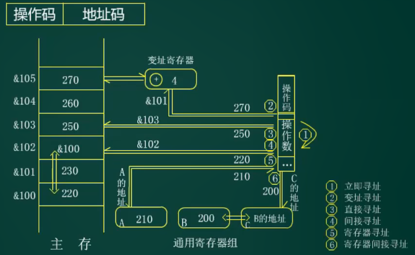
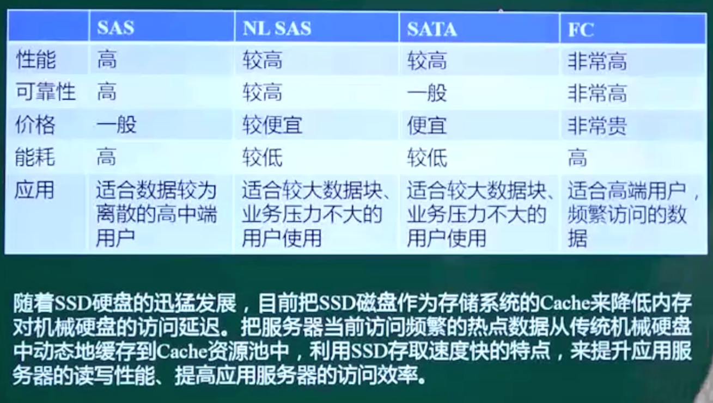

## 计算机硬件基础

#### 数据的表示方法

##### R进制的表示（R可为二、八、十、十六）

**原则：逢R进一**

二进制只有“0”和“1”两个数，常用下标2表示。如(10)2。

十进制常用下标“10”或在数字的后面加上一个英文字母“D”来表示，如(89)10或89D。

八进制常用下标“8”或在数字的后面加上一个英文字母“O”来表示，如(25)8或25O。

十六进制，就是由十进制改变而来，在十进制的基础之上，用A代表10，B代表11，C代表12，D代表13，E代表14，F代表15。

十六进制常用下标“16”或在数字的后面加上一个英文字母“H”来表示，如(A1B4)16或A1B4H

##### 计算机中的原码、反码和补码

|      | 数值1     | 数值-1    | 1+(-1)    |
| ---- | --------- | --------- | --------- |
| 原码 | 0 0000001 | 1 0000001 | 1 0000000 |
| 反码 | 0 0000001 | 1 1111110 | 1 1111111 |
| 补码 | 0 0000001 | 1 1111111 | 0 0000000 |

补码在表示负数时，是在原码取反(反码)的基础上+1

取值范围

|      | 定点整数                               | 定点小数 |
| ---- | -------------------------------------- | -------- |
| 原码 | -(2n-1-1)~2n-1-1 | -1<X<1   |
| 反码 | -(2n-1-1)~2n-1-1 | -1<X<1   |
| 补码 | -(2n-1)~2n-1-1   | -1≤X<1   |

#### 逻辑运算

### 计算机系统的组成与体系结构

#### 计算机的结构

#### 指令系统的基础—寻址方式（寻找操作数）

指令：操作码（加减乘除）+ 地址码（对哪个地址进行操作）（操作数的地址）

寻址方式：（2，3，4方式的地址都放在主存（内存））

1. 立即寻址 （速度最快，但是会受到范围的限制，限制大，没有广泛使用）
2. 变址寻址 （有变址寄存器，基址+偏移）
3. 直接寻址
4. 间接寻址（多了一次缓存，访问的是地址的地址）
5. 寄存器寻址
6. 寄存器间接寻址

#### CISC与RISC

| 指令系统类型 |                             指令                             | 寻址方式   | 实现方式                                             | 其他                       |
| ------------ | :----------------------------------------------------------: | ---------- | ---------------------------------------------------- | -------------------------- |
| CISC（复杂） |              数量多，使用频率差别大，可变长格式              | 支持多种   | 微程序控制技术                                       |                            |
| RISC（精简） | 数量少，使用频率接近，定长格式，大部分为单周期指令，操作寄存器，只有Load/Store操作内存 | 支持方式少 | 增加了通用寄存器；硬布线逻辑控制为主；适合采用流水线 | 优化编译，有效支持高级语言 |

#### 流水线

运行时间的计算

#### 

技术指标的计算

n：指令系数	Tk：流水线时间

吞吐率：Tp=n/Tk   上题例子：Tp = 100 / 203

(理论最大吞吐率：Tp=1/T，周期的倒数，上题例子：Tp=1/2)

加速比：S=Ts/Tk （Ts:未使用流水线的时间，上题例子：S=500/203）

效率

### 存储系统

#### 存储系统结构

#### 存储系统的存取方式

- 顺序存取（磁带）

- 直接存取（硬盘）

- 随机存取（内存）

- 相连存取（Cache）

#### 主存储器基础—组成

- 实际的存储器总容量，是由一片或多片存储芯片配以控制电路构成的。其容量为 W × B，W是存储单元（word，即字）的数量，B表示每个word由多少 bit（位）组成。
  如：某一芯片规格为 w×b，则组成 WxB 的存储器需要（W/w）×（B/b）个芯片。

- 主存储器（内存）采用：随机存取方式存储，需对每个存储单元进行编址。而在主存储器中，通常以word为单位进行标识，即每个字一个地址，通常采用16进制表示。

- 例如，按字节编址，地址从A4000H—CBFFFH，则表示有（CBFFF-A4000)+1个字节，即28000H个字节，也就是163840个字节，等于160KB。
  $$
  计算字节数：CBFFF+1=CC000\\ \ CC000-A4000 = 28000\\
  
  十六进制转二进制：0010 1000 0000 0000 0000\\
  
  因为 2^{10} = 1024 = 1K \ 所以去掉 10 个 0\\
  
  变成 \ 10 1000 00\\
  
  二进制转十进制：1×2^7+1×2^5 = 128 + 32 = 160 \ KB\\
  $$

  - 假设芯片容量 32k × 8 bit

    160k × 8 bit / 32k × 8 bit = 5 块

- 表示存储容量相关术语：
  位：用bit表示，一个二进制表示1bit
  字节：用B表示，1B=8bit
  字：实际表示CPU一次处理的二进制的位数，通常为字节的整数倍
  对应的字长有：8/16/32/64bit

#### Cache

​	如果Cache的访问命中率为h，而Cache的访问周期时间是t1，主存储器的访问周期时间是t2，则整个系统的平均访存时间就应该是：命中时间+未命中的时间
$$
t3 = h \times t1 + (1 - h) \times t2
$$

- Cache 淘汰算法

  - 先进先出算法

  - 最近最少使用算法

  - 随机算法

#### 磁盘

​	磁盘

1. SATA
2. SCSI
3. SAS（串行SCSI）
4. SSD

#### RAID 技术

- RAID 0	写入速度块，利用率最高-100%，可靠性最差

- RAID 1	使用 Disk Mirror （硬盘镜像技术），具备备份和容错能力，效率不高但可靠性高，利用率-50%

- RAID 3	提供奇偶校验盘，具备数据容错能力，单盘失效时，产生奇偶盘I/O瓶颈效应，硬盘利用率=（n-1）/n

- RAID 5	采用分布式奇偶校验的数据分段技术，将用于奇偶校验的数据存放在各个硬盘中，具有数据容错能力，可靠性好；有较好的性能，硬盘利用率=（n-1）/n

- RAID 6	私有级RAID级别标准，全称是“带有两个独立分布式校验方案的独立数据磁盘”；从功能上讲，能实现两个磁盘掉线容错的，都叫RAID6；磁盘利用率（n-2）/n

- RAID 10	先做RAID1再做RAID0，先镜像再条带化

- RAID 01	先做RAID0再做RAID1

#### RAID 2.0优势

- 快速重构
- 自动负载均衡
- 系统性能提升
- 自愈合  

### 系统的可靠性

#### 串联系统
假设一个系统由n个子系统组成，当且仅当所有的子系统都能正常工作时，系统才能正常工作，这种系统称为串联系统。

设系统各个子系统的可靠性分别用$R_1、R_2，...,R_n$表示，则系统的可靠性$R=R_1\times R_2\times...\times R_n$

如果系统的各个子系统的失效率分别用$\lambda_1,\lambda_2,...\lambda_n$来表示，则系统的失效率为$\lambda=\lambda_1+\lambda_2+...\lambda_n$

#### 并联系统

假如一个系统由n个子系统组成，只要有一个子系统能够正常工作，系统就能正常工作，如下图所示。

设系统各个子系统的可靠性分别用$R_1、R_2，...,R_n$表示，则系统的可靠性

$R=1-(1-R_1)\times(1-R_2)\times...\times(1-R_n)$

### 操作系统

#### 操作系统概述

#### 进程管理

##### 进程的状态

##### 死锁问题

​	进程管理是操作系统的核心，但如果设计不当，就会出现死锁的问题。一个进程再等待一个不可能发生的事，则进程就死锁了。而如果一个或多个进程产生死锁，就会造成系统死锁。

​	死锁产生的四个条件：1.互斥 2.保持和等待 3.不剥夺 4.环路等待

​	解决死锁的措施：1.死锁预防 2.死锁避免—银行家算法 3.死锁检测 4.死锁解除

##### 银行家算法—分配资源的原则

- 当一个进程对资源的最大需求量不超过系统中的资源数时可以接纳该进程。
- 进程可以分期请求资源，但请求的总数不能超过最大需求量。
- 当系统现有的资源不能满足进程尚需资源数时，对进程的请求可以推迟分配，但总能使进程在有限的时间里得到资源。

##### 进程的互斥和同步

....

##### PV操作-用来解决互斥和同步的问题

临界区：每个进程中访问临界资源的那段代码成为临界区

信号量：一种特殊的变量，计数器

PV操作：用来解决互斥和同步的问题。

PV操作是分开来看的：

​	P操作：使S=S-1，若S>=0，则该进程继续执行，否则该进程排入等待队列

​	V操作：使S=S+1，若S<=0，唤醒等待队列中的一个进程

#### 存储管理

##### 页式存储

分页存储管理的思想：把内存分为一个个相等的小分区，再按照分区大小把进程拆分成一个个小部分。

##### 页面置换算法

1. 先进先出 FIFO
2. 最佳置换法 OPT  (理想算法)
3. 最近最少使用置换法 LRU

#### 文件管理—树形目录结构

.....

#### 设备管理

数据传输控制方式

1. 程序控制方式：CPU与外设间的数据传送是在程序的控制下完成的一种数据传送方式
2. 程序中断方式：程序中断是指计算机执行现行程序的过程中，出现某些急需处理的异常情况和特殊请求，CPU暂时终止现行程序，而转去对随机发生的更紧迫的事件进行处理，在处理完毕后，CPU将自动返回原来的程序继续执行。
3. DMA方式：DMA是l/O设备与主存之间由硬件组成的直接数据通路，主要用于高速I／O设备与主存之间的成组数据传送。

### 数据通信基础

### 计算机网络技术

