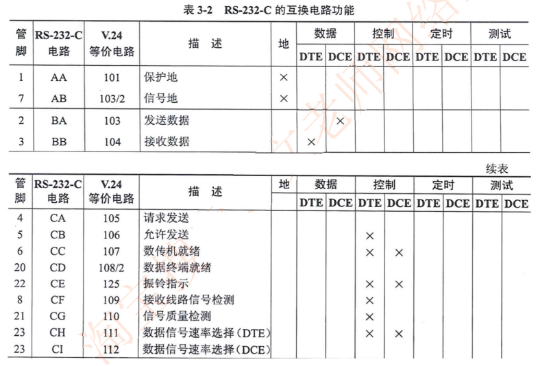
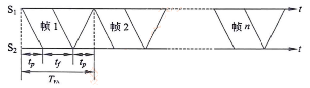
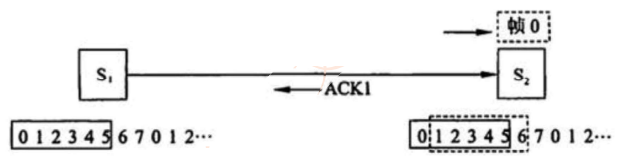
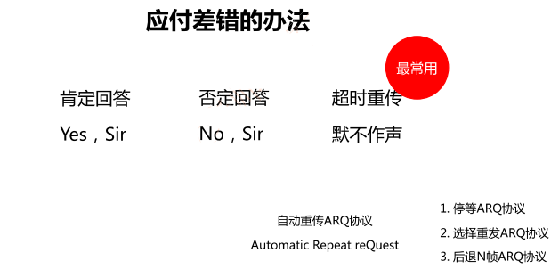
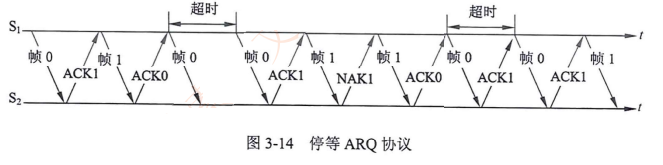
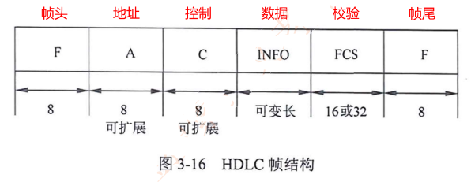

# 网络工程师

## 一、计算机网络概述

### ICT：IT+CT：信息技术+通信技术

### 计算机网络的分类

### OSI 七层模型和功能

### OSI 七层模型与 TCP/IP 模型的比较

## 二、数据通信基础

通信系统模型的组成：信源 （发送方）、信道、信宿 （接收方）

#### 2.1 信道带宽

- 模拟信道 ：$ W = f2 - f1$（f2、f1 代表最高、最低频率，单位 Hz）
- 数字信道 （离散信道）：带宽为信道能够达到的最大数据传输速率， 单位 bit/s

- 数据传输速率 ：每秒钟能够传输的二进制数据位数，单位 比特/秒（bit/s, b/s 或 bps）

  - 网络通信常用bit，存储用B

    - 1B = 8 bit

#### 2.2 信道特性

- 码元：一个数字脉冲称为一个码元，即在单位时间（时间周期）发的信道

- 码元速率：单位时间内信道传送的码元个数，如果T代表码元宽度（脉冲周期）

  则 码元速率（波特率）：$ B = 1 / T$ ， 单位：波特 Baud

  - 一个码元携带信息量 n 位 与 码元种类 N 的关系 $ n = \log_2N$ 

- 尼奎斯特定理：在一个理想（没有噪声环境）的信道中，若信道带宽为W，

  - 最大码元速率为 $ B = 2W$  -> 最大码元速率 = 2倍的信道带宽
  - 最大数据速率为 $R = B \log_2N = 2W \log_2N$ -> 极限数据速率 = 最大码元速率 * 码元种类

- 香农定理：在噪声信道的极限速率和带宽之间的关系

  - 极限信息传输速率公式：$ C = W \log_2 (1 + \frac{S}{N}) \enspace (bit/s)$  

    信噪比：$\frac{S}{N}$

- 分贝与信噪比关系：$dB = 10 \log_{10} (\frac{S}{N}) \enspace (dB)$

  

#### 2.3 误码率（考得少）

1. 误码率是衡量数据通信系统在正常工作情况下传输可靠性的指标。
2. Def ： 传世出错的码元数占传输总码元数的比例，误码率越小，通信可靠性越高。
3. $Pe = Ne / N$ 其中 Ne 表示出错数，N 表示传送总数
4. 在计算机通信网络中，误码率一般要求低于 $10^{-6}$
5. 数据延时 < 200 ms， 语音视频延时 < 50 ms ， 抖动  <  20 ms，丢包率 < 1% 

#### 2.4 信道延迟

1. 信道延迟与源端和宿端的距离有关，也与具体信道中信号的传输速率有关
2. 光速为 300 m/us = 30 0000 km/s ==记 km/s 的就行==
3. 电缆中传播速度一般为光速 77%， 即 200 m/us = 20 0000 km/s
4. 例如 500 米同轴电缆时延大约为 2.5 us
5. 卫星信道的时延大约 270ms （来回双向的延迟）
6. ==发送数据时间 = 线路延迟 +  调制延迟==
7. 线路延迟 = 传输距离 / 传输速度 （路上跑的时间）
8. 调制延迟 = 数据帧大小 / 速率 （排队上车的时间）
9. $ 1s = 10^3 ms = 10^6 us$

#### 2.5 传输介质

双绞线： 8 根铜导线每两根扭在一起

​	分类：直通线 / 交叉线， 屏蔽和非屏蔽双绞线

光纤：利用光在==玻璃或塑料纤维==中的==全反射原理==而达成的光传导工具

- 光传导损耗比电缆传导的损耗低得多，光纤适合用于长距离的信息传递
- 特点：重量轻，体积小，传输远（衰减小）、容量大、抗电磁干扰

光纤分类：***

  1. 单模光纤
     - 当光纤的集合尺寸可以于光波长相相比拟时，即纤芯的几何尺寸与光信号波长相差不大时，一般为 5 - 10 um
     - 光纤只允许==一种模式在其中传播==，单模光纤具有极宽的带宽，特别适合==大容量，长距离的光纤通信==（贵）
  2. 多模光纤
     - 多模光纤纤芯的集合尺寸远大于光波波长，一般为 50 um、62.5 um，允许多种模式光信号传播
     - 多模光纤仅用于 ==较小容量、短距离的光纤传输通信==（便宜，胖子不值钱）

多模与单模对比

#### 2.6 数据编码

单极性码：高电压表示 1，无电压表示 0

 极性码： 负电压表示 1，正电压表示 0

双极性码：0 电平表示 0，1在正负之间交替翻转，1跳0不跳

归零编码 RZ：码元中间的信号回归到 0 电平

​						从负电平到 0 电平的转换边表示 1，正电平到0 电平的转换边表示码元 0

不归零码 NRZ : 当出现 1 时电平翻转，出现 0 时电平不翻转，也叫差分码

  

##### 双相码

- 双相码要求每一位都要有一个电平转换，**一高一低，必须反转**
- 这种编码的特点是：具有自定时和检测错误的功能
- ==曼彻斯特和差分曼彻斯特码==就是典型的双相码

曼彻斯特编码==（重点考点）==

​	曼彻斯特编码是一种双相码，在每个比特中间均有一个跳变，第一个编码自定义，假如下图由高电平向低电平的跳变代表 0，低电平向高电平跳变代表 1

​	曼彻斯特编码常用于以太网中

差分曼特斯特编码

​	差分曼特斯特编码也是一种双相码，用于令牌环网中

​	有跳变代表 0，无跳变代表 1 ==【有0无1】==

​	**不是比较形状，比较起始电平（上一个终止与下一个起点）**

两种曼彻斯特编码的特点

- 两种曼彻斯特编码优点：把时钟和数据包含在信号数据流中，也成为同步码
- 编码效率低：每个码元都要调制为两个不同的电平，因而调制速率是码元速率的两倍，这对信道的带宽提出了更高的要求，例如当数据传输速率为 100 Mbps 时，需要 200 MHz 的脉冲
- 编码效率都是 50%, 一般指用于最早的 10M 以太网编码

4B/5B 编码 ==（重点考点）==

- 发送数据流每 4bits，先使用不归零码（NBZ-I），编码成 5bit，多一位用于解决同步问题

各种编码效率

- 曼码和差分曼码效率 50%，用于以太网
- 4B/5B 效率 80%，用于百兆以太网
- 8B/10B 效率 80%，用于千兆以太网
- 64B/66B 效率 97%，用于万兆以太网

#### 2.7 数字调制技术

将数字信号转换为模拟信号称为调制，将模拟信号转换为数字信号称为解调

- 幅度键控（ASK）：用载波的两个不同振幅表示 0 和 1
- 频移键控（FSK）：用载波的两个不同频率表示 0 和 1
- 相移键控（PSK）：用载波的起始相位的变化表示 0 和 1
  - 差分相移键控 DPSK ： 与 上一个比较形状，有 0 无 1
- 正交幅度调制（QAM）：用两个==幅度相同==但==相位差 90°==的模拟信号合成一个模拟信号  5G/WIFI

码元支取两个相位值叫两相调制，码元可取 4 个相位叫 4 相调制， 则 N = 2， N = 4

特殊的：**DPSK 是 2 相，QPSK 是 4 相**

#### 2.8 脉码调制 PCM

- <u>解调</u>：把模拟信号转换为数字信号的过程

- 常用数字化技术就是脉冲编码调制技术（Pulse Code Modulation，PCM），简称脉码调制

- PCM 数字化过程 3 个步骤：==采用、量化和编码==

采样：按照一定的时间间隔对模拟信号进行取样，把模拟信号的当前值作为样本

- 奈奎斯特采样定理：如果模拟信号的最高频率为 $f_{max}$, 若以大于 $2f_{max}$的采样频率对其进行采样，则采样得到的离散信号序列就能完整地恢复出原始信号。		  $ f = \frac{1}{t} \geq 2f_{max}$

量化：把取样后得到的样本由连续值转换为离散值，离散的个数决定了量化的精度

编码：把量化后的样本值变成相对应的二进制代码，可以得到相应的二进制代码序列，其中每个二进制代码都可以用一个脉冲串来表示，这一组脉冲序列就代表经 PCM 编码的模拟信号

例如：对声音信号数字化时，由于语音的最高频率是 4kHz , 所以取样频率是 8kHz。对语音样本用 128 个等级量化，因而每个样本用 7bit 表示。在数字信道上传世这种数字化后的语音信号的速率是 7 * 8000 = 56 Kbps 【重点理解】

#### 2.9 通讯方式和交换方式

##### 2.9.1 数据通信方式

1. 按通信方向分
   - 单工通信：只能单方向传输的工作模式（电视/广播）
   - 半双工：交替发送和接收信息，但不能同时接收或发送（对讲机/WIFI/HUB）
   - 全双工：双方可以同时进行双向的信息传送（电话/交换机）

2. 按同步方式分
   - 两种传输方式：异步传输和同步传输
   - 异步传输：把各个字符分开传输，在字符之前插入一位起始位，在字符之后插入一位停止位，起始位对接收方的时钟起置位作用。在字符和停止位之间还要插入一位校验位，一般使用奇偶校验。
     
   - 同步传输：比特**分组**（帧)要大得多。不是独立发送每个字符，而是把他们组合起来一起发送。我们称这些组合为数据帧，或简称帧。数据帧的第一部分包含同步字符，用于通知接收方一个帧已经达到。帧的最后一部分是一个帧结束标记。

##### 2.9.2 交换方式

- 数据交换技术有 3 种：电路交换、报文交换 和 分组交换
- 电路交换：整个报文从源头到终点连续的传输
- 报文交换：整个报文先传送到相邻结点，全部存储下来查找转发表，再转发到下一个结点。
- 分组交换：数据报方式、虚电路方式
  - 数据报方式：每个分组被独立地处理，每个节点根据一个路由选择算法，为每个分组选择一条路径，使它们的目的地相同。（IP）
  - 虚电路方式：在数据传送之前，先建立一条逻辑上的连接，每个分组都沿着一条路径传输。（X.25、FR、ATM）
  - 减小了延迟，提高了吞吐量
  - 分组交换可以按分组纠错，发现错误只需重发出错的分组，通信效率提高

#### 2.10 多路复用技术

- 多路复用技术是把多个低速的信道组合成一个高速的信道的技术
- 光纤入户：上网、电视、电话
- 这种技术要用到两个设备
  - 多路复用器（Mutiplexer），在发送端根据某种约定的规则把多个低带宽的信号符合成一个高带宽的信号;
  - 多路分配器（Demultiplexer），在接收端根据统一规则把高带宽信号分解成多个低带宽信号
  - 多路复用器和多路分配器统称多路器，简写MUX

##### 2.10.1 频分复用/时分复用/波分复用

##### 2.10.2 数字传输系统***

- 脉码调制已经介绍，对 4kHz 语音信道按 8kHz 速率采样，128 级量化，则每个语音信道的比特流是 56Kbps
- 美国和日本使用 T1 标准，==T1 = 56K * 24 + 开销与间隔 = 1.544M==

- 欧洲标准 E1

  - ITU-T 标准 E1 信道数据速率是 ==2.048Mbps==，把 ==32 个== 8 位一组的数据像本组装成 125 us 的基本帧，其中==30个子信道用于语音传送，2 个子信道（CH0 和 CH16）用于控制信令==

  - 每 4 帧能提供 64 个控制位，除了北美和亚洲的日本外，E1 载波得到广泛使用

  - E1 每语音 ==64K== (= 8 * 8000)   

##### 2.10.3 同步数字序列

- STM-1 -> **155Mbps** 其他是这个的四倍
- STM-4 -> 622Mbps
- STM-16 -> 2.5Gbps
- STM-64 -> 10Gbps

#### 2.11 差错控制

- 数据传输中出现错误不可避免，因此需要采用差错控制方法。数据通信中常用的办法==检错和纠错==。
- 差错控制原理∶传输 k 位，加入 r 位冗余（某种算法定义），接受方收到进行计算比较
- 接收方知道有差错发生，但不知道是怎样的差错，向发送方请求重传，称为检错
- 接收方知道有差错发生，而且知道是怎样的差错，这种策略称为纠错

##### 2.11.1 奇偶校验

- 奇偶校验是最常用的检错方法，能检出一位错位
- 原理∶在7位ASCII码后增加一位，使码字中1的个数成奇数（奇校验）或偶数（偶校验)
- 奇校验：整个校验码（有效信息位和校验位）中 “1” 的个数为奇数  1011 010(1)
- 偶校验：整个校验码（有效信息位和校验位）中 “1” 的个数为偶数  1011 010(0)

##### 2.11.2 海明码

- 海明（Hamming）码是通过冗余数据位来**检测**和**纠正**差错的编码方式

- **海明距离**：一个码字要变成另一个码字时必须改变的最小位数

- 例如∶7 位 ASCII 码增加一位奇偶位成为 8 位的码字，这 128 个 8 位的码字之间的==海明距离==是 2

  所以，当其中 1 位出错时便能检测出来，两位出错无能为力

- **海明码原理**：在数据中间加入几个校验码，码距均匀拉大，当某一位出错，会引起几个校验位的值发生变化
- **海明不等式**：校验码个数为 k，可以表示 $2^k$ 个信息，1 个信息用来表示"没有错误"，其余 $ 2^k - 1$ 个表示数据中存在错误，如果满足 $2^k - 1 \geq m + k$ ( m + k 为编码后的数的总长度)，则在理论上 k 个校验码就可以判断是哪一位（包括信息码和校验码）出现了问题

###### 海明码编码方法

[【官方双语】汉明码Pa■t1，如何克服噪■_哔哩哔哩_bilibili](https://www.bilibili.com/video/BV1WK411N7kz)

[【官方双语】汉明码part2，优雅的全貌_哔哩哔哩_bilibili](https://www.bilibili.com/video/BV1pV411y7E8)

##### 2.11.3 CRC 循环冗余校验码

#### 2.12 总结

- 奈奎斯特定理：$R = B \log_2N = 2W \log_2N$ N取决于调制技术
- 香农定理：$ C = W \log_2 (1 + \frac{S}{N}) \enspace (bit/s)$
- 信道延迟：发送数据时间 = 线路延迟 +  调制延迟
  - 线路延迟 = 传输距离 / 传输速度 （路上跑的时间）
  - 调制延迟 = 数据帧大小 / 速率 （排队上车的时间）
- 光纤与光缆：单模光纤和多模光纤
  - 传输模式、光源、距离、成本
- 数据编码：曼彻斯特编码和差分曼彻斯特编码
- 调制技术：ASK、FSK、PSK，QAM DPSK 默认是 2 相，QPSK 是 4 相
- 脉冲编码调制 PCM : 采样频率 $\geqslant 2f_{max}$ 量化等级为 N，每个样本携带 $log_2N$
- 同步传输 / 异步传输，三种交换方式概念
- T1 和 E1 载波： T1 = 1.544Mbps  E1 = 2.048 Mbps
- 光纤多路复用 OC-1 = 51.84 Mbps  SMT-1=OC-3=155Mbps
- 奇偶校验、海明码和CRC循环冗余校验码原理和计算

## 三、广域通信网

#### 3.1 公共交换电话网 PSTN

##### 3.1.1 电话系统结构

- 在公共交换电话网(Public Switched Telephone Network，PSTN)是为了语音通信而建立的网络，从 20 世纪 60 年代开始又被用于数据传输。
- 电话网由3个部分组成∶本地回路、干线和交换机
- 干线和交换机一般采用数字传输和交换技术，而本地回路基本采用模拟线路
- 电话线联网时需要在发送端通过调制解调器把数字信号变换为模拟信号，接收端再通过调制解调器把模拟信号变换为数字信号

##### 3.1.2 本地回路

- DTE （Data Terminal Equipment）数据终端设备，这种设备代表通信链路的端点
- DCE （Data Circuit Equipment）数据电路设备，用于信号变换器、自动呼叫等
- DTE：PC/电话机
- DCE：猫/调制解调器/Modem

##### 3.1.3 机械特性 （以下都是以 RS-232-C 接口为例）

- 机械特性描述 DTE 和 DCE 之间物理上的分界线，规定连机器的==几何形状、尺寸大小、引线数、引线排列方式及锁定装置==等。
- RS-232-C 没有正式规定连机器的标准，只有在其附录中建议使用25针的D型连接器，也有很多使用其他连接器，特别是在微型机RS-232-C串行接口上，大多使用9针连接器。

##### 3.1.4 电气特性

- RS-232-C采用的==V.28标准==电路，速率==20kb/s==，最长==15米==
- 信号源产生 3-15V 的信号，±3V之间是信号电平过渡区
- ==3-15V 表示1，-3-15V 表示0==

##### 3.1.5 功能特性

- 对接口连线的功能给出明确定义，RSR-232-C 采用的标准是 ==V.24==

#### 3.2 流量与差错控制

流量控制：协调发送站和接受站工作步调，避免发送速度过快，接受站处理不过来

- X.25 TCP

差错控制：检测和纠正传输错误的机制

- 检错码：CRC；纠错码：海明码

##### 3.2.1 流量控制-停等协议

- 工作原理∶发送站发一帧，收到应答信号后再发送下一帧，接收站每收到一帧后回送一个应答信号（ACK)，表示愿意接收下一帧，如果接收站不应答，发送站必须等待。

- ==$ TFA=2t_p+t_f$==  tp 路上传送时间(路上跑的时间)， tf 发送时间(排队上车的时间)

##### 3.2.2 流量控制-滑动窗口

- 滑动窗口协议主要思想是︰==允许连续发送多个帧而无须等待应答==
- 如图假设站$S_1$和$S_2$通过全双工链路连接，$S_2$ 维持能容纳6个帧的缓冲区（$W_收=6$）
- 这样$S_1$就可以连续发送6个帧而不必等待应答信号（$W_发=6$）

##### 3.2.3 差错控制

###### 停等 ARQ 协议

- 停等ARQ协议是停等流控技术和自动请求重发技术的结合。
- 发送站发出一帧后必须等待应答信号，收到肯定应答信号 ACK 后继续发送下一帧；收到否定应答信号 NAK 后重发该帧；若在一定的时间内没有收到应答信号也必须重发。

###### 选择重发 ARQ 协议 vs 后退 N 帧 ARQ 协议

- 选择重发 ARQ : 重传特定的某一帧 $W_发 = W_收 \leqslant 2^{K-1}$
- 后退 N 帧 ARQ ：重传此帧和后续的 N 帧  $W_发 = W_收 \leqslant 2^K-1$
- **选上退下** ； k 为帧编号的位数

###### HDLC

- HDLC (High Level Data Link Control，高级数据链路控制) 
- 是一种面向位（比特)的数据链路层控制协议
- 通常使用CRC-16、CRC-32校验，帧边界 "01111110"

##### 3.2.4 X.25 公共数据网

- X.25分为三个协议层，即==物理层、链路层和分组层==，分别对应OSI模型低三层
- X.25是一种分组交换技术，面向连接，建立虚链路
- X.25支持==差错控制和流量控制==，传输速率：64kbps

##### 3.2.5 帧中继 FR （Frame Rlay）

- 帧中继在第二层建立虚链路，提供==虚链路==服务，本地标识 DLCI
- 基于分组交换的透明传输，可提供==面向连接==的服务
- ==只做检错和拥塞控制，没有流控和重传机制，开销很少==
- 既可以按需要提供带宽，也可以应对突发的数据传输 （CIR：承诺速率，EIR: 扩展速率）
- **帧长可变**，长度可达1600-4096字节，可以承载各种局域网的数据帧
- 可以达到很高的速率，==2-45Mbps==
- 不适合对延迟敏感的应用(语音、视频)
- 数据的丢失依赖于运营商对虚电路的配置
- 不保障可靠的提交

#### 3.3 ISDN 和 ATM

- ISDN 综合数字业务网，目的是以数字系统代替模拟电话系统，把音频、视频、数据业务放在一个网上统一传输
- 分为 窄带ISDN 和 宽带ISDN，窄带ISDN 提供两种用户接口
- 基本速率 BRI = 2B+D = ==144Kbps==
- 基群速率 PRI = 30B+D = ==2.048M==
- 宽带ISDN，即ATM
- ATM是==信元交换==，信元为==53字节==固定长度
- ATM依然是以虚链路提供面向连接的服务
- ATM典型速率为==150M==

#### 3.4 总结

- RSR 232 接口物理特性 （偶尔考）
- 数据链路层的差错控制技术（选上退下，选一退多）
- HDLC 协议 （面向位、数据链路层、同步、帧定界符）
- ==FR协议==（面向连接、DLCI标识虚电路、数据链路层、可突发、有拥塞控制、无滑动窗口流量控制，有错误检测无重传）
- ISDN 基础（BRI 和 PRI 接口）
- ATM （面向连接、虚电路、4类业务）

## 四、局域网和城域网

#### 4.1 CSMA/CD

- 对总线型、星型和树型拓扑访问控制协议是CSMA/CD (Carrier Sense Multiple Access/Collision Detection) 。
- CSMA基本原理：发送数据之前，先监听信道上是否有人在发送。若有，说明信道正忙，否则说明信道是空闲的，然后根据预定的策略决定∶
  1. 若信道空闲，是否立即发送。
  2. 若信道忙，是否继续监听。
- 如果连续发生==16次==碰撞后，认为网络繁忙有问题，不再尝试发送。

##### 4.1.1 CSMA/CD 三种监听算法

1. 非坚持型监听算法：后退随机时间

​			由于随机时延后退，从而==减少了冲突的概率==。问题是因为后退而使信道闲置一段时间，这使==信道的利用率降低==，而且==增加了发送时延==。

2. 1-坚持型监听算法：继续监听，不等待

   有利于抢占信道，减少信道空闲时间。但是，多个站同时都在监听信道时必然会发生冲突。
   ==冲突概率和利用率都高（双高)==

3. P-坚持型监听算法

​		若信道空闲，以概率 P 发送，以概率（1-P）延迟一个时间单位，P 大小可调整。

#### 4.2 冲突检测原理

载波监听只能减小冲突的概率，不能完全避免冲突。当两个帧发生冲突后，若继续发送，将会浪费网络带宽。为了改进带宽利用率，发送站应采取边发边听的冲突检测方法，即︰

1. 发送期间同时接收，并把接收的数据与站中存储的数据进行比较。
2. 若比较结果一致，说明没有冲突，重复 1 。
3. 若比较结果不一致，说明发生了冲突，立即停止发送，并发送一个==简短的干扰信号==(Jamming)，使所有站都停止发送。
4. 发送 Jamming 信号后，==等待一段随机长的时间==，重新监听，再试着发送。

#### 4.3 最小帧长计算

- 最小帧长：$L_{min} = 2R \times \frac {d}{v}$
- R 为网络数据速率，d 为最大距离，v 为传播速度
- 不冲突：发送时间 > 正常传送 + 返回确认时间
- $\frac{L}{R} > 2 \times \frac{d}{v}$ 推出最小帧长公式

#### 4.4 以太网帧结构

- 前面 7 + 1 字段用于时钟同步，不算入帧长
- 数据 46-1500 字节，不够至少填充到 46 字节
- 校验位 4 字节，CRC循环冗余校验 32 位
- 最小帧长64字节：6+6+2+46+4=64
- 最大帧长1518字节   6+6+2+1500+4=1518

##### 4.4.1 802.3 以太网物理层规范

- 物理介质命名规范	==<传输速率Mbps><信号方式><最大传输距离（百米）或介质类型>==

##### 4.4.2 802.3u 快速以太网 100M

##### 4.4.3 千兆以太网

- 两个标准 802.3z 和 ==802.3ab ( 1000BASE-T )==，千兆需要==4对==双绞线，达到100米传输
- 1000BASE-LX 标准可以使用==单模和多模光纤==传输
- 千兆以太网编码方法：4B/5B 或 8B/9B

##### 4.4.4 万兆以太网

- 万兆以太网标准：==IEEE 802.3ae==，支持 10G 速率，可用光纤或者双绞线传输
- 万兆以太网基本应用于点对点线路，==不再共享带宽，没有冲突检测==，载波监听和多路访问技术也不再重要。千兆以太网和万兆以太网采用与传统以太网同样的帧结构。

#### 4.5 虚拟局域网 VLAN

- 虚拟局域网 （Virtual Local Area Network ，VLAN）
- 根据管理功能、组织机构或应用类型对交换局域网进行分段而形成的逻辑网络
- 虚拟局域网工作站==可以不属于同一物理网段==，任何交换端口都可以分配给某个VLAN，属于同一VLAN的所有端口构成一个==广播域==。
- 不同VLAN通信必须经过==三层设备==（路由器、三层交换机、防火墙等)
- 冲突域和广播域，一个中继线和集线器是一个冲突域，一个VLAN为一个广播域，交换机的一个接口为一个冲突域
- VLAN划分︰基于端口、基于MAC、基于策略、基于协议

##### 4.5.1 交换机 VLAN 划分

- 静态划分 VLAN：基于交换机端口
- 动态划分 VLAN：基于 MAC 地址、基于策略、基于网络层协议、基于网络层地址

##### 4.5.2 VLAN 的作用

1. ==控制网络流量==。一个VLAN内部的通信（包括广播通信）不会转发到其他VLAN中去，从而有助于控制广播风暴，减小冲突域，提高网络带宽的利用率。
2. ==提高网络的安全性==。可以通过配置 VLAN 之间的路由来提供广播过滤、安全和流星控制等功能。不同VLAN之间的通信受到限制，提高了企业网络的安全性。
3. ==灵活的网络管理==。VLAN 机制使得工作组可以突破地理位置的限制而根据管理功能来划分。如果根据 MAC 地址划分 VLAN，用户可以在任何地方接入交换网络，实现移动办公。

#### 4.6 交换机端口类型

- ==Access 接口== ： 只能传送单个 VLAN 数据，一般用于连接 PC/摄像头等终端
- ==Trunk 接口==：能传达多个 VLAN 数据，一般用于交换机互联

- Hybrid接口：混合接口，包含Access和Trunk属性
- QinQ：双层标签，一般用于运营商城域网

> 添加和删除 VLAN 标记的过程是由交换机专用硬件自动实现的，处理速度很快，不会引入太大延迟

#### 4.7 802.1Q ***

#### 4.8 STP 生成树协议

##### 4.8.1 技术背景（略）

##### 4.8.2 STP 基本概念

- 采用生成树（Spanning-tree）技术，能够在网络中存在二层环路时，通过==逻辑阻塞==（Block）特定端口，从而==打破环路==，并且在网络出现拓扑变更时及时收敛，保障==网络冗余性==。

**当网络出现故障时**

在网络出现拓扑变更时及时收敛，保障==网络冗余性==。

##### 4.8.3 STP 的操作步骤

1. 确定一个根桥（Root Bridge )【选优先级和MAC地址最小的桥】
2. 确定其他网桥的根端口（Root Port)【非根桥的端口到根桥最近的端口】
3. 每个段选择一个指定端口（Designated Port )【先选指定桥，指定桥上为指定端口】
4. 选出非指定端口（NonDesignated Port）

##### 4.8.4 桥ID （Bridge ID）

- 桥ID一共==8个字节==，由2个字节优先级和6个字节的MAC地址构成
- 桥优先级默认为32768，可以手工修改
- MAC 地址为交换机背板 MAC

##### 4.8.5 路径开销 （Path Cost）

- 路径开销是一个端口量，是 STP/RSTP 协议用于选择链路的参考值。
- 端口路径开销的默认值及取值范围由选定的路径开销算法决定，路径开销与端口带宽成反比。
- 华为设备路径开销标准有: 802.1d-1998、802.1t及私有的 legacy，默认为 802.1t 标准。

##### 4.8.6 几种生成树协议

- 生成树协议:802.1d STP（拓扑收敛需要30-50s）
- 快速生成树协议802.1w RSTP（6s内完成收敛）
- 多生成树协议802.1s MSTP（实现多个VLAN负载均衡）

#### 4.9 城域网

- E-LAN基本技术是802.1Q的VLAN帧标记，双层标记，打了==两层VLAN标签==，这种技术被定义为==IEEE 802.1ad==，也称为==QinQ==技术。
- QinQ实际是把用户VLAN嵌套在城域以太网的VLAN中传送
- 另一种城域网技术IEEE802.1ah，也成为PBB，也叫==MAC-IN-MAC==技术

#### 4.10 总结

- 802 标准：802.3 以太网 802.11 无线局域网 WLAN
- CSMA/CD：以太网介质访问控制协议，原理：先听后发，边听边发，若有冲突，立即停止
- 监听算法∶非坚持型，1-坚持型（双高)，P-坚持型
- 最小帧长：$L_{min} = 2R \times \frac {d}{v}$
- MAC帧结构，以太网传输介质，VLAN技术，STP计算过程

## 五、无线局域网

#### 5.1 802.11 标准

#### 5.2 WLAN 网络分类

- 基础设施网络（Infrastructure Networking） 通过无线接入点AP接入
- 特殊网络（Ad Hoc Networking） 军用/寝室打游戏

#### 5.3 WLAN 通信技术

- 无线网主要使用三种通信技术：==红外线、扩展频谱和窄带微波技术==
- 扩展频谱通信︰将信号散步到更宽的带宽上以==减少发送阻塞==和干扰的机会
- WLAN 主要使用==扩展频谱技术==：频率跳动扩频FHSS和 直接序列扩展频谱DSSS

#### 5.4 WLAN 频谱介绍

##### 5.4.1 ISM

ISM频段，此频段主要是开放给工业、科学、医学三个主要机构使用，该频段是依据美国联邦通讯委员会（FCC）所定义出来，并没有所谓使用授权的限制。

##### 5.4.2 不重叠的信道

- 2.4 G 频段：13 个信道，3 个不重叠信道 （1，6，11）
- 5.8 G 频段：12个信道，5 个不重叠信道
- WLAN 不重叠信道有 3 + 5 = 8 个

##### 5.4.3 信道重用与 AP 部署

##### 5.4.4 WLAN 频段与信道

- WLAN技术被 802.11b/g/n 定义工作在 2.4GHz 的频段中，在其中 2.4GHz 频段被划分为 14 个交叠的、错列的 20MHz 无线载波信道，它们的中心频率间隔分别为 5MHz 。802.11a/n/ac 工作在有更多信道的5GHz频段中。
- 信道在不同的国家的使用会根据该国家法规而有所不同。
  - 在美国，FCC法规仅允许信道1到11被使用
  - 在欧洲，允许信道1到13被使用
  - 在日本，1到14信道被允许使用
  - 在中国，1到13信道被允许使用

##### 5.4.5 2.4 GHz 频段

- 支持802.11b/g/n
- 802.11b 每个信道需要占用 22MHz
- 802.11g、802.11n 每个信道需要占用 20MHz
- 802.11n 完全兼容802.11b 和802.11g

##### 5.4.6 5GHz 中心频率和信道编号

##### 5.4.7 中国的 5.8GHz 信道

- 在中国，5.8GHz频段内有5个非重叠信道，分别为：149，153，157，161，165

#### 5.5 802.11 MAC 层

802.11 标准为 MAC 子层定义了 3 种访问控制机制

- CSMA/CA分布式协调功能︰大家争用访问
- RST/CTS信道预约︰要发生先打报告，其他终端记录信道占用时间
- PCF点协调功能∶由AP集中轮询所以终端，将发送权限轮流交给各个终端，类似令牌

> 为什么不用 CSMA/CD：隐藏节点问题

#### 5.6 802.11 三种帧间间隔

- IFS（分布式协调IFS）：最长的IFS，==优先级最低==，用千异步帧竞争访问的时延。
- PIFS（点协调IFS）：中等长度的IFS，==优先级居中==，在PCF操作中使用。
- SIFS（短IFS）：最短的IFS，==优先级最高==，用千需要立即响应的操作。

#### 5.7 移动 Ad Hoc 网络

- 802.11 定义 AD Hoc 网络是由无线移动节点组成的对等网，无需网络基础设施的支持，每个节点既是主机，又是路由器，是一种 MANNET （Mobile Ad Hoc Network）
- 网络 Ad Hoc 是拉丁语，具有“即兴，临时”的意思

MANNET 网络特点：

- 网络拓扑结构动态变化的，不能使用==传统路由协议==
- 无线信道提供的带宽较小，信号衰落和噪声干扰的影响却很大
- 无线终端携带的电源能量有限
- 容易招致网络窃听、欺骗、拒绝服务等恶意攻击的威胁

#### 5.8 WLAN 安全

1. SSID访问控制∶隐藏SSID，让不知道的人搜索不到
2. 物理地址过滤：在无线路由器设置 MAC 地址黑白名单
3. WEP认证和加密：==PSK预共享密钥认证，RC4加密==
4. WPA （802.11i 草案）
   - 认证：802.1x 加密：RC4 **（增强）** + TKIP （临时密钥完整协议，动态改变密钥）完整性认证和防重放攻击
5. WP2 （802.11i）
   - 针对 WPA 的优化，加密协议：==基于 AES 的 CCMP==

#### 5.9 章节总结

- 无线局域网扩频技术 FHSS/DSSS
- 无线频谱与信道 2.4G/5G    中国分别有 3 个和 5 个不重叠信道
- CSMA/CA，隐藏节点，MANET
- 无线安全：WEP、WPA、WPA2 AES/TPIK/CCMP

## 六、网络互连与互联网

#### 6.1 OSI 的优点

- 将网络的通信过程划分为小一些、简单一些的部件，有助于各个部件的开发、设计和故障排除
- 通过网络组件的标准，允许多个供应商进行开发
- 通过定义在模型的每一层实现功能，鼓励产业的标准化允许各种类型的网络硬件和软件互相通信
- 防止对某一层所做的改动影响到其他的层，这样有利于开发

#### 6.2 双绞线线序

#### 6.3 网络演进总结

1. 交换机前身：中继器、集线器
2. 二层交换机：基于MAC转发
3. 三层交换机：集成路由功能
4. 多业务交换机：FW/AC/LB/WS
   - 可编程交换机：SDN
   - SDN部署：Google、AT&T
   - CISCO N9K : ACI(Application Centric Infrastructure)
     以应用为中心的基础设施
   - HW127/128∶敏捷网络，敏捷开发H3C 125、锐捷N18K∶都支持SDN

#### 6.4 数通设备总结

#### 6.5 TCP/IP 参考模型

#### 6.6 协议簇

- 传输控制协议/因特网协议（TCP/IP）簇是由美国国防部（DoD）所创建的，主要用来确保数据的完整性及在毁灭性战争中维持通信。
- 是由一组不同功能的协议组合在一起构成的协议簇
- TCP/IP 是当今数据网络的基础

#### 6.7 以太网

##### 6.7.1 以太网拓扑

##### 6.7.2 双工模式

- 半双工模式下，共享物理介质的通信双方必须采用CSMA/CD机制来避免冲突。全双工模式下，通信双方可以同时实现双向通信，这种模式不会产生冲突，不需要使用CSMA/CD机制。
- 同一物理链路上相连的两台设备的双工模式必须保持一致。(厂商对接案例)
- 案例分析：对讲机是半双工的典型例子，电话网络是典型的全双工例子。

##### 6.7.3 冲突域 冲突检测技术 CSMA/CD

CSMA/CD 原理如下：

先听先发，边听边发；

一旦冲突，立即停止；

等待时机，然后再发；

注：“听” 即监听、检测；“发” 即发送数据

> 冲突域与广播域的思考：集线器是一个冲突域，交换机的一个接口是一个冲突域；一个 VLAN 是一个广播域

#### 6.8 以太网帧结构

##### 6.8.1 帧格式

##### 6.8.2 Ethernet_II

- Ethernet_II ： Xerox 与 DEC、Intel 在 1982 年指定的 以太网标准帧格式

- Ethernet_II 帧类型值 大于等于 1536 （0x0600）

- 以太网数据帧的长度在 64 -1518 字节之间

##### 6.8.3 IEEE 802.3 帧格式

- IEEE 在 1985 年公布的 Ethernet 802.3 的 SNAP 版本以太网帧格式

- IEEE 802.3 帧 长度字段 小于等于 1500 （0x05DC）
- 总长度：64-1518B

##### 6.8.4 数据帧传输

- 数据链路层基于 MAC 地址进行帧的转发

#### 6.9 以太网地址 MAC 地址 / 硬件地址

- 华为产品 MAC 地址 前 3 个字节 ： 0x00E0FC
- 思科： 0x0000.c 施乐： 全 0

##### 6.9.1 单播

MAC地址第八位是 0

##### 6.9.2 广播

广播帧的目的 MAC 地址为十六进制的 FF:FF:FF:FF:FF:FF

所有收到广播帧的主机都会处理这个帧。广播方式会产生大量流量，导致带宽利用率降低，进而影响整个网络的性能

##### 6.9.3 组播

组播的MAC地址第八位是1

组播比广播更加高效。组播转发可以理解为选择性的广播，主机侦听特定组播地址，接收并处理目的MAC地址为该组播MAC地址的帧。

#### 6. 10 数据帧的发送与接收

当主机接收到的数据帧所包含的目的MAC地址是自己时，会把以太网封装剥掉后送往上层协议。

#### 6.11 以太网小结

1. 网络设备如何确定以太网数据帧的上层协议？

   以太网帧中包含一个 Type 字段，表示帧中的数据应该发送到上层哪个协议处理。比如，IP 协议对应的 Type 值为0x0800，ARP 协议对应的 Type 值为Ox0806。

2. 终端设备接收到数据帧时，会如何处理？

   主机检查帧头中的 目的 MAC 地址，如果 目的 MAC 地址不是 本机 MAC 地址，也不是本机侦听的组播或 广播 MAC 地址，则主机会丢弃收到的帧。
   
   如果 目的 MAC 地址是 本机 MAC 地址，则接收该帧，检查帧校验序列（FCS）字段，并与本机计算的值对比来确定帧在传输过程中是否保持了完整性。
   
   如果检查通过，就会剥离帧头和帧尾，然后根据帧头中的 Type 字段来决定把数据发送到哪个上层协议进行后续处理。

#### 6.12 IP 协议

##### 6.12.1 IP 报文格式

###### IPv4

- 生存期（TTL） 用于设置一个数据包可经过的路由器数量上限，每经过一台路由器就会减 1
- 协议字段包含一个数字，标识有效载荷部分的数据类型，1 = ICMP；16 = TCP；17 = UDP

###### IPv6

- 跳数限制：与 TTL 相同

#### 6.13 网关

- 网关用于转发来自不同网段之间的数据包。

#### 6.14 IP 地址

##### 6.14.1 IP 地址类别

  #### 6.15 VLSM 划分子网

#### 6.16 CIDR 无类域路由

#### 6.17 ICMP 协议

#### 6.18 ARP 协议

#### 6.19 传输层协议 TCP、UDP

