# 网络工程师

## 一、计算机网络概述

### ICT：IT+CT：信息技术+通信技术

### 计算机网络的分类

### OSI 七层模型和功能


### OSI 七层模型与 TCP/IP 模型的比较


## 二、数据通信基础

通信系统模型的组成：信源 （发送方）、信道、信宿 （接收方）

#### 2.1 信道带宽

- 模拟信道 ：$W = f2 - f1$（f2、f1 代表最高、最低频率，单位 Hz）
- 数字信道 （离散信道）：带宽为信道能够达到的最大数据传输速率， 单位 bit/s

- 数据传输速率 ：每秒钟能够传输的二进制数据位数，单位 比特/秒（bit/s, b/s 或 bps）

  - 网络通信常用bit，存储用B

    - 1B = 8 bit

#### 2.2 信道特性

- 码元：一个数字脉冲称为一个码元，即在单位时间（时间周期）发的信道

- 码元速率：单位时间内信道传送的码元个数，如果T代表码元宽度（脉冲周期）

  则 码元速率（波特率）：$B = 1 / T$ ， 单位：波特 Baud

  - 一个码元携带信息量 n 位 与 码元种类 N 的关系 $n = \log_2N$ 

- 尼奎斯特定理：在一个理想（没有噪声环境）的信道中，若信道带宽为W，

  - 最大码元速率为 $B = 2W$  -> 最大码元速率 = 2倍的信道带宽
  - 最大数据速率为 $R = B \log_{2}N = 2W \log_{2}N$ -> 极限数据速率 = 最大码元速率 * 码元种类

- 香农定理：在噪声信道的极限速率和带宽之间的关系

  - 极限信息传输速率公式：$C = W \log_{2} (1 + \frac{S}{N}) \enspace (bit/s)$

    信噪比：$\frac{S}{N}$

- 分贝与信噪比关系：$dB = 10 \log_{10} (\frac{S}{N}) \enspace (dB)$

  

#### 2.3 误码率（考得少）

1. 误码率是衡量数据通信系统在正常工作情况下传输可靠性的指标。
2. Def ： 传世出错的码元数占传输总码元数的比例，误码率越小，通信可靠性越高。
3. $Pe = Ne / N$ 其中 Ne 表示出错数，N 表示传送总数
4. 在计算机通信网络中，误码率一般要求低于 $10^{-6}$
5. 数据延时 < 200 ms， 语音视频延时 < 50 ms ， 抖动  <  20 ms，丢包率 < 1% 

#### 2.4 信道延迟

1. 信道延迟与源端和宿端的距离有关，也与具体信道中信号的传输速率有关
2. 光速为 300 m/us = 30 0000 km/s ==记 km/s 的就行==
3. 电缆中传播速度一般为光速 77%， 即 200 m/us = 20 0000 km/s
4. 例如 500 米同轴电缆时延大约为 2.5 us
5. 卫星信道的时延大约 270ms （来回双向的延迟）
6. ==发送数据时间 = 线路延迟 +  调制延迟==
7. 线路延迟 = 传输距离 / 传输速度 （路上跑的时间）
8. 调制延迟 = 数据帧大小 / 速率 （排队上车的时间）
9. $1s = 10^3 ms = 10^6 us$

#### 2.5 传输介质

双绞线： 8 根铜导线每两根扭在一起

​	分类：直通线 / 交叉线， 屏蔽和非屏蔽双绞线

光纤：利用光在==玻璃或塑料纤维==中的==全反射原理==而达成的光传导工具

- 光传导损耗比电缆传导的损耗低得多，光纤适合用于长距离的信息传递
- 特点：重量轻，体积小，传输远（衰减小）、容量大、抗电磁干扰

光纤分类：***

  1. 单模光纤
     - 当光纤的集合尺寸可以于光波长相相比拟时，即纤芯的几何尺寸与光信号波长相差不大时，一般为 5 - 10 um
     - 光纤只允许==一种模式在其中传播==，单模光纤具有极宽的带宽，特别适合==大容量，长距离的光纤通信==（贵）
  2. 多模光纤
     - 多模光纤纤芯的集合尺寸远大于光波波长，一般为 50 um、62.5 um，允许多种模式光信号传播
     - 多模光纤仅用于 ==较小容量、短距离的光纤传输通信==（便宜，胖子不值钱）


多模与单模对比


#### 2.6 数据编码

单极性码：高电压表示 1，无电压表示 0


 极性码： 负电压表示 1，正电压表示 0


双极性码：0 电平表示 0，1在正负之间交替翻转，1跳0不跳


归零编码 RZ：码元中间的信号回归到 0 电平

​						从负电平到 0 电平的转换边表示 1，正电平到0 电平的转换边表示码元 0


不归零码 NRZ : 当出现 1 时电平翻转，出现 0 时电平不翻转，也叫差分码

  

##### 双相码

- 双相码要求每一位都要有一个电平转换，**一高一低，必须反转**
- 这种编码的特点是：具有自定时和检测错误的功能
- ==曼彻斯特和差分曼彻斯特码==就是典型的双相码

曼彻斯特编码==（重点考点）==

​	曼彻斯特编码是一种双相码，在每个比特中间均有一个跳变，第一个编码自定义，假如下图由高电平向低电平的跳变代表 0，低电平向高电平跳变代表 1

​	曼彻斯特编码常用于以太网中


差分曼特斯特编码

​	差分曼特斯特编码也是一种双相码，用于令牌环网中

​	有跳变代表 0，无跳变代表 1 ==【有0无1】==

​	**不是比较形状，比较起始电平（上一个终止与下一个起点）**


两种曼彻斯特编码的特点

- 两种曼彻斯特编码优点：把时钟和数据包含在信号数据流中，也成为同步码
- 编码效率低：每个码元都要调制为两个不同的电平，因而调制速率是码元速率的两倍，这对信道的带宽提出了更高的要求，例如当数据传输速率为 100 Mbps 时，需要 200 MHz 的脉冲
- 编码效率都是 50%, 一般指用于最早的 10M 以太网编码

4B/5B 编码 ==（重点考点）==

- 发送数据流每 4bits，先使用不归零码（NBZ-I），编码成 5bit，多一位用于解决同步问题


各种编码效率

- 曼码和差分曼码效率 50%，用于以太网
- 4B/5B 效率 80%，用于百兆以太网
- 8B/10B 效率 80%，用于千兆以太网
- 64B/66B 效率 97%，用于万兆以太网


#### 2.7 数字调制技术

将数字信号转换为模拟信号称为调制，将模拟信号转换为数字信号称为解调

- 幅度键控（ASK）：用载波的两个不同振幅表示 0 和 1
- 频移键控（FSK）：用载波的两个不同频率表示 0 和 1
- 相移键控（PSK）：用载波的起始相位的变化表示 0 和 1
  - 差分相移键控 DPSK ： 与 上一个比较形状，有 0 无 1
- 正交幅度调制（QAM）：用两个==幅度相同==但==相位差 90°==的模拟信号合成一个模拟信号  5G/WIFI

码元支取两个相位值叫两相调制，码元可取 4 个相位叫 4 相调制， 则 N = 2， N = 4

特殊的：**DPSK 是 2 相，QPSK 是 4 相**


#### 2.8 脉码调制 PCM

- <u>解调</u>：把模拟信号转换为数字信号的过程

- 常用数字化技术就是脉冲编码调制技术（Pulse Code Modulation，PCM），简称脉码调制

- PCM 数字化过程 3 个步骤：==采用、量化和编码==


采样：按照一定的时间间隔对模拟信号进行取样，把模拟信号的当前值作为样本

- 奈奎斯特采样定理：如果模拟信号的最高频率为 $f_{max}$, 若以大于 $2f_{max}$的采样频率对其进行采样，则采样得到的离散信号序列就能完整地恢复出原始信号。		  $f = \frac{1}{t} \geq 2f_{max}$

量化：把取样后得到的样本由连续值转换为离散值，离散的个数决定了量化的精度

编码：把量化后的样本值变成相对应的二进制代码，可以得到相应的二进制代码序列，其中每个二进制代码都可以用一个脉冲串来表示，这一组脉冲序列就代表经 PCM 编码的模拟信号

例如：对声音信号数字化时，由于语音的最高频率是 4kHz , 所以取样频率是 8kHz。对语音样本用 128 个等级量化，因而每个样本用 7bit 表示。在数字信道上传世这种数字化后的语音信号的速率是 7 * 8000 = 56 Kbps 【重点理解】

#### 2.9 通讯方式和交换方式

##### 2.9.1 数据通信方式

1. 按通信方向分
   - 单工通信：只能单方向传输的工作模式（电视/广播）
   - 半双工：交替发送和接收信息，但不能同时接收或发送（对讲机/WIFI/HUB）
   - 全双工：双方可以同时进行双向的信息传送（电话/交换机）

2. 按同步方式分
   - 两种传输方式：异步传输和同步传输
   - 异步传输：把各个字符分开传输，在字符之前插入一位起始位，在字符之后插入一位停止位，起始位对接收方的时钟起置位作用。在字符和停止位之间还要插入一位校验位，一般使用奇偶校验。
     
   - 同步传输：比特**分组**（帧)要大得多。不是独立发送每个字符，而是把他们组合起来一起发送。我们称这些组合为数据帧，或简称帧。数据帧的第一部分包含同步字符，用于通知接收方一个帧已经达到。帧的最后一部分是一个帧结束标记。

##### 2.9.2 交换方式

- 数据交换技术有 3 种：电路交换、报文交换 和 分组交换
- 电路交换：整个报文从源头到终点连续的传输
- 报文交换：整个报文先传送到相邻结点，全部存储下来查找转发表，再转发到下一个结点。
- 分组交换：数据报方式、虚电路方式
  - 数据报方式：每个分组被独立地处理，每个节点根据一个路由选择算法，为每个分组选择一条路径，使它们的目的地相同。（IP）
  - 虚电路方式：在数据传送之前，先建立一条逻辑上的连接，每个分组都沿着一条路径传输。（X.25、FR、ATM）
  - 减小了延迟，提高了吞吐量
  - 分组交换可以按分组纠错，发现错误只需重发出错的分组，通信效率提高

#### 2.10 多路复用技术

- 多路复用技术是把多个低速的信道组合成一个高速的信道的技术
- 光纤入户：上网、电视、电话
- 这种技术要用到两个设备
  - 多路复用器（Mutiplexer），在发送端根据某种约定的规则把多个低带宽的信号符合成一个高带宽的信号;
  - 多路分配器（Demultiplexer），在接收端根据统一规则把高带宽信号分解成多个低带宽信号
  - 多路复用器和多路分配器统称多路器，简写MUX


##### 2.10.1 频分复用/时分复用/波分复用


##### 2.10.2 数字传输系统***

- 脉码调制已经介绍，对 4kHz 语音信道按 8kHz 速率采样，128 级量化，则每个语音信道的比特流是 56Kbps
- 美国和日本使用 T1 标准，==T1 = 56K * 24 + 开销与间隔 = 1.544M==


- 欧洲标准 E1

  - ITU-T 标准 E1 信道数据速率是 ==2.048Mbps==，把 ==32 个== 8 位一组的数据像本组装成 125 us 的基本帧，其中==30个子信道用于语音传送，2 个子信道（CH0 和 CH16）用于控制信令==

  - 每 4 帧能提供 64 个控制位，除了北美和亚洲的日本外，E1 载波得到广泛使用

  - E1 每语音 ==64K== (= 8 * 8000)   


##### 2.10.3 同步数字序列


- STM-1 -> **155Mbps** 其他是这个的四倍
- STM-4 -> 622Mbps
- STM-16 -> 2.5Gbps
- STM-64 -> 10Gbps

#### 2.11 差错控制

- 数据传输中出现错误不可避免，因此需要采用差错控制方法。数据通信中常用的办法==检错和纠错==。
- 差错控制原理∶传输 k 位，加入 r 位冗余（某种算法定义），接受方收到进行计算比较
- 接收方知道有差错发生，但不知道是怎样的差错，向发送方请求重传，称为检错
- 接收方知道有差错发生，而且知道是怎样的差错，这种策略称为纠错

##### 2.11.1 奇偶校验

- 奇偶校验是最常用的检错方法，能检出一位错位
- 原理∶在7位ASCII码后增加一位，使码字中1的个数成奇数（奇校验）或偶数（偶校验)
- 奇校验：整个校验码（有效信息位和校验位）中 “1” 的个数为奇数  1011 010(1)
- 偶校验：整个校验码（有效信息位和校验位）中 “1” 的个数为偶数  1011 010(0)

##### 2.11.2 海明码

- 海明（Hamming）码是通过冗余数据位来**检测**和**纠正**差错的编码方式

- **海明距离**：一个码字要变成另一个码字时必须改变的最小位数

- 例如∶7 位 ASCII 码增加一位奇偶位成为 8 位的码字，这 128 个 8 位的码字之间的==海明距离==是 2

  所以，当其中 1 位出错时便能检测出来，两位出错无能为力

- **海明码原理**：在数据中间加入几个校验码，码距均匀拉大，当某一位出错，会引起几个校验位的值发生变化
- **海明不等式**：校验码个数为 k，可以表示 $2^k$ 个信息，1 个信息用来表示"没有错误"，其余 $2^k - 1$ 个表示数据中存在错误，如果满足 $2^k - 1 \geq m + k$ ( m + k 为编码后的数的总长度)，则在理论上 k 个校验码就可以判断是哪一位（包括信息码和校验码）出现了问题


###### 海明码编码方法


[【官方双语】汉明码Pa■t1，如何克服噪■_哔哩哔哩_bilibili](https://www.bilibili.com/video/BV1WK411N7kz)

[【官方双语】汉明码part2，优雅的全貌_哔哩哔哩_bilibili](https://www.bilibili.com/video/BV1pV411y7E8)

##### 2.11.3 CRC 循环冗余校验码


#### 2.12 总结

- 奈奎斯特定理：$R = B \log_2N = 2W \log_2N$ N取决于调制技术
- 香农定理：$C = W \log_2 (1 + \frac{S}{N}) \enspace (bit/s)$
- 信道延迟：发送数据时间 = 线路延迟 +  调制延迟
  - 线路延迟 = 传输距离 / 传输速度 （路上跑的时间）
  - 调制延迟 = 数据帧大小 / 速率 （排队上车的时间）
- 光纤与光缆：单模光纤和多模光纤
  - 传输模式、光源、距离、成本
- 数据编码：曼彻斯特编码和差分曼彻斯特编码
- 调制技术：ASK、FSK、PSK，QAM DPSK 默认是 2 相，QPSK 是 4 相
- 脉冲编码调制 PCM : 采样频率 $\geqslant 2f_{max}$ 量化等级为 N，每个样本携带 $log_2N$
- 同步传输 / 异步传输，三种交换方式概念
- T1 和 E1 载波： T1 = 1.544Mbps  E1 = 2.048 Mbps
- 光纤多路复用 OC-1 = 51.84 Mbps  SMT-1=OC-3=155Mbps
- 奇偶校验、海明码和CRC循环冗余校验码原理和计算

## 三、广域通信网

#### 3.1 公共交换电话网 PSTN

##### 3.1.1 电话系统结构

- 在公共交换电话网(Public Switched Telephone Network，PSTN)是为了语音通信而建立的网络，从 20 世纪 60 年代开始又被用于数据传输。
- 电话网由3个部分组成∶本地回路、干线和交换机
- 干线和交换机一般采用数字传输和交换技术，而本地回路基本采用模拟线路
- 电话线联网时需要在发送端通过调制解调器把数字信号变换为模拟信号，接收端再通过调制解调器把模拟信号变换为数字信号


##### 3.1.2 本地回路

- DTE （Data Terminal Equipment）数据终端设备，这种设备代表通信链路的端点
- DCE （Data Circuit Equipment）数据电路设备，用于信号变换器、自动呼叫等
- DTE：PC/电话机
- DCE：猫/调制解调器/Modem


##### 3.1.3 机械特性 （以下都是以 RS-232-C 接口为例）

- 机械特性描述 DTE 和 DCE 之间物理上的分界线，规定连机器的==几何形状、尺寸大小、引线数、引线排列方式及锁定装置==等。
- RS-232-C 没有正式规定连机器的标准，只有在其附录中建议使用25针的D型连接器，也有很多使用其他连接器，特别是在微型机RS-232-C串行接口上，大多使用9针连接器。


##### 3.1.4 电气特性

- RS-232-C采用的==V.28标准==电路，速率==20kb/s==，最长==15米==
- 信号源产生 3-15V 的信号，±3V之间是信号电平过渡区
- ==3-15V 表示1，-3-15V 表示0==

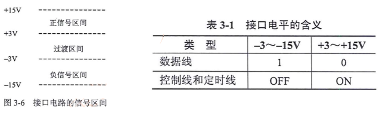

##### 3.1.5 功能特性

- 对接口连线的功能给出明确定义，RSR-232-C 采用的标准是 ==V.24==


#### 3.2 流量与差错控制

流量控制：协调发送站和接受站工作步调，避免发送速度过快，接受站处理不过来

- X.25 TCP

差错控制：检测和纠正传输错误的机制

- 检错码：CRC；纠错码：海明码

##### 3.2.1 流量控制-停等协议

- 工作原理∶发送站发一帧，收到应答信号后再发送下一帧，接收站每收到一帧后回送一个应答信号（ACK)，表示愿意接收下一帧，如果接收站不应答，发送站必须等待。

- ==$TFA=2t_p+t_f$==  tp 路上传送时间(路上跑的时间)， tf 发送时间(排队上车的时间)


##### 3.2.2 流量控制-滑动窗口

- 滑动窗口协议主要思想是︰==允许连续发送多个帧而无须等待应答==
- 如图假设站$S_1$和$S_2$通过全双工链路连接，$S_2$ 维持能容纳6个帧的缓冲区（$W_收=6$）
- 这样$S_1$就可以连续发送6个帧而不必等待应答信号（$W_发=6$）


##### 3.2.3 差错控制


###### 停等 ARQ 协议

- 停等ARQ协议是停等流控技术和自动请求重发技术的结合。
- 发送站发出一帧后必须等待应答信号，收到肯定应答信号 ACK 后继续发送下一帧；收到否定应答信号 NAK 后重发该帧；若在一定的时间内没有收到应答信号也必须重发。


###### 选择重发 ARQ 协议 vs 后退 N 帧 ARQ 协议

- 选择重发 ARQ : 重传特定的某一帧 $W_发 = W_收 \leqslant 2^{K-1}$
- 后退 N 帧 ARQ ：重传此帧和后续的 N 帧  $W_发 = W_收 \leqslant 2^K-1$
- **选上退下** ； k 为帧编号的位数


###### HDLC

- HDLC (High Level Data Link Control，高级数据链路控制) 
- 是一种面向位（比特)的数据链路层控制协议
- 通常使用CRC-16、CRC-32校验，帧边界 "01111110"


##### 3.2.4 X.25 公共数据网

- X.25分为三个协议层，即==物理层、链路层和分组层==，分别对应OSI模型低三层
- X.25是一种分组交换技术，面向连接，建立虚链路
- X.25支持==差错控制和流量控制==，传输速率：64kbps

##### 3.2.5 帧中继 FR （Frame Rlay）

- 帧中继在第二层建立虚链路，提供==虚链路==服务，本地标识 DLCI
- 基于分组交换的透明传输，可提供==面向连接==的服务
- ==只做检错和拥塞控制，没有流控和重传机制，开销很少==
- 既可以按需要提供带宽，也可以应对突发的数据传输 （CIR：承诺速率，EIR: 扩展速率）
- **帧长可变**，长度可达1600-4096字节，可以承载各种局域网的数据帧
- 可以达到很高的速率，==2-45Mbps==
- 不适合对延迟敏感的应用(语音、视频)
- 数据的丢失依赖于运营商对虚电路的配置
- 不保障可靠的提交


#### 3.3 ISDN 和 ATM

- ISDN 综合数字业务网，目的是以数字系统代替模拟电话系统，把音频、视频、数据业务放在一个网上统一传输
- 分为 窄带ISDN 和 宽带ISDN，窄带ISDN 提供两种用户接口
- 基本速率 BRI = 2B+D = ==144Kbps==
- 基群速率 PRI = 30B+D = ==2.048M==
- 宽带ISDN，即ATM
- ATM是==信元交换==，信元为==53字节==固定长度
- ATM依然是以虚链路提供面向连接的服务
- ATM典型速率为==150M==

#### 3.4 总结

- RSR 232 接口物理特性 （偶尔考）
- 数据链路层的差错控制技术（选上退下，选一退多）
- HDLC 协议 （面向位、数据链路层、同步、帧定界符）
- ==FR协议==（面向连接、DLCI标识虚电路、数据链路层、可突发、有拥塞控制、无滑动窗口流量控制，有错误检测无重传）
- ISDN 基础（BRI 和 PRI 接口）
- ATM （面向连接、虚电路、4类业务）


## 四、局域网和城域网

#### 4.1 CSMA/CD

- 对总线型、星型和树型拓扑访问控制协议是CSMA/CD (Carrier Sense Multiple Access/Collision Detection) 。
- CSMA基本原理：发送数据之前，先监听信道上是否有人在发送。若有，说明信道正忙，否则说明信道是空闲的，然后根据预定的策略决定∶
  1. 若信道空闲，是否立即发送。
  2. 若信道忙，是否继续监听。
- 如果连续发生==16次==碰撞后，认为网络繁忙有问题，不再尝试发送。

##### 4.1.1 CSMA/CD 三种监听算法


1. 非坚持型监听算法：后退随机时间

​			由于随机时延后退，从而==减少了冲突的概率==。问题是因为后退而使信道闲置一段时间，这使==信道的利用率降低==，而且==增加了发送时延==。

2. 1-坚持型监听算法：继续监听，不等待

   有利于抢占信道，减少信道空闲时间。但是，多个站同时都在监听信道时必然会发生冲突。
   ==冲突概率和利用率都高（双高)==

3. P-坚持型监听算法

​		若信道空闲，以概率 P 发送，以概率（1-P）延迟一个时间单位，P 大小可调整。

#### 4.2 冲突检测原理

载波监听只能减小冲突的概率，不能完全避免冲突。当两个帧发生冲突后，若继续发送，将会浪费网络带宽。为了改进带宽利用率，发送站应采取边发边听的冲突检测方法，即︰

1. 发送期间同时接收，并把接收的数据与站中存储的数据进行比较。
2. 若比较结果一致，说明没有冲突，重复 1 。
3. 若比较结果不一致，说明发生了冲突，立即停止发送，并发送一个==简短的干扰信号==(Jamming)，使所有站都停止发送。
4. 发送 Jamming 信号后，==等待一段随机长的时间==，重新监听，再试着发送。

#### 4.3 最小帧长计算

- 最小帧长：$L_{min} = 2R \times \frac {d}{v}$
- R 为网络数据速率，d 为最大距离，v 为传播速度
- 不冲突：发送时间 > 正常传送 + 返回确认时间
- $\frac{L}{R} > 2 \times \frac{d}{v}$ 推出最小帧长公式


#### 4.4 以太网帧结构


- 前面 7 + 1 字段用于时钟同步，不算入帧长
- 数据 46-1500 字节，不够至少填充到 46 字节
- 校验位 4 字节，CRC循环冗余校验 32 位
- 最小帧长64字节：6+6+2+46+4=64
- 最大帧长1518字节   6+6+2+1500+4=1518

##### 4.4.1 802.3 以太网物理层规范

- 物理介质命名规范	==<传输速率Mbps><信号方式><最大传输距离（百米）或介质类型>==


##### 4.4.2 802.3u 快速以太网 100M


##### 4.4.3 千兆以太网

- 两个标准 802.3z 和 ==802.3ab ( 1000BASE-T )==，千兆需要==4对==双绞线，达到100米传输
- 1000BASE-LX 标准可以使用==单模和多模光纤==传输
- 千兆以太网编码方法：4B/5B 或 8B/9B


##### 4.4.4 万兆以太网

- 万兆以太网标准：==IEEE 802.3ae==，支持 10G 速率，可用光纤或者双绞线传输
- 万兆以太网基本应用于点对点线路，==不再共享带宽，没有冲突检测==，载波监听和多路访问技术也不再重要。千兆以太网和万兆以太网采用与传统以太网同样的帧结构。


#### 4.5 虚拟局域网 VLAN

- 虚拟局域网 （Virtual Local Area Network ，VLAN）
- 根据管理功能、组织机构或应用类型对交换局域网进行分段而形成的逻辑网络
- 虚拟局域网工作站==可以不属于同一物理网段==，任何交换端口都可以分配给某个VLAN，属于同一VLAN的所有端口构成一个==广播域==。
- 不同VLAN通信必须经过==三层设备==（路由器、三层交换机、防火墙等)
- 冲突域和广播域，一个中继线和集线器是一个冲突域，一个VLAN为一个广播域，交换机的一个接口为一个冲突域
- VLAN划分︰基于端口、基于MAC、基于策略、基于协议

##### 4.5.1 交换机 VLAN 划分

- 静态划分 VLAN：基于交换机端口
- 动态划分 VLAN：基于 MAC 地址、基于策略、基于网络层协议、基于网络层地址


##### 4.5.2 VLAN 的作用

1. ==控制网络流量==。一个VLAN内部的通信（包括广播通信）不会转发到其他VLAN中去，从而有助于控制广播风暴，减小冲突域，提高网络带宽的利用率。
2. ==提高网络的安全性==。可以通过配置 VLAN 之间的路由来提供广播过滤、安全和流星控制等功能。不同VLAN之间的通信受到限制，提高了企业网络的安全性。
3. ==灵活的网络管理==。VLAN 机制使得工作组可以突破地理位置的限制而根据管理功能来划分。如果根据 MAC 地址划分 VLAN，用户可以在任何地方接入交换网络，实现移动办公。

#### 4.6 交换机端口类型

- ==Access 接口== ： 只能传送单个 VLAN 数据，一般用于连接 PC/摄像头等终端
- ==Trunk 接口==：能传达多个 VLAN 数据，一般用于交换机互联

- Hybrid接口：混合接口，包含Access和Trunk属性
- QinQ：双层标签，一般用于运营商城域网

> 添加和删除 VLAN 标记的过程是由交换机专用硬件自动实现的，处理速度很快，不会引入太大延迟


#### 4.7 802.1Q ***


#### 4.8 STP 生成树协议

##### 4.8.1 技术背景（略）

##### 4.8.2 STP 基本概念


- 采用生成树（Spanning-tree）技术，能够在网络中存在二层环路时，通过==逻辑阻塞==（Block）特定端口，从而==打破环路==，并且在网络出现拓扑变更时及时收敛，保障==网络冗余性==。

**当网络出现故障时**


在网络出现拓扑变更时及时收敛，保障==网络冗余性==。

##### 4.8.3 STP 的操作步骤

1. 确定一个根桥（Root Bridge )【选优先级和MAC地址最小的桥】
2. 确定其他网桥的根端口（Root Port)【非根桥的端口到根桥最近的端口】
3. 每个段选择一个指定端口（Designated Port )【先选指定桥，指定桥上为指定端口】
4. 选出非指定端口（NonDesignated Port）


##### 4.8.4 桥ID （Bridge ID）

- 桥ID一共==8个字节==，由2个字节优先级和6个字节的MAC地址构成
- 桥优先级默认为32768，可以手工修改
- MAC 地址为交换机背板 MAC


##### 4.8.5 路径开销 （Path Cost）

- 路径开销是一个端口量，是 STP/RSTP 协议用于选择链路的参考值。
- 端口路径开销的默认值及取值范围由选定的路径开销算法决定，路径开销与端口带宽成反比。
- 华为设备路径开销标准有: 802.1d-1998、802.1t及私有的 legacy，默认为 802.1t 标准。


##### 4.8.6 几种生成树协议

- 生成树协议:802.1d STP（拓扑收敛需要30-50s）
- 快速生成树协议802.1w RSTP（6s内完成收敛）
- 多生成树协议802.1s MSTP（实现多个VLAN负载均衡）

#### 4.9 城域网

- E-LAN基本技术是802.1Q的VLAN帧标记，双层标记，打了==两层VLAN标签==，这种技术被定义为==IEEE 802.1ad==，也称为==QinQ==技术。
- QinQ实际是把用户VLAN嵌套在城域以太网的VLAN中传送
- 另一种城域网技术IEEE802.1ah，也成为PBB，也叫==MAC-IN-MAC==技术


#### 4.10 总结

- 802 标准：802.3 以太网 802.11 无线局域网 WLAN
- CSMA/CD：以太网介质访问控制协议，原理：先听后发，边听边发，若有冲突，立即停止
- 监听算法∶非坚持型，1-坚持型（双高)，P-坚持型
- 最小帧长：$L_{min} = 2R \times \frac {d}{v}$
- MAC帧结构，以太网传输介质，VLAN技术，STP计算过程

## 五、无线局域网

#### 5.1 802.11 标准


#### 5.2 WLAN 网络分类

- 基础设施网络（Infrastructure Networking） 通过无线接入点AP接入
- 特殊网络（Ad Hoc Networking） 军用/寝室打游戏


#### 5.3 WLAN 通信技术

- 无线网主要使用三种通信技术：==红外线、扩展频谱和窄带微波技术==
- 扩展频谱通信︰将信号散步到更宽的带宽上以==减少发送阻塞==和干扰的机会
- WLAN 主要使用==扩展频谱技术==：频率跳动扩频FHSS和 直接序列扩展频谱DSSS


#### 5.4 WLAN 频谱介绍

##### 5.4.1 ISM

ISM频段，此频段主要是开放给工业、科学、医学三个主要机构使用，该频段是依据美国联邦通讯委员会（FCC）所定义出来，并没有所谓使用授权的限制。


##### 5.4.2 不重叠的信道


- 2.4 G 频段：13 个信道，3 个不重叠信道 （1，6，11）
- 5.8 G 频段：12个信道，5 个不重叠信道
- WLAN 不重叠信道有 3 + 5 = 8 个

##### 5.4.3 信道重用与 AP 部署


##### 5.4.4 WLAN 频段与信道

- WLAN技术被 802.11b/g/n 定义工作在 2.4GHz 的频段中，在其中 2.4GHz 频段被划分为 14 个交叠的、错列的 20MHz 无线载波信道，它们的中心频率间隔分别为 5MHz 。802.11a/n/ac 工作在有更多信道的5GHz频段中。
- 信道在不同的国家的使用会根据该国家法规而有所不同。
  - 在美国，FCC法规仅允许信道1到11被使用
  - 在欧洲，允许信道1到13被使用
  - 在日本，1到14信道被允许使用
  - 在中国，1到13信道被允许使用

##### 5.4.5 2.4 GHz 频段

- 支持802.11b/g/n
- 802.11b 每个信道需要占用 22MHz
- 802.11g、802.11n 每个信道需要占用 20MHz
- 802.11n 完全兼容802.11b 和802.11g


##### 5.4.6 5GHz 中心频率和信道编号


##### 5.4.7 中国的 5.8GHz 信道

- 在中国，5.8GHz频段内有5个非重叠信道，分别为：149，153，157，161，165


#### 5.5 802.11 MAC 层

802.11 标准为 MAC 子层定义了 3 种访问控制机制

- CSMA/CA分布式协调功能︰大家争用访问
- RST/CTS信道预约︰要发生先打报告，其他终端记录信道占用时间
- PCF点协调功能∶由AP集中轮询所以终端，将发送权限轮流交给各个终端，类似令牌


> 为什么不用 CSMA/CD：隐藏节点问题

#### 5.6 802.11 三种帧间间隔

- IFS（分布式协调IFS）：最长的IFS，==优先级最低==，用千异步帧竞争访问的时延。
- PIFS（点协调IFS）：中等长度的IFS，==优先级居中==，在PCF操作中使用。
- SIFS（短IFS）：最短的IFS，==优先级最高==，用千需要立即响应的操作。

#### 5.7 移动 Ad Hoc 网络

- 802.11 定义 AD Hoc 网络是由无线移动节点组成的对等网，无需网络基础设施的支持，每个节点既是主机，又是路由器，是一种 MANNET （Mobile Ad Hoc Network）
- 网络 Ad Hoc 是拉丁语，具有“即兴，临时”的意思


MANNET 网络特点：

- 网络拓扑结构动态变化的，不能使用==传统路由协议==
- 无线信道提供的带宽较小，信号衰落和噪声干扰的影响却很大
- 无线终端携带的电源能量有限
- 容易招致网络窃听、欺骗、拒绝服务等恶意攻击的威胁

#### 5.8 WLAN 安全

1. SSID访问控制∶隐藏SSID，让不知道的人搜索不到
2. 物理地址过滤：在无线路由器设置 MAC 地址黑白名单
3. WEP认证和加密：==PSK预共享密钥认证，RC4加密==
4. WPA （802.11i 草案）
   - 认证：802.1x 加密：RC4 **（增强）** + TKIP （临时密钥完整协议，动态改变密钥）完整性认证和防重放攻击
5. WP2 （802.11i）
   - 针对 WPA 的优化，加密协议：==基于 AES 的 CCMP==

#### 5.9 章节总结

- 无线局域网扩频技术 FHSS/DSSS
- 无线频谱与信道 2.4G/5G    中国分别有 3 个和 5 个不重叠信道
- CSMA/CA，隐藏节点，MANET
- 无线安全：WEP、WPA、WPA2 AES/TPIK/CCMP


## 六、网络互连与互联网

#### 6.1 OSI 的优点

- 将网络的通信过程划分为小一些、简单一些的部件，有助于各个部件的开发、设计和故障排除
- 通过网络组件的标准，允许多个供应商进行开发
- 通过定义在模型的每一层实现功能，鼓励产业的标准化允许各种类型的网络硬件和软件互相通信
- 防止对某一层所做的改动影响到其他的层，这样有利于开发

#### 6.2 双绞线线序


#### 6.3 网络演进总结

1. 交换机前身：中继器、集线器
2. 二层交换机：基于MAC转发
3. 三层交换机：集成路由功能
4. 多业务交换机：FW/AC/LB/WS
   - 可编程交换机：SDN
   - SDN部署：Google、AT&T
   - CISCO N9K : ACI(Application Centric Infrastructure)
     以应用为中心的基础设施
   - HW127/128∶敏捷网络，敏捷开发H3C 125、锐捷N18K∶都支持SDN

#### 6.4 数通设备总结


#### 6.5 TCP/IP 参考模型


#### 6.6 协议簇

- 传输控制协议/因特网协议（TCP/IP）簇是由美国国防部（DoD）所创建的，主要用来确保数据的完整性及在毁灭性战争中维持通信。
- 是由一组不同功能的协议组合在一起构成的协议簇
- TCP/IP 是当今数据网络的基础

#### 6.7 以太网

##### 6.7.1 以太网拓扑


##### 6.7.2 双工模式


- 半双工模式下，共享物理介质的通信双方必须采用CSMA/CD机制来避免冲突。全双工模式下，通信双方可以同时实现双向通信，这种模式不会产生冲突，不需要使用CSMA/CD机制。
- 同一物理链路上相连的两台设备的双工模式必须保持一致。(厂商对接案例)
- 案例分析：对讲机是半双工的典型例子，电话网络是典型的全双工例子。

##### 6.7.3 冲突域 冲突检测技术 CSMA/CD


CSMA/CD 原理如下：

先听先发，边听边发；

一旦冲突，立即停止；

等待时机，然后再发；

注：“听” 即监听、检测；“发” 即发送数据

> 冲突域与广播域的思考：集线器是一个冲突域，交换机的一个接口是一个冲突域；一个 VLAN 是一个广播域


#### 6.8 以太网帧结构

##### 6.8.1 帧格式


##### 6.8.2 Ethernet_II

- Ethernet_II ： Xerox 与 DEC、Intel 在 1982 年指定的 以太网标准帧格式


- Ethernet_II 帧类型值 大于等于 1536 （0x0600）

- 以太网数据帧的长度在 64 -1518 字节之间

##### 6.8.3 IEEE 802.3 帧格式

- IEEE 在 1985 年公布的 Ethernet 802.3 的 SNAP 版本以太网帧格式


- IEEE 802.3 帧 长度字段 小于等于 1500 （0x05DC）
- 总长度：64-1518B


##### 6.8.4 数据帧传输


- 数据链路层基于 MAC 地址进行帧的转发

#### 6.9 以太网地址 MAC 地址 / 硬件地址


- 华为产品 MAC 地址 前 3 个字节 ： 0x00E0FC
- 思科： 0x0000.c 施乐： 全 0

##### 6.9.1 单播


MAC地址第八位是 0

##### 6.9.2 广播


广播帧的目的 MAC 地址为十六进制的 FF:FF:FF:FF:FF:FF

所有收到广播帧的主机都会处理这个帧。广播方式会产生大量流量，导致带宽利用率降低，进而影响整个网络的性能


##### 6.9.3 组播


组播的MAC地址第八位是1

组播比广播更加高效。组播转发可以理解为选择性的广播，主机侦听特定组播地址，接收并处理目的MAC地址为该组播MAC地址的帧。


#### 6. 10 数据帧的发送与接收


当主机接收到的数据帧所包含的目的MAC地址是自己时，会把以太网封装剥掉后送往上层协议。

#### 6.11 以太网小结

1. 网络设备如何确定以太网数据帧的上层协议？

   以太网帧中包含一个 Type 字段，表示帧中的数据应该发送到上层哪个协议处理。比如，IP 协议对应的 Type 值为0x0800，ARP 协议对应的 Type 值为Ox0806。

2. 终端设备接收到数据帧时，会如何处理？

   主机检查帧头中的 目的 MAC 地址，如果 目的 MAC 地址不是 本机 MAC 地址，也不是本机侦听的组播或 广播 MAC 地址，则主机会丢弃收到的帧。
   
   如果 目的 MAC 地址是 本机 MAC 地址，则接收该帧，检查帧校验序列（FCS）字段，并与本机计算的值对比来确定帧在传输过程中是否保持了完整性。
   
   如果检查通过，就会剥离帧头和帧尾，然后根据帧头中的 Type 字段来决定把数据发送到哪个上层协议进行后续处理。

#### 6.12 IP 协议

##### 6.12.1 IP 报文格式

###### IPv4


- 生存期（TTL） 用于设置一个数据包可经过的路由器数量上限，每经过一台路由器就会减 1
- 协议字段包含一个数字，标识有效载荷部分的数据类型，1 = ICMP；16 = TCP；17 = UDP

###### IPv6


- 跳数限制：与 TTL 相同

#### 6.13 网关


- 网关用于转发来自不同网段之间的数据包。

#### 6.14 IP 地址

##### 6.14.1 什么是 IP 地址

1. 在 IP 网络中，通信节点需要有一个唯一的 IP 地址
2. IP 地址 用于 IP 报文的寻址以及标识一个节点
3. IPv4 地址一共 32 bits，使用点分十进制形式标识；


| 十进制 | 192.     | 168.     | 10.      | 1        |
| ------ | -------- | -------- | -------- | -------- |
| 二进制 | 11000000 | 10101000 | 00001010 | 00000001 |


##### 6.14.2 IP 地址类别


##### 6.14.3 网络掩码

- 网络掩码与IP地址搭配使用，用于描述一个IP地址中的网络部分及主机部分。
- 网络掩码 32 bits，与 32 bits的IP地址一一对应，掩码中为 1 的位对应IP地址中的网络位，掩码中为 0 的位对应IP地址中的主机位。


默认网络掩码：

- A 类：255.0.0.0
- B 类：255.255.0.0
- C 类：255.255.255.0

##### 6.14.4 IP 网络通信类型

1. 单播 Unicast
2. 广播 Broadcast
3. 组播 Multicast

##### 6.14.5 IP 地址类型

- 网络地址∶指代网络的地址。在网络的IPv4地址范围内，最小地址保留为网络地址。此地址的主机部分的每个主机位均为 0。
- 广播地址∶用于向网络中的所有主机发送数据的特殊地址。广播地址使用该网络范围内的最大地址。即主机部分的各比特位全部为 1 的地址。
- 主机地址:可分配给网络中终端设备的地址。


  #### 6.15 VLSM 划分子网

> 标准 ABC 类网络问题： IP 地址空间极大浪费；一个广播域中 PC 数量过于庞大，网络可能被广播报文消耗大量资源。


子网数量：$2^m$ 向主机位借位后产生的子网个数，m 位 所借的位数

每个子网主机数量：$2^n-2$ 向主机位借位后的每个子网中可用 IP 数，n 为原主机位剔除被借位后的剩余位数；-2的原因：每个子网的网络号和广播号不可用

#### 6.16 公有IP、私有 IP

IPv4 地址空间中有一部分特殊的地址，成为私有 IP 地址，私有IP地址不能直接访可公网( lnternet )的IP，只能在本地使用。

| 私有IP地址空间 | 地址范围                            |
| -------------- | ----------------------------------- |
| 10.0.0.0/8     | 10.0.0.0 到 10.255.255.255 A1       |
| 172.16.0.0/12  | 172.16.0.0 到 172.16.255.255 B16    |
| 192.168.0.0/16 | 192.168.0.0 到 192.168.255.255 C256 |

#### 6.17 CIDR 无类域路由

CIDR : 无类域间路由，超网 Classless Inter-Domain Routing

工作原理（路由聚合）：


做法：转换成二进制，写出==相同的掩码位数==，聚合后的 IP 则是首个 IP 


优点：

1. 减小骨干路由器表项压力
2. 缓解 IP 地址 耗尽


#### 6.18 ICMP 协议

> Internet控制消息协议ICMP (Internet Control Message Protocol）是网络层的一个重要协议。ICMP协议用来在网络设备间传递各种差错和控制信息，并对于收集各种网络信息、诊断和排除各种网络故障等方面起着至关重要的作用。


- ICMP 用来传递差错、控制、查询等信息

##### 6.18.1 ICMP 重定向


1. 主机A希望发送报文到服务器A，于是根据配置的默认网关地址向网关RTB 发送报文。

2. 网关RTB 收到报文后，检查报文信息，发现报文应该转发到与源主机在同一网段的另一个网关设备RTA，因为此转发路径是更优的路径。
3. RTB 会向主机发送一个 Redirect 消息，通知主机直接向另一个网关 RTA 发送该报文。
4. 主机收到 Redirect 消息后，会向RTA发送报文，然后RTA会将该报文再转发给服务器A。

##### 6.18.2 ICMP 差错检测


ICMP Echo 消息常用于诊断源和目的地之间的网络连通性，同时还可以提供其他信息，如报文往返时间等。

##### 6.18.3 ICMP 错误报告


##### 6.18.4 ICMP 数据包格式


##### 6.18.5 ICMP 消息类型和编码类型


##### 6.18.6 ICMP 典型应用

1. Ping
2. tracert

##### 6.18.7 ICMP 小结

1. Ping 使用的是哪两类 ICMP 消息？

​	Ping利用ICMP Echo请求消息(Type值为8 ）来发起检测目的可达性。目的端收到ICMP Echo请求消息后，根据IP报文头中的源地址向源端发送ICMP Echo回复消息（Type值为0)。

2. 当网络设备收到 TTL 值 为 0 的 IP 报文时，会如何操作

​	如果IP数据包在到达目的地之前TTL值已经降为0，则收到IP数据包的网络设备会丢弃该数据包，并向源端发送ICMP消息通知源端TTL超时。

#### 6.19 ARP 协议


ARP 老化时间：因系统而异

##### 6.19.1 代理 ARP


位于不同网络的网络设备在不配置网关的情况下，可以通过 ARP 代理实现相互通信

##### 6.19.2 免费 ARP


免费ARP 用于探测 IP 地址是否冲突

##### 6.19.3 小结

1. 网络设备在什么情况下会发送 ARP Request?

​		源设备在发送数据给目的设备前，会首先查看自身的ARP缓存，查找ARP缓存中是否存在目的设备的IP地址和MAC地址的映射。如果存在则直接使用，如果不存在则会发送ARP Request。

2. 网络设备在什么时候会产生免费 ARP

​		当网络上的一个设备被分配了IP地址或者IP地址发生变更后，可以通过免费ARP来检查IP地址是否冲突。

#### 6.20 传输层协议 TCP、UDP

- TCP（传输控制协议）属于可靠面向连接的网络协议
- UDP（用户数据报协议）属于不可靠面向无连接的网络协议

##### 6.20.1 TCP 报文格式


##### 6.20.2 UDP 报文格式


- 与 TCP 相比，做了很大精简，省略诸多控制字段

##### 6.20.3 TCP/UDP 端口号


- 源端口随机分配，目标端口使用知名端口
- 应用客户端使用的源端口一般为系统中未使用的且大于 1024
- 目的端口号为服务器端应用服务器的进程，如 telnet:23

##### 6.20.4 TCP 序列号及确认号


##### 6.20.5 TCP 三次握手建立连接


##### 6.20.6 TCP 四次握手断开连接


##### 6.20.7 TCP 窗口机制


#### 6.21 数据封装与转发全过程（略）

#### 6.21 华为命令行

##### 6.21.1 基本命令结构

- 每条命令都有独特的格式或语法结构，并在相应的试图下配置
- 常规命令语法为 关键字 + 参数


##### 6.21.2 命令视图


##### 6.21.3 命令等级

| 用户等级 |  名称  |                     操作                     |
| :------: | :----: | :------------------------------------------: |
|    0     | 访问级 | 诊断/查看（ping、tracert、telnet、display）  |
|    1     | 监控级 |             display 内容稍微丰富             |
|    2     | 配置级 |    网络服务，包括路由，各个网络层次的命令    |
|  3 - 15  | 管理级 | 系统管理层面（升级系统/上传下载文件，debug） |


```bash
<Huawei> system-view # 进入系统视图
[Huawei] sysname Demo # 配置设备名称
[Demo] header login information "Welcome to Huawei" # 设置用户登录前显示的标题信息
[Demo] header shell information "Welcome to Huawei" # 设置用户登录后显示的标题信息
[Demo] command-privilege level 3 view user save # 修改命令级别，只有 3 级的用户才能执行 save 命令
<Demo> clock timezone BJ add 08:00:00 # 设置所在时区
<Demo> clock datatime hh:mm:ss year-mm-dd # 设置当前时间
<Demo> display clock # 显示当前时间
<Demo> display current-configuration # 显示当前配置
<Demo> save # 将当前配置保存到目录下 "vrpcfg.zip"
<Demo> startup saved-configuration vrpcfg.zip # 下次启动时加载 "vrpcfg.zip"
Info: Succeeded in setting the file for booting system
<Demo> reset saved-configuration # 删除启动配置文件（也可以直接delete）
Clear the configuration in the device successfully.
<Demo> compare configuration [filename] # 比较当前配置与保存的配置

[Huawei] aaa
[00]
```


```bash
<Huawei>sy
Enter system view, return user view with Ctrl+Z.
[Huawei]sysname R1
[R1]interface g0/0/0
[R1-GigabitEthernet0/0/0]display int brief
PHY: Physical
*down: administratively down
(l): loopback
(s): spoofing
(b): BFD down
^down: standby
(e): ETHOAM down
(d): Dampening Suppressed
InUti/OutUti: input utility/output utility
Interface                   PHY   Protocol InUti OutUti   inErrors  outErrors
Ethernet0/0/0               down  down        0%     0%          0          0
Ethernet0/0/1               down  down        0%     0%          0          0
Ethernet0/0/2               down  down        0%     0%          0          0
Ethernet0/0/3               down  down        0%     0%          0          0
Ethernet0/0/4               down  down        0%     0%          0          0
Ethernet0/0/5               down  down        0%     0%          0          0
Ethernet0/0/6               down  down        0%     0%          0          0
Ethernet0/0/7               down  down        0%     0%          0          0
GigabitEthernet0/0/0        up    down        0%     0%          0          0
GigabitEthernet0/0/1        down  down        0%     0%          0          0
NULL0                       up    up(s)       0%     0%          0          0
[R1-GigabitEthernet0/0/0]ip add 12.1.1.1 24
May 20 2022 17:41:58-08:00 R1 %%01IFNET/4/LINK_STATE(l)[0]:The line protocol IP 
on the interface GigabitEthernet0/0/0 has entered the UP state. 
[R1] aaa
[R1-aaa]local-user admin123 privilege level 0 password cipher admin123
Info: Add a new user.
[R1-aaa]local-user admin123 service-type telnet
[R1-aaa]q
[R1]user-int vty 0 4
[R1-ui-vty0-4]authentication-mode aaa
[R1-ui-vty0-4]q
[R1]q
<R1>telnet 12.1.1.2
  Press CTRL_] to quit telnet mode
  Trying 12.1.1.2 ...
  Error: Can't connect to the remote host
<R1>telnet 12.1.1.1
  Press CTRL_] to quit telnet mode
  Trying 12.1.1.1 ...
  Connected to 12.1.1.1 ...

Login authentication


Username:admin123
Password:
<R1>
```


#### 6.22 动态路由协议分类

#### 

#### 6.23 链路状态路由协议

使用距离矢量路由协议的路由器并不了解网络的拓扑。该路由器只知道︰

- 自身与目的网络之间的==距离==
- 应该往哪个==方向==或哪个接口转发数据包


**特点**：周期性更新（广播）整张路由表


##### 6.23.1 信息交换过程

路由器初始启动

- 最初的网络发现：直连路由写入路由表


- 初次路由信息交换


- 再次路由信息交换


路由器完成收敛的标志

- 所有路由表包含相同网络可达性信息
- 网络（路由）进入一个稳态

路由器继续交换路由信息

- 当无新路由信息被更新时收敛结束
- 网络在达到收敛前无法完全正常工作

##### 6.23.2 RIP 路由的度量值

RIP以跳数（Hops）作为度量值，虽然简单，但事实上不科学，如下图：


##### 6.23.3 路由协议优先级


##### 6.23.4 路由环路的产生

- 路由器C `10.1.4.0/24` 出现故障


- RIP 三个计时器：Hello 30s、Dead 180s、垃圾计时器 120s

  180s没有收到更新，标记为无效路由；再过120s没收到更新，删表

- 针对路由环路的理解

##### 6.23.5 防环机制

- 定义最大度量以防止计数至无穷大
- 水平分割
  路由中毒
- 毒性逆转
- 抑制计时器
- 触发更新

##### 6.23.6 环路避免


##### 6.23.7 RIP 协议概述

- RIP（Routing Information Protocols，路由信息协议）应用较早、使用较为普遍的内部网关协议
- 适用于小型网络，是典型的距离矢量路由协议
- RIP基于UDP，端口`520`
- 华为设备上路由优先级为`100`

#### 6.24 OSPF

##### 6.24.1 LSAs 泛洪


##### 6.24.2 构建 LSDB


##### 6.24.3 SPF 计算


##### 6.24.4 维护路由表


##### 6.24.5 OSPF 简介

- Open Shortest Path First，开放式最短路径优先协议
- OSPF是一种链路状态路由协议，在RFC 2328中描述
- Open 意味着公有，任何厂商都能支撑OSPF，目前业内使用最广泛的IGP
- 在华为设备上，OSPF协议优先级 Internal 10，External 150
- 路由器之间交互的是链路状态信息，而不是直接交互路由
- 每台OSPF路由器都知晓网络拓扑结构
- 采用SPF算法计算达到目的地的最短路径
- 支持VLSM，支持手工路由汇总

##### 6.24.6 OSPF 基本特点

- 适应范围广：支持各种规模的网络。
- 快速收敛：在网络的拓扑结构发生变化后立即发送更新报文，使这一变化在自治系统中同步。
- 无自环：使用SPF最短路径树算法进行路由计算，不会产生环路。
- 区域划分：允许网络被划分成区域来管理，链路状态数据库仅需和区域内其他路由器保持一致。==减小对路由器内存和CPU的消耗==。同时区域间传送的路由信息减小，==降低网络带宽占用==。

##### 6.24.7 RouterID 


- Router Identifier，路由器标示符，用于在一个OSPF域中唯一地标识一台路由器，每台运行OSPF的路由器具备Router-ID。
- 相同 OSPF 域内，禁止出现两台路由器有相同 RouterID 。
- OSPF Router-ID 可以通过手工配置的方式，或使用自动获取的方式。自动选取的机制是∶若路由器存在 loopback 接口，则选最大的 loopback 接口IP地址，若无则选活跃的物理接口中IP地址最大的作为 RouterID（实际项目手工配置）。
- Router-ID 值遵循稳定第一的原则，不会抢占。如果需要更新 RouterID：
  - 重配地址：`Undo ip address`
  - 重启进程：`Reset ospf process`

##### 6.24.8 OSPF Cost 

- OSPF使用Cost“开销”作为路由度量值。
- OSPF接口 cost=100M/接口带宽，其中100M为OSPF参考带宽（reference-bandwidth）,可修改。
- 每一个激活OSPF的接口都有一个cost值。
- 一条OSPF路由的cost由该路由从起源一路到达本地的所有==入接口cost值的总和==。


##### 6.24.9 OSPF 三张表


##### 6.24.10 OSPF 报文类型

- Hello    建立和维护OSPF邻居关系
- DBD    链路状态数据库描述信息（描述LSDB中的LSA头部信息）
- LSR     链路状态请求，向OSPF邻居请求链路状态信息
- LSU     链路状态更新（包含一条或多条LSA）
- LSAck   多LSU中的LSA进行确认

##### 6.24.11 OSPF 邻居关系建立


##### 6.24.12 OSPF 网络类型

- OSPF支持的网络类型：
- 点到点网络
- 广播型多路访问网络
- 非广播型多路访问（NBMA）网络
- P2MP网络


常用链路层协议对应的默认网络类型：


##### 6.24.13 DR   BDR


- 为减小多路访问网络中的OSPF流量，OSPF会在每一个Ma网络（多路访问网络）选举一个指定路由器（DR）和一个备用指定路由器（BDR）。
  - DR选举规则：最高OSPF接口优先级拥有者被选做 DR ，如果优先级相等（默认为1），具有最高 OSPF RouterID 的路由器被选举为DR，并且 DR 具有非抢占性。
- 指定路由器（DR）：负责使用变化新消息更新其他OSPF路由器（DRother）
- 备用指定路由器（BDR）：监控DR状态，并在当前DR发生故障后接替其角色


- 注意OSPF为“接口敏感协议”，DR及BDR的身份状态是基于OSPF接口的
- Ma 网络中，所有 DRother 路由器均只与DR和BDR建立邻接关系， DRother 间不建立邻接关系。
- 如此一来，Ma 网络中OSPF需要维护的邻居关系大幅减少：$M = (n - 2) \times 2 + 1$
- LSA 泛洪问题得到缓解

##### 6.12.14 LSA 泛洪


- 路由器R3用224.0.0.6通知DR及BDR，DR、BDR监听224.0.0.6这一组播地址
- DR向组播地址224.0.0.5发送更新以通知其他路由器，所有的OSPF路由器监听224.0.0.5
- 路由器收到链路变化后的LSU后，更新自己的LSDB，进行SPF重新计算，更新路由表

##### 6.12.15 OSPF 区域


单区域存在的问题

- LSA泛洪严重，OSPF路由器的负担很大
- 区域内部动荡会引起全网路由器的SPF计算
- LSDB庞大，资源消耗过多，设备性能下降，影响数据转发
- 每台路由器都需要维护的路由表越来越大，单区域内路由无法汇总


多区域获得的改进

- 减少了LSA洪泛范围，有效把拓扑变化控制在区域内，达到网络优化的目的
- 在区域边界可以做路由汇总，减小了路由表
- 充分利用OSPF特殊区域的扩展性，进一步减少LSA泛洪，从而优化路由
- 多区域提高了网络的扩展性，有利于组建大规模网络


- 所有非骨干区域必须与骨干区域直连。

  

##### 6.12.16 OSPF 路由器角色


##### 6.12.17 OSPF 的基本配置

- 创建 OSPF 进程，并指定 OSPF 进程号以及 RouterID

  `[Router] ospf [process-id|router-id router-id]`


- 在 area0 中宣告指定端口

```
[Router] area area-id
[Router] network ip-address wildcard-mask
```


- 通配符掩码 wildcard-mask
  通配符是一个用于决定哪些IP地址该精确匹配（0代表匹配）哪些地址位被忽略的32位数值。通常用于访问控制列表（ACL）、OSPF路由协议通告。


```
ospf 1 router-id 2.2.2.2
 area 0
  network 176.16.1.0 0.0.0.255
```


**单区域OSPF 配置实例**


**多区域OSPF 配置实例**


- R2（ASR） 配置如下

```
[R2] ospf 1 router-id 2.2.2.2[R2-ospf-1] area 0
[R2-ospf-1-area-0.0.0.0] network 192.168.12.0 0.0.0.255
[R2-ospf-1] area 1
[R2-ospf-1-area-0.0.0.1] network 192.168.23.0 0.0.0.255
```


**OSPF 查看与验证**

```
display ospf biref # 查看OSPF协议相关运行参数
display ospf peer # 查看OSPF 邻居表
display ospf lsdb # 查看LSDB表
display ospf routing # 查看OSPF路由
```

​	

**修改OSPF cost**


**修改OSPF DR 优先级**


#### 6.25 二层交换机


##### 6.25.1 主要功能

- 维护MAC地址表，MAC寻址

- 数据帧的转发及过滤

- 二层环路避免及冗余性支持

  

##### 6.25.2 MAC地址表


##### 6.25.3 交换机寻址过程

 


#### 6.26 VLAN

##### 6.26.1 为什么需要 VLAN


- 整台交换机所有端口均属于同一广播域
- 网络中的设备可能被大量的广播损耗资源
- 无法根据业务需求灵活规划网络结构


- VLAN（Virtual LAN）可以解决上述问题
- 通过将交换机端口加入特定VLAN，可以起到隔离广播的作用。


- 不同VLAN是不同广播域、不同网段
- 可根据业务需求灵活进行VLAN规划
- 不同的VLAN间无法进行二层互访

##### 6.26.2 VLAN 知识小结

- 一个VLAN中所有设备处于同一广播域内，不同的VLAN为不同的广播域，一个VLAN一般是一个IP网段，不同的VLAN规划到不同的IP网段；
- 不同的VLAN之间二层隔离，广播不能跨越VLAN传播，因此不同VLAN之间的设备无法进行二层通信，需通过三层设备实现互通;
- VLAN中成员关系多基于交换机的接口进行静态地分配，划分VLAN就是将交换机的接口添加到特定VLAN；
- VLAN工作于OSI参考模型的第二层，是二层交换机的一个非常根本的工作机制。

##### 6.26.3 VLAN 成员模式


- 静态VLAN：以手工的方式将接口加入特定的VLAN;
- 动态VLAN：根据接入到交换机的客户端的MAC地址等信息，动态地将交换机的接口添加到特定的VLAN。

##### 6.26.4 VLAN 端口分类

- Access 端口：一般用于连接主机的端口，Access 端口只能属于一个VLAN
- Trunk 端口：一般用于交换机之间连接的端口，trunk端口可以属于多个VLAN，可以接收和发送多个VLAN报文。
- Hybrid 端口：可以用于交换机之间连接，也可以用于接用户的计算机
  Hybrid 端口可以属于多个VLAN，可以接收和发送多个 VLAN 的报文。

##### 6.26.5 Access 接口


##### 6.26.6 Trunk 接口


- 当一条链路，需要承载多个VLAN信息的时候，需要使用trunk来实现
- Trunk 两端交换机需采用相同的干道协议
- 一般用于交换机之间或交换机与路由器直连互联

##### 6.26.7 802.1Q


##### 6.26.8 端口的缺省ID（PVID）

- 每个Access、Trunk、Hybrid、QinQ 类型的端口都可以配置一个缺省VLAN（PVID：PortDefault VLAN ID），表示端口所属的VLAN。
- 对于 Access 类型端口，PVID的数值表示当前端口所属VLAN。
- 对于 Trunk、Hybrid 类型端口，由于 Hybrid 类型端口和 Trunk 类型端口允许多个 VLAN 数据帧通过，也可以理解为这两种类型端口属于多个VLAN，所以需要配置PVID。
- PVID，缺省情况下为VLAN1。


##### 6.26.9 VLAN 基本配置

- 在交换机上创建VLAN，并进入VLAN视图

  `[Quidway] vlan 10 | vlan batch 10 20 30`

- （可选）在特定VLAN视图下修改VLAN的名字

  `[Quidway-vlan10] name TechVLAN`

- 为特定的vlan添加接口

  `[Quidway-vlan10] port GigabitEthernetO/0/1`

- 将特定的接口配置为access类型，并加入vlan

  ```
  [Quidway] interface gigabitEthernet0/0/1
  [Quidway-gigabitEthernet0/0/1] port link-type access
  [Quidway-gigabitEthernet0/0/1] port default vlan 10
  ```

##### 6.26.10 VLAN 实验

```
[sw1] vlan batch 10 20 # 批量创建 VLAN 10 20

# 将 GE0/0/1 配置为 access 类型，并加入 VLAN 10
[sw1]int g0/0/1
[sw1-GigabitEthernet0/0/1]port link-type access
[sw1-GigabitEthernet0/0/1]port default vlan 10

# 将 GE0/0/2 配置为 access 类型，并加入 VLAN 20
[sw1-GigabitEthernet0/0/1]int g0/0/2
[sw1-GigabitEthernet0/0/2]port link-type access
[sw1-GigabitEthernet0/0/2]port default vlan 20

# 将特定接口配置为 trunk 类型
[sw2-GigabitEthernet0/0/2]int g0/0/24
[sw2-GigabitEthernet0/0/24]port link-type trunk
# 在 接口中放行特定 VLAN
[sw2-GigabitEthernet0/0/24]port trunk allow-pass vlan 10 20 99

# 配置 trunk 接口的 pvid，这个 VLAN 的流量从 trunk 接口转发不会打标签，默认是 vlan 1
[sw2-GigabitEthernet0/0/24]port trunk pvid vlan 99
```

##### 6.26.11 二层端口类型分析

- Access接口收到帧，如果该帧不带tag，则接受帧并打上端口vid
- 交换机将帧从相应VLAN接口转发出去，删除Tag。
- 如果该接口为trunk，查看allow-pass vlan，如果存在直接转发出去

###### 6.26.11.1 Access 接口


**思考：PC1是否能与PC2、PC3 通信**


- 如果该帧携带tag，则当vlanID与PVID相同时，接收该报文，否则丢弃。


###### 6.26.11.2 Trunk 接口

- Trunk接口收到帧，如果不带Tag，打上接口PVID，查看allow-pass vlan，允许则通过，否则丢弃。
- Trunk接口收到帧，如果带Tag，查看allow-pass vlan，允许则通过，否则丢弃。


- Trunk接口发送帧，若vlanID与接口pvid相同，且该vlan在allow-pass vlan列表中，则去掉Tag，发送数据帧。
- Trunk接口发送帧，若vlanID与接口pvid不同，且该vlan在allow-pass vlan列表中，直接发送数据帧。


###### 6.26.11.3 Hybrid 接口

- Hybrid接口收到帧，若数据帧带tag，且vlanID在 allow-pass vlan列表里面，则接受该报文，否则丢弃。


- Hybrid接口发送帧，当vlanID是接口允许通过的vlanID时，发送该帧。可以通过命令设置发送时是否携带Tag。


#### 6.26.12 VLAN间路由互通

VLAN能隔离广播域。通常两个广播域之间由路由器连接，广播域之间来往的数据包都是通过路由器中继的。因此，VLAN间的通信需要路由器提供中继服务，这被称为：==VLAN间路由==。


###### 6.26.12.1 通过物理接口实现 VLAN 间通信

- VLAN 能内部节点的通信是二层通信，而不同 VLAN 之间的节点通信则是三层通信，需要借助三层设备，如**路由器/三层交换机/防火墙**。


###### 6.26.12.2 通过子接口实现 VLAN 间通信

- 在路由器以太网接口上进行“子接口”的划分，与交换机的Trunk链路对接。
- 子接口是逻辑接口，可以配置IP地址，需要指定vlan-id（物理接口UP )


#### 6.26.13 VLAN interface


#### 6.26.14 三层交换机


**二三层交换机、路由器简单组网**

.


### 七、下一代互联网 IPv6

#### 7.1 IPv4 问题与改进

- 网络地址短缺：IPv4为32位，只能提供43亿个地址    ==IPv6 128位==
- 地址分配不合理：IPv4中 1/3 被美国占用，IBM 等大型企业地址比很多国家都多
- 路由速度慢：随着网络规模扩大，路由表越来越庞大，路由处理速度越来越慢 IPv4头部多达13个字段    ==IPv6只有8个字段==
- 缺乏安全功能：IPv4没有加密、认证等机制  ==IPv6集成 IPSec==
- 不支待新的业务模式：IPv4 没有扩展字段   ==IPv6 支持多报头嵌套==
- IPv6只能由源发节点进行分段，中间路由器不能分段，目的是简化路由处理   ==MTU发现==


#### 7.2 IPv6 报文格式

- 精简了包头，加快处理速度，增加扩展头和安全性


- 版本(4位)：用0110指示IPv6
- 通信类型(8位)：用于区分不同的IP分组，相当于IPv4中服务类型字段（实际不用)流标记(20位)：标识某些需要特别处理的分组(实际不用)
- ==负载长度(16位)==：表示除了IPv6固定头部40个字节之外的负载长度，扩展头包含在负载长度之中
- 下一头部(8位)：指明下一个头部类型，可能是IPv6==扩展头部或高层协议==的头部
- ==跳数限制(8位)==：用于检测路由循环，类似TTL
- 源地址(128位)：发送节点的地址
- 目标地址(128位)：接收节点的地址


**6种扩展头部**


#### 7.3 IPv6 地址

- IPv6 地址扩展到**128**位
- 采用**冒号分隔的十六进制数**表示
- 例如：`8000:0000:0000:0000:0123:4567:89AB:CDEF`


- 每个字段前面的O可以省去，例如0123可以简写为123
- 一个或多个全0字段，可以用一对冒号`:`代替
- 以上地址可简写为8000::123:4567:89AB:CDEF
- IPv4==兼容地址==可以写为::192.168.10.1
- ==有效0位不可以简写，双冒号只能出现一次==

- 

- 节点地址与其子网前缀组合起来可采用紧缩形式表示，

  例如节点地址`12AB:0:0:CD30: 123:4567:89AB:CDEF`

- 若其子网号为`2AB:0:0:CD30::/60`

  则等价的写法是 `12AB:0:0:CD30:123:4567:89AB:CDEF/60`

##### 7.3.1 IPv6 地址分类

- ==单播地址==

  - 不确定地址∶地址 `0:0:0:0:0:0:0:0` 称为不确定地址，不能分配给任何节点
  - 回环地址:地址 `0:0:0:0:0:0:0:1` 称为回环地址

- ==任意播地址==表示一组接口的标识符，通常是路由距离最近的接口

  - 任意播地址不能用作源地址，而只能作为目标地址
  - 任意播地址不能指定给IPv6主机，只能指定给IPv6路由器

- ==组播地址==

  - 发往组播地址的分组被传送给该地址标识的所有接口
  - IPv6中没有广播地址，它的功能已被组播地址所代替

  

- ==单播地址==

  - 可聚合全球单播地址︰这种地址在全球范围内有效，相当千IPv4公用地址（前缀为`001`）
  - 链路本地地址∶用于同一链路的相邻节点间的通信（前缀为`11111110 10`）结合MAC地址自动生成
  - 站点本地地址︰相当千IPv4中的私网地址（前缀为`11111110 11`)
  - ==【助记∶1聚2恋3占】==

- ==组播地址==

  - IPv6组播地址的格式前缀为`1111 1111`

  

##### 7.3.2 IPv4 与 IPv6 对比


##### 7.3.3 IPv6 路由协议

- RIPng OSPFv3 BGP4+
- DHCPv 6无状态配置
- ICMPv6（新增加的邻居发现功能代替了ARP协议的功能）

#### 7.4 过渡技术

##### 7.4.1 IPv4 到 IPv6 过渡技术

- 隧道技术∶解决IPv6节点之间通过IPv4网络进行通信
- 双栈技术∶同时运行IPv4和IPv6
- 翻译技术∶解决纯IPv6节点与纯IPv4节点之间进行通信

##### 7.4.2 隧道技术


##### 7.4.3 翻译技术

- NAT-PT ( Network Address Translation-Protocol translator）
- ==实现纯IPv6节点与纯IPv4节点间的通信==

- 静态NAT-PT 1:1
- 动态NAT-PT M:N基于端口NAPT-PT M:1


#### 7.5 章节总结

- IPv6地址基础
  - 报文格式：每个字段作用
  - 地址格式：128位，冒号十六进制法，简写： 每段中无效零位可以省略，连续一段或多段零可以用`::`代替，但`::`只能出现一次
  - 地址分类；单播/组播/任意播        单播三类:一聚二恋三占有
- 过渡技术
  - 隧道技术：解决IPv6节点之间通过IPv4网络进行
  - 通信双栈技术：同时运行IPv4和IPv6
  - 翻译技术：解决纯IPv6节点与纯IPv4节点之间通进行通信

### 八、网络安全

#### 8.1 网络安全威胁类型

1. **窃听**：例如搭线窃听、安装通信监视器和读取网上的信息等。
2. **假冒**：当一个实体假扮成另一个实体进行网络活动时就发生了假冒。
3. **重放**：重复一份报文或报文的一部分，以便产生一个被授权效果。
4. **流量分析**：对网上信息流观察和分析推断出网上传输的有用信息。
5. **数据完整性破坏**：有意或无意地修改或破坏信息系统，或者在非授权和不能监测的方式下对数据进行修改。
6. **拒绝服务**：当一个授权实体不能获得应有的对网络资源的访问。**SYN-Flooding**
7. **资源的非授权使用**：即与所定义的安全策略不一致的使用。
8. **陷门和特洛伊木马**：通过替换系统合法程序，或者在合法程序里插入恶意代码。

9. **病毒**：随着人们对计算机系统和网络依赖程度的增加，计算机病毒已经构成了对计算机系统和网络的严重威胁。
10. **诽谤**：利用计算机信息系统的广泛互连性和匿名性散布错误的消息，以达到坻毁某个对象的形象和知名度的目的。

#### 8.2 网络安全漏洞

- 物理安全性：没关门，机房楼上就是厕所
- 软件安全漏洞：软件有恶意代码，留有后门等
- 不兼容使用安全漏洞：我买的高通笔记本64位程序不兼容，退货
- 选择合适的安全哲理：理想与现实，考虑性价比，够用就好


#### 8.3 网络攻击

- ==**被动攻击**==：典型的是**监听**，最难被检测，重点是**预防**，主要手段是**加密**
- ==**主动攻击**==：假冒、重放、欺骗、消息篡改和拒绝服务，重点是检测而不是预防，手段有防火墙、IDS等技术
- 物理临近攻击：防止外人乱进机房
- 内部人员攻击：内鬼渗透，国共抗战，内部瓦解
- 分发攻击：软件开发出来未安装之前，被篡改（疫苗运输恒温不合格）.


#### 8.4 安全措施目标

- 访问控制
- 认证：身份认证，消息认证
- 完整性：确保接收到的信息与发送的信息一致
- 审计：不可抵赖
- 保密：确保敏感信息不被泄露


基本安全技术：数据加密、数字签名、身份认证、防火墙、入侵检测、内容检查


#### 8.5 现代加密技术

共享密钥加密算法/==对称加密算法==：加密和解密密钥也一样
公钥加密算法/==非对称加密算法==：加密和解密密钥不一样

##### 8.5.1 共享密钥/对称加密算法

- 数据加密标准（DES）：一种分组密码，在加密前，先对整个明文进行分组。每一个==分组为64位==，之后进行16轮迭代，产生一组==64位密文数据==，使用的密钥是==56位==。
- 3DES：使用两个密钥，执行三次DES算法，密钥长度是==112位==。
- 国际数据加密算法(IDEA)使用128位密钥，把明文分成64位的块，进行8轮迭代。
  - IDEA可以使用硬件或软件实现，比DES快。
- 高级加密标准（Advanced Encryption Standard，AES）
  - AES支持128，192和256位三种密钥长度，可通过硬件实现
- 流加密算法和RC4：加密速度快，可以达到DES 10倍


##### 8.5.2 公钥加密算法

- 每个实体有两个密钥：公钥公开，私钥自己保存
  - 公钥加密，私钥解密，可实现保密通信
  - 私钥加密，公钥解密，可实现数字签名
- 典型公钥加密算法：==RSA==

#### 8.6 数字签名

- 数据签名是用于==确认发送者身份和消息完整性==的一个加密消息摘要
  - 接收者能够核实发送者
  - 发送者事后不能抵赖对报文的签名
  - 接收者不能伪造对报文的签名


#### 8.7 哈希 Hash （散列函数） MD5 SHA

- 将一段数据（任意长度）经过一道计算，转换为一段定长的数据

- 计算工具：http://www.fileformat.info/tool/hash.htm

- ==不可逆性（单向）==：几乎无法通过Hash结果推导出原文，即无法通过x的Hash值推导出x

- ==无碰撞性==：几乎没有可能找到一个y，使得y的Hash值等于x的Hash值

- ==雪崩效应==：输入轻微变化，Hash输出值产生巨大变化

  

- 使用场景
  - 发布文件的完整性验证，如：炒股软件+MD5
  - 服务器中保存用户的密码
  - 数字签名


##### 8.7.1 用户密码的存储


##### 8.7.2 HMAC

- 增加一个key做哈希			HMAC = Hash（文件+key）
- 需要双方预先知道这个key
- HMAC：消除中间人攻击，源认证+完整性校验（数字签名也能实现）

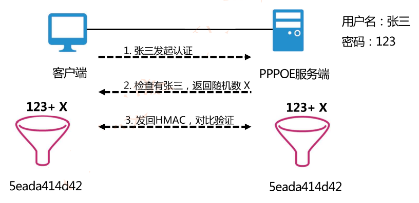

##### 8.7.3 两种报文摘要算法

- MD5∶对任意长度报文进行运算，先把报文按==512位分组==，最后得到==128位===报文摘要。
- SHA∶也是对==512位==长的数据块进行复杂运行，最终产生==160位==散列值，比MD5更安全，计算比MD5慢。

#### 8.8 数字证书 与 CA

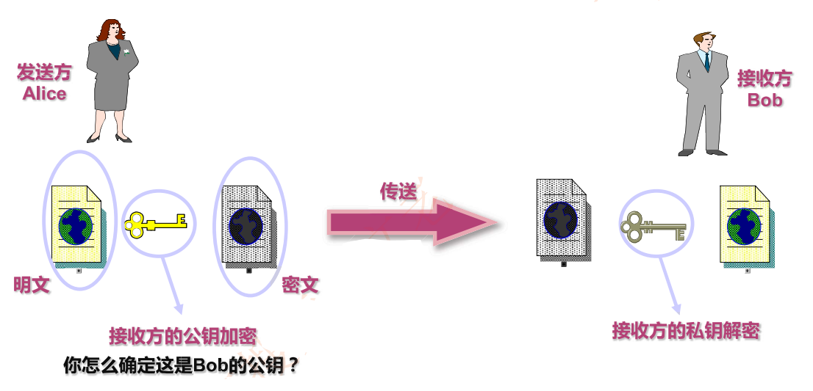


##### 8.8.1 公钥证书实例

- 公钥证书的种类与用途
  - CA
  - Personal
  - Code Signing-Server
- 证书回收列表（CRL )


##### 8.8.2 证书链

- 如果用户数量很多，通常由多个CA，每个CA为一部分用户发行和签署证书
- 如果有两个CA，X1和X2，假设用户A从CA机构X1获得了证书，用户B从X2获得证书
- 如果==两个证书发放机构X1和X2彼此间安全交换了公钥，彼此信任==，那么他们的证书可以形成证书链。
- A通过一个证书链来获取B的公钥，证书链表示为：`X1《X2》X2《B》`
- B也能通过相反的证书链来获取A的公开密钥：`X2《X1》X1《A》`

#### 8.9 虚拟专用网 VPN

- 虚拟专用网（Virtual Private Network ，VPN）：一种建立在公网上的，由某一组织或某一群用户专用的通信网络
- 二层VPN：L2TP和PPTP（基于==PPP== )
- 三层VPN：==IPSec==和GRE
- 四层VPN：==SSL==

##### 8.9.1 实现 VPN 的关键技术

- 隧道技术（Tunneling）
- 加解密技术（Encryption&Decryption）
- 密钥管理技术（Key Management）
- 身份认证技术（Authentication）

##### 8.9.2 VPN 解决方案

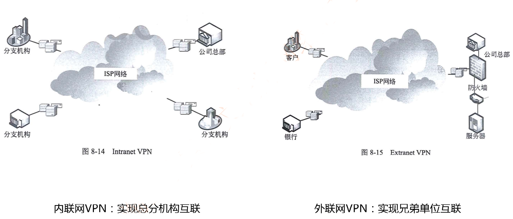


##### 8.9.3 二层隧道协议

- 二层隧道协议有PPTP和L2TP，都是把数据封装在PPP帧中在因特网上传输
- PPP协议（13下19-20，14下19，16下12 )
  - PPP可以在点对点链路上传输多种上层协议的数据包，有校验位


- PPP包含==链路控制协议LCP==和==网络控制协议NCP==

##### 8.9.4 PPP 协议认证功能  PAP和CHAP

- PAP：两次握手验证协议，口令以明文传送，被验证方首先发起请求。
- CHAP：三次握手，认证过程不传送认证口令，传送MMAC散列值


#### 8.10 IPSec 原理

- IPSec（IP Security）是 IETF 定义的一组协议，用于增强IP网络的安全性

- IPSec 协议集提供如下安全服务：

  - 数据完整性（Data Integrity）

  - 认证（Authentication）

  - 保密性（Confidentiality）

  - 应用透明安全性（Application-transparent Security）


- IPSec功能分为三类：==认证头(AH)、封装安全负荷（ESP）、Internet密钥交换协议（IKE）==
  - 认证头（AH）：提供==数据完整性和数据源认证==，但不提供数据保密服务  MD5、SHA
  - 封装安全负荷（ESP）：提供==数据加密==功能，加密算法有DES、3DES、AES等
  - Internet密钥交换协议（IKE）：用于==生成和分发==在ESP和AH中使用的密钥

| IPSec协议 | 功能               |
| --------- | ------------------ |
| AH        | 数据完整性和源认证 |
| ESP       | 数据加密           |
| IKE       | 密钥生成和分发     |


**IPSec 两种封装形式**


#### 8.11 SSL 与 HTTPS

##### 8.11.1 安全套接层

- 安全套接层(Secure Socket Layer , SSL）是 Netscape 于1994年开发的==**传输层**安全协议==，面向用于实现Web安全通信。
- 1999年，IETF基于SSL3.0版本，制定了传输层安全标准TLS（Transport Layer Security）
- SSL/TLS在Web安全通信中被称为**HTTPS**。

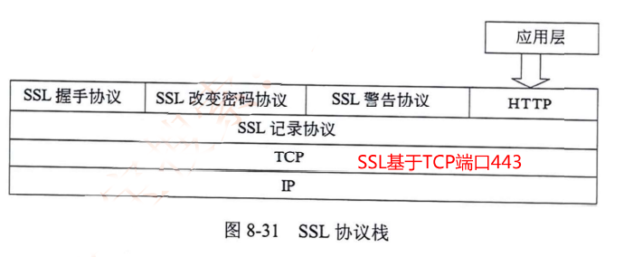

##### 8.11.2 S-HTTP 应用层协议

- S-HTTP 安全的超文本传输协议 （Security HTTP）
- S-HTTP ==语法与HTTP一样，而报文头有所区别==，进行了加密

#### 8.12 PGP

- PGP（Pretty Good Privacy）是一个完整的电子邮件安全软件包，PGP提供==数据加密和数字签名==两种服务。采用==RSA公钥证书==进行身份验证，使用==IDEA==进行数据加密，使用==MD5==进行数据完整性验证。
- PGP应用广泛的原因∶
  - 支持多平台（Windows，Linux ，MacOS）上免费使用，得到许多厂商支持
  - 基于比较安全的算法（RSA，IDEA，MD5）
  - 即可以加密文件和电子邮件，也可以用于个人通信，应用集成PGP

#### 8.12 S/MIME，SET 和 Kerberos 认证

- S/MIME（Security/Multipurpose Internet Mail Extensions）提供电子邮件安全服务
- SET（Secure Electronic Transation）安全的电子交易，用于保障电子商务安全
- Kerberos是用于进行身份认证的安全协议，支持AAA：==认证、授权和审计==。

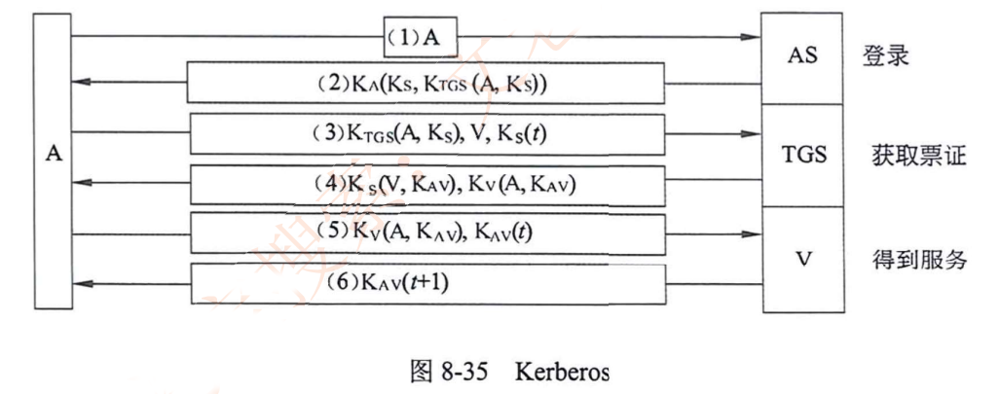

#### 8.13 防火墙技术

- 防火墙可以实现内部网络（信任网络）与外部不可信任网络（Internet）之间或是内部网络不同==区域隔离==与==访问控制==。
- 防火墙技术与分类：包过滤、状态化防火墙、应用层网关、应用层检测DPI


#### 8.14 计算机病毒与防护

- 病毒：指一段可执行的程序代码，通过对其他程序进行修改，可以感染这些程序使其含有该病毒程序的一个拷贝。
- 病毒四个阶段︰
  - 潜伏阶段（震网病毒）
  - 繁殖阶段（勒索病毒）
  - 触发阶段（震网病毒）
  - 执行阶段

##### 8.14.1 病毒分类与命名规则

- 病毒名称一般格式  <病毒前缀>.<病毒名>.<病毒后缀>


##### 8.14.2 常见病毒类型


#### 8.15 IDS 与 IPS

##### 8.15.1 入侵检测 IDS

- 入侵检测IDS是防火墙之后的第二道安全屏障
- 美国国防部提出公共入侵检测系统架构


##### 8.15.2 入侵检测系统的数据源


- 操作系统审计记录/操作系统日志
- 网络数据：核心交换机镜像，服务器接入交换机镜像


##### 8.15.3 入侵检测系统分类

- 按信息来源分：HIDS、NIDS、DIDS(主机/网络/分布式)
- 按响应方式分：实时检测和非实时检测
- 按数据分析技术和处理方式分：==异常检测、误用检测==和混合检测
  - 异常检测∶建立并不断更新和维护系统正常行为的轮廓，定义报警阈值，超过阈值则报警
    - 能够检测从未出现的攻击，但误报率高
  - 误用检测:对已知的入侵行为特征进行提取，形成入侵模式库，匹配则进行报警
    - 已知入侵检测准确率高，对于未知入侵检测准确率低，高度依赖特征库专家系统和模式匹配

#### 8.16 入侵防御系统 IPS

入侵防御系统是一种抢先的网络安全检测和防御系统，能检测出攻击并积极响应。

- IPS不仅具有入侵检测系统检测攻击行为的能力，而且具有拦截攻击并阻断攻击的功能。
- IPS不是IDS和防火墙功能的简单组合，IPS在攻击响应上采取的是主动的全面深层次的防御。

#### 8.17 入侵防御系统 IPS vs 入侵检测系统 IDS

- 部署位置不同：IPS一般==串行部署==，IDS一般==旁路部署==
- 入侵响应能力不同：IPS能检测入侵，并能主动防御，IDS只能检测记录日志，发出警报


#### 8.18 章节总结

- 网络攻击分类：主动和被动

- 加密技术

  - 对称：DES、3DES、IDEA、AES、RC4
  - 非对称：RSA

- 数字签名原理

- 散列：验证数据完整性，防止非法篡改      MD5、SHA、HMAC

  | 协议 | 分组 | 散列值 | 安全性 |
  | ---- | ---- | ------ | ------ |
  | MD5  | 512  | 128    | 一般   |
  | SHA  | 512  | 160    | 高     |

- 数字证书：CA用自己私钥签名，==证明主体的公钥==，证书链

- 密钥管理:PKI

- VPN：概念和实现原理，PPP，LCP和NCP，==PAP和CHAP==


- 病毒：蠕虫病毒-前缀为`worm `    宏病毒-前缀为`macro`，感染excel或word
- IDS：收集信息并进行分析，发现违反安全策略的行为或攻击
  - 被动监听，一般旁挂部署
  - IPS是主动安全设备，一般串行部署
- 异常检测：既能对已知的攻击进行检测，也能检测未出现过的攻击，缺点是误报较多。
- 误用检测：对已知入侵行为检测准确率高，漏检率低，缺点是未知入侵检测准确率低。

## 九、网络操作系统与应用服务器

#### 9.1 常见的网络系统

- Windows Server、 Unix 、 Linux
- Windows Server 2008 R2 仅支持 64 位
- Linux 广泛使用，遵循公共版权许可证（GPL）

### Windows Server

#### 9.2 本地用户与组

- 用户：包括用户名、密码、权限以及说们
- 用户组：具有相同性质的用户归结在一起，统一授权，组成用户组
  - 创建用户和组：计算机-右键-管理-计算机管理-本地用户和组

**常见用户组**


#### 9.3 逻辑组织模式与活动目录

- 网络中计算机逻辑组织的两种模式：工作组模式和域模式（活动目录AD）。
- **工作组模式**∶每台计算机都拥有自己的本地安全账户管理数据库SAM
- **域模式**︰用户信息存储在域控制器，可以在域中漫游，访问域中任意一台服务器上的资源


- **活动目录（Active Directory，AD）**∶对域中的==账户和资源对象==进行存放并集中管理
- 是一个动态的==分布式文件系统==，包含你了存储网络信息的目录结构和相关目录服务
- 域控制器（Domain Controller，DC ）域中安装了活动目录的计算机 `dcpromo`
- AD 存储的用户信息，分散在多个DC，操作系统对信息进行备份和选择性复制，维护信息一致性，提供容错能力活动目录中，对象的名字采用==DNS域名结构==，所以安装 AD 必须先安装 DNS 组件


#### 9.4 域的逻辑结构

- 组织单元OU：一组管理对象的容器，只能管理一个域中某些对象
- 域树∶域的集合，多个域统一管理
- 域林∶域树的集合


#### 9.5 活动目录工作组分类

- 全局组(G)∶来自本地域，可授权访问域林中的任何信任域
- 域本地组(DL)∶来自任何域，只能访问本地域中的资源
- 通用组(U)：可来自域林中的任何域，访问权限可以达到域林中的任何域


**组策略**

- A-G-DL-P策略
- A-G-G-DL-P策略
- A表示用户账号 G表示全局组 U表示通用组 DL表示域本地组 P表示资源权限
- A-G-DL-P策略：将用户账号添加到全局组中，将全局组添加到域本地组中，然后为域本地组分配资源权限。

#### 9.6 活动目录的安装

- 活动目录必须安装在==NTFS 分区==，同时必须安装 ==DNS 服务==
- 命令安装：运行`dcpromo.exe`，启动安装向导
- 图形化安装：管理服务器->添加服务器角色

#### 9.7 远程桌面

- 远程桌面协议RDP，基于TCP 3389
- Windows 默认可以使用远程桌面服务，但只能2人使用，必须为Administrators或RmoteDesktop users才能登陆，安装远程桌面服务，可以突破此限制
- 图形化远程桌面连接︰开始-所有程序-附件-远程桌面连接命令快捷键: `mstsc`


**远程桌面用户组权限**


#### 9.8 MMC 管理控制台

- MMC 管理控制台集成了用来管理网络、计算机、服务的管理工具
- 可以用来管理硬件、软件和 Windows 系统的网络组建
- MMC 相当于一个工具箱，可以在里面自由放各类管理工具


#### 9.9 IIS 服务器

- IIS（Internet Information Server）因特网信息服务器
- 可以构建www服务器、FTP服务器和SMTP服务器==【没有POP3和IMAP】==
- 安装IIS服务︰开始→管理工具→服务器管理→角色→添加角色→web服务器（IIS）


##### 9.9.1 Web 默认文档


##### 9.9.2 网络安全性配置


##### 9.9.3 FTP 服务器

- FTP端口：TCP 20（数据）21（控制）数据端口比控制端口小1
- 添加FTP站点∶开始→管理工具→IIS管理器→网站→添加FTP站点


###### FTP 站点访问

- 客户端访问︰浏览器或windows搜索`ftp://192.168.1.10`
- 命令行访问：DOS下ftp命令访问
  - dir：展示目录下的文件
  - get∶从服务器端下载文件
  - put:向FTP服务器端上传文件
  - lcd :设置客户端当前的目录
  - bye :退出FTP连接


### Linux

#### 9.10 网络配置

- Linux系统，设备和配置都是文件
- 网络相关配置文件大多数位于`/etc`目录下
- 这些文件可以在系统运行时修改，不用重启或停止任何守护程序，更改**立刻生效**
- “#”开头的为注释内容


##### 9.10.1 网络配置文件

- 接口配置文件：`/etc/sysconfig/network-script/ifcfge-enoxxx`

```
TYPE=Ethernet #网络接口类型
BOOTPROTO=none #静态地址
...
DEFROUTE=yes
NAME=eno1621222 #网卡名称
UUID=6120dma3-8123-41jf-mb23-rjedo2ONBOOT=no
IPADDRO=192.168.0.2 #IP地址
PREFXO=24 #子网掩码
GATEWAYO=192.168.0.1 #网关地址DNS1=114.114.114.114
HWADDR=00:0C:29:61:34:7D #网卡物理地址
...
```

- `/etc/hostname`：系统主机名文件

- `/etc/hosts`：包含IP地址和主机名之间的映射，还包含==主机别名==

- ```
  127.0.0.1 pc1 localhost #127.0.0.1是IP地址，pc1是主机名，localhost是别名192.168.0.2 pc2

- `/etc/host.conf` 指定客户机域名解析顺序

  ```order hosts , bind```

- `/etc/resolv.conf` ( 18上33）指定客户机域名搜索顺序和DNS服务器地址︰

  ```
  Seach test.edu.cn
  nameserver 114.114.114.114 #首选DNS服务器
  nameserver 8.8.8.8 #备用DNS服务器```

##### 9.10.2 网络接口配置

`ifconfig` 网络接口设置

```bash
ifconfig interface-name ip-address up[down
[root@localhost~]# ifconfig eno1123013210.1.1.1 netmask 255.255.255.0 up
[root@localhost~]# ifconfig eno11230132
inet 10.1.1.1 netmask 255.255.255.0
ether 00:20:57:95:23:ce txqueuelen 1000 ( Ethernet )
```

`route` 配置路由命令


```
Route [add|del] [-net/-host] target [netmask Nm] [gw Gw] [if]
route add -net target 3.3.3.0/24 gw 2.2.2.254
route add -host target 192.168.168.119 gw 192.168.168.1
```

`netstat` 网络查询命令

- -a 显示所有连接的信息，包括正在侦听的
- -i 显示已配置网络设备的统计信息
- -c 持续更新网络状态（每秒一次）直到被人中止
- -r 显示内核路由表
- -n 以数字格式而不是已解析的名称显示远程和本地地址


#### 9.11 文件管理

- Linux 系统所有设备都对应一个文件，使用索引节点记录文件信息，每个索引节点有编号。
- 多机目录树形层次结构，最上层是==根目录==，用`/`表示。
  - Linux : `/etc/host`只有一个根目录
  - Windows : `E:\test\test.txt` 每个磁盘分区都是单独的树
- Linux文件挂载︰将一个文件系统的顶层目录挂到另一个文件系统的子目录上，使他们成文一个整体
  - 挂载点必须是一个目录，而不能是一个文件
  - 一个分区挂载在一个已知的目录节点上，这个目录不可以为空，挂载后这个目录以前的内容不可用

#### 9.12 文件类型与访问权限

- 五种文件类型∶普通文件、目录文件、链接文件、设备文件和管道文件
  - `-` 普通文件
  - `d` 文件夹
  - `l` 链接文件
  - `b` 设备文件
  - `p` 管道文件
- 四类权限︰读、写、执行、无访问权限
- 三类用户∶文件所有者、与文件所有者同组用户和其他用户


#### 9.13 基本操作命令

1. cat命令∶用来在屏幕上滚动显示文件的内容，cat命令也可以同时查看多个文件的内容，还可以用来合并文件

   `cat[-选项] fileName [filename2] ... [fileNameN]`

2. more 命令：如果文本文件比较长，一屏显示不完，这时可以使用 more 命令将文件内容分屏显示

3. less 命令：less 命令的功能与 more 命令很相似，也是按页显示文件，不同的是 less 命令在显示文件时允许用户既可以向前或向后翻阅文件。按B键向前翻页显示;按Р键向后翻页显示;输入百分比显示指定位置;按Q键退出显示

4. 文件复制命令 cp
   `cp[-选项] sourcefileName I directory destfileName I directory`

   -a：整个目录复制。它保留链接、文件属性，并递归地复制子目录

   -f：删除已经存在的目标文件且不提示

5. 文件移动命令mv。

6. 文件删除命令rm。rm[-选项] fileName |directory ...忽略不存在的文件，从不给出提示。
   指示rm将参数中列出的全部目录和子目录均递归地删除。大的笑话︰删库跑路rm -rf /*

7. 创建/删除目录命令 `mkdir rmdir`

8. 改变目录命令cd

9. 显示当前目录命令pwd 

   `[root@redhat-64-]#pwd 显示的路径名为/home/sun)`

10. 列目录命令ls

11. 文件访问权限命令chmod `chmod g+rw test.txt`

12. 文件链接命令In。In 命令的功能是在文件之间创建链接。

#### 9.14 用户与组管理

- Linux系统中最重要的是超级用户，即**根用户root**  UID=0

- 用户管理配置文件（偶尔考)

  - `/etc/passwd` 每个用户在该文件中都有一行对应记录，该文件对所有用户都是可读的分为7个域，记录了这个用户的基本属性，

    格式如下︰用户名∶加密的口令∶用户ID:组ID:用户的全名或描述︰登录目录︰登录shell

  - `/etc/shadow`只有**超级用户root**能读的文件/etc/shadow，该文件包含了系统中的所有用户及其口令等相关信息，分成9个域:

    

- useradd[-选项] username

  -d 指定用于取代默认/home/username 的用户主目录`useradd -d /home/test user1`

  -g 用户所属用户组的组名或组 ID `useradd -g test user2`

- passwd [-选项] username

- userdel groupadd groupdel

#### 9.15 Linux 总结

- 网络配置文件: ifcfg-enoxxx、hostname、hosts、host.conf、reslov.conf
- 网络配置命令：ifconfig、route、netstat
- 文件/目录管理∶挂载、权限
- 文件和目录操作命令13个


#### 9.16 Apache 服务器配置

- Apache：提供web、ftp等服务，其中web配置文件 `httpd.conf`
- Apache 站点默认 WEB 根目录是`/var/www/html`
- 虚拟主机：基于==IP地址==、基于==端口==、基于==名字==


------


#### 9.17 DNS 服务器

- DNS主机名解析的查找顺序

  1. 先查找客户端解析程序缓存 [hosts文件，历史解析记录] 

  2. 如果1没有，则向DNS服务器发出解析请求[本地服务器、转发器、根]
  3. 如果2不成功，则尝试`netbios`名字解析


- `ipconfig /displaudns` 查看 DNS 缓存

- `ipconfig /flushdns` 清除 DNS 缓存

  

- Windows 下 hosts 的路径 `%windir%/system32/drivers/etc/hosts`
- Linux 下 host 的路径 `/etc/hosts`

##### 9.17.1 域名系统

- 域名系统通过层次结构分布式数据库建立一致性名字空间
- FQDN 完全合格域名，比如 `www.baidu.com`
- 最顶层是根域，用`.`表示
- 根域下面时候顶级域，分为国家顶级域和通用顶级域
- 顶级域下面是二级域，二级域下还可以划分子域


##### 9.17.2 域名记录


##### 9.17.3 域名查询

- 递归查询：域名服务器**彻底进行名字解析，并返回最后的结果**。==【老好人】==
- 迭代查询：域名服务器进行迭代访问，**反复多次**，直到最后找到结果。==【踢皮球】==


##### 9.17.4 转发服务器

- DNS服务器收到查询请求后，首先在自己的**区域文件**中查找，再在**高速缓存**中查找==【先干本职工作】==
- 如果查不到，这时DNS服务器必修向其他服务器发送查询请求
- DNS通知∶及时同步主/辅DNS信息


##### 9.17.5 DNS 服务器配置

- DNS/DHCP 服务器**必须为静态IP地址**，而 Web/FTP均可为动态IP（全部未分配）
- Linux 系统中提供 DNS 服务的组件为 `bind`，主配置文件为`named.conf`

#### 9.18 DHCP 服务器

- DHCP (Dynamic Host Configuration Protocol，动态主机配置协议）
- Linux 系统 DHCP服务配置文件为`/etc/dhcpd.conf`


##### 9.18.1 DHCP 抓包分析


##### 9.18.2 DNS 基础

- DHCP租约默认8天，当租期超过一半时(4天），进行续约。
- 续约完后还是8天
- `169.254.0.0/16` 自动续约失败，DHCP 获取失败

##### 9.18.3 DHCP 中继


- 中继前是广播，中继后以单播形式发送

##### 9.18.4 Linux DHCP 配置

`dhcpd.conf` 配置文件例子说明

```shell
subnet 192.168.0.0 netmask 255.255.255.0 {
range 192.168.0.200 192.168.0.254; # 分配地址范围
ignore client-updates;
default-lease-time 3600;
max-lease-time 7200;
option routers 192.168.0.1; # 网关
option domain-name "test.org"; # 默认搜索域
option domain-name-servers 192.168.0.2; # dns 地址
host test1 { hardware ethernet 00:EO:4C:70:33:65;fixed-address 192.168.0.8;}
}
```


##### 9.18.5 华为路由器 DHCP 配置

华为路由器/三层交换机 DHCP 配置

```
[dhcp]dhcp enable  //开启DHCP功能
[dhcp]ip pool vlan10 //DHCP地址池vlan10
[dhcp-ip-pool-vlan10]network 192.168.10.0 mask 24
[dhcp-ip-pool-vlan10]gateway-list 192.168.10.254 //指定网关地址
[dhcp-ip-pool-vlan10]dns-list 8.8.8.8 //指定DNS地址
[dhcp-ip-pool-vlan10]q
[dhcp]ip pool vlan20 //DHCP地址池 vlan20
[dhcp-ip-pool-vlan20]network 192.168.20.0 mask 24
[dhcp-ip-pool-vlan20]gateway-list 192.168.20.254
[dhcp-ip-pool-vlan20]dns-list 8.8.8.8
[dhcp-ip-pool-vlan20]q
```

#### 9.19 特殊 IP 地址


#### 9.20 Samba

- 向 Linux主机提供windows风格的==文件和打印机共享服务==(18下32 )
- 目的∶现网windows居多，为了让Linux兼容与现网用户共享数据和服务

`sam.conf` 配置


## 十、组网技术

#### 10.1 交换机基础

##### 10.1.1 交换机分类

1. 根据交换方式分

   - 存储转发式交换（Store and Forward）：完整接收数据帧，缓存、验证、碎片过滤，然后转发

     优点∶可以提供差错校验和非对称交换	缺点∶延迟大

   - 直通式交换（Cut-through）：输入端口扫描到目标地址后立即开始转发

     优点︰迟小、交换速度快	缺点︰没有检错能力，不能实现非对称交换

   - 碎片过滤式交换（Fragment Free）：开始转发前先检查数据包的长度是否够**64个字节**，如果小于64个字节，说明是冲突碎片，则丢弃；如果大于等千64个字节，则转发该包

2. 根据交换的协议层划分∶二层交换机、三层交换机、多层交换机
3. 根据交换机结构划分∶固定端口交换机、模块化交换机
4. 根据配置方式划分：堆叠交换机、非堆叠交换机
5. 根据管理类型划分∶网管交换机、非网管交换机、智能交换机
6. 层次结构划分︰==核心交换机、汇聚交换机、接入交换机==


##### 10.1.2 交换机性能参数

- 端口类型：RJ45电口、光口（SC/GBIC/SFP/SPF+/SFP28）
- 传输模式：半双工、全双工
- 交换容量：$端口数 \times 端口速率 \times 2$
- 包转发率：单位时间内发送64字节数据包的个数1000Mbps/8/(64+8+12)=1.488Mpps
- MAC地址数：交换机MAC地址表中可以存储最大的MAC地址数量
- VLAN表项：交换机最大支持VLAN数量，现在都是4094个

#### 10.2 路由器基础

##### 10.2.1 路由器接口

- 广域网WAN端口 和 局域网LAN端口
- RJ45端口：常规以太网电口
- 以太网光口：SC/GBIC/SFP/SPF+/SFP28
- AUI端口∶用于令牌环或总线型以太网接口
- ==Serial串口∶用于连接DDN、帧中继、X.25、PSTN等网络==
- ISDN BRI/PRI端口：ISDN线路互联
- SDH POS接口：155M/622M/2.5G/10G

#### 10.3 交换机和路由器管理

- Console接口（最基础最常用）
- AUX端口连接 Modem
- Telnet/SSH
- 浏览器网管软件


## 十一、网络管理

#### 11.1 网络管理基础

- 网络管理软件 vs 网络监控软件
- 网络管理五大功能域∶故障管理、配置管理、计费管理、性能管理和安全管理
  - 助记:“安配能计障”
- 故障管理：尽快发现故障，找出故障原因，以便采取补救措施(15上48)

**网络监控系统体系结构**


代理与监视器两种通信方式：==轮询和事件报告==

#### 11.2 SNMNP

##### 11.2.1 网络管理协议五大标准

1. ISO制定：CMIS/CMIP公共管理信息服务规范
2. 基于TCP/IP：简单网络管理协议==**SNMPv1、SNMPv2、SNMPv3**==
3. 基于局域网：远程监控网络RMON: RMON-1和RMON-2
4. IEEE制定：基于物理层和数据链路层CMOL
5. ITU-T：电信网络管理标准TMN

##### 11.2.2 SNMPv1

- SNMP为**应用层**协议，通过==UDP==承载，端口161
- 不可靠，但==效率高==，网络管理不会太多增加网络负载
- 每个代理进程管理若干被管理对象，并且与某些管理站建立==团体( community )==关系
  - 相当于简单的认证方式


##### 11.2.3 SNMP协议的操作


- 为了简化书写，前三个可以简写为：get、get-next和set。
- SNMP双端口：客户端用端口**161**来接收 get/set，服务器端用端口**162**来接收 trap

##### 11.2.4 SNMPv1 机制与问题

- SNMP网络管理中，管理站和代理站之间可以是==一对多==关系，也可以是==多对一==关系
- RFC1157 规定 SNMP基本认知和控制机制，通过团体名验证实现
- 团体名 Community 明文传输，不安全

##### 11.2.5 SNMPv2

- SNMPv2增加定义了 GetBulk 和 inform 两个新协议操作
- GetBulk：快速获取大块数据
- Inform：允许一个NMS向另一个NMS发送Trap信息/接收响应消息


##### 11.2.6 SNMPv3

- SNMPv3重新定义了==**网络管理框架和安全机制**==。
- 重新定义网络管理框架:将前两版中的管理站和代理统一叫做SNMP实体（entity）
- 安全机制：认证和加密传输
  - 时间序列模块，提供重放攻击防护
  - 认证模块：完整性和数据源认证，使用 SHA 或 MD5
  - 加密模块：防止内容泄露，使用 DES 算法
- 有两种威胁是SNMPv3没有防护的：==**拒绝服务和通信分析**==

##### 11.2.7 管理数据库 MIB-2

- 被管理对象标识符 OID


#### 11.3 RMON

- RMON ( Remote Network Monitoring )

- 用于监视==网络通信情况==的设备叫网络监视器（Monitor）或网络分析器（Analyzer）、探测器（Probe）等   

  【监测流量vs 监测设备】

- RMON定义了管理信息库 RMON MIB-II（流量信息），与 SNMP MIB（设备信息)

- RMON目标：监视子网范围内通信，从而减少管理站和被管理系统之间的通信负载


#### 11.4 网络管理命令

##### 11.4.1 Ping


##### 11.4.2 故障诊断 ping traceroute


##### 11.4.3 ARP


##### 11.4.4 netstat


#### 11.4.5 route nslookup


#### 11.5 章节总结

- 网络管理五大功能域
- SNMP
  - SNMPv1：应用层协议、UDP、团体名
  - SNMPv2：getbluck、inform
  - SNMPv3：架构、安全
- MIB ( OID )    RMONE
- 网络管理命令（重点)


## 十二、网络规划设计

#### 12.1 综合布线

##### 12.1.1 结构化布线系统

- 网络规划和设计过程是一个==**迭代和优化**==的过程。
- 结构化综合布线系统是基于现代计算机技术的通信物理平台，集成了==语音、数据、图像和视频==的传输功能，消除了原有通信线路在传输介质上的差别。

##### 12.1.2 综合布线六大子系统

- 结构化布线系统包含6个子系统∶
  - 工作区子系统、水平子系统、干线子系统、设备间子系统、管理子系统和建筑群子系统


##### 12.1.3 综合布线物理结构图


#### 12.1.4 布线距离


#### 12.2 网络分析与设计

##### 12.2.1 周期与模型


##### 12.2.2 网络流量分析


##### 12.2.3 网络安全技术措施表


##### 12.2.4 技术评价

- 在进行网络技术选择时，考虑：通信带宽、技术成熟性、连接服务类型、可扩展性、高投资产出比等因素
- 对于大型网络工程来说，==项目本身不能成为新技术的试验田==。尽量使用较成熟、拥有较多案例的技术。


#### 12.3 网络结构与功能

##### 12.3.1 局域网结构类型


##### 12.3.2 三层架构


#### 12.4 广域网接入技术

1. PSTN 公用电话网络 56Kbps
2. ISDN：BRI=2B+D=144K PRI = 30B+ D=2.048M
3. 线缆调制解调器接入 HFC 主干光纤，铜缆接入（常考）
4. 数字用户线路远程接入xDSL（常考）


##### 12.4.1 广域网互联技术 DDN


##### 12.4.2 广域网互联技术 SDH


- STM1=155M
- STM4=622M
- STM16=2.5G
- STM-64=10G


- MSTP 是在 SDH 平台上提供以太网接口的技术
- 傻傻分不清楚∶裸纤、专线、SDH、MSTP、MSTP+、OTN、PTN、IP-RAN
- https://zhuanlan.zhihu.com/p/69588287


#### 12.5 网络故障诊断与排查

##### 12.5.1 问题解决模型


##### 12.5.2 网络故障排查命令

- `show/display`：监测系统的安装情况与网络的正常运行状况，也可以用千对故障区域的定位。debug:帮助分离协议和配置问题（实际不用)
- `ping`：用于检测网络上不同设备之间的连通性
- `tracert` ：用于确定数据包在从一个设备到另一个设备直至目的地的过程中所经过的路径
- 网络管理工具（如 Cisco Works 、HPOpenView 等）都含有监测以及故障排除功能，这有助干对网络互联环境的管理和故障的及时排除。

##### 12.5.3 专用故障排查工具

- 欧姆表、数字万用表及电缆测试器：利用这些参数可以检测电缆的物理连通性。

- 测试并报告电缆状况，其中包括==近端串音==、信号衰减及噪音

  

- 时域反射计与光时域反射计

  - 时域反射器（TDR）能够快速定位金属线缆中的短路、断路、阻抗等问题
  - **光时域反射器（OTDR）**精确测量光纤的长度、断裂位置、信号衰减等

- 网络监测器：分析统计网络状态

- 网络分析仪：科来

##### 12.5.4 层次化故障排查


#### 12.6 章节总结

- 综合布线六大子系统
- 五个阶段生命周期
- 每个阶段大体任务
- 安全表格
- 网络结构与功能（三层架构）
- 广域网接入技术（HFC）
- 网络故障诊断与排查（层次化思想）

## 十三、计算机硬件基础

#### 数据的表示方法

##### R进制的表示（R可为二、八、十、十六）

**原则：逢R进一**

二进制只有“0”和“1”两个数，常用下标2表示。如(10)<sub>2</sub>。

十进制常用下标“10”或在数字的后面加上一个英文字母“D”来表示，如(89)<sub>10</sub>或89D。

八进制常用下标“8”或在数字的后面加上一个英文字母“O”来表示，如(25)<sub>8</sub>或25O。

十六进制，就是由十进制改变而来，在十进制的基础之上，用A代表10，B代表11，C代表12，D代表13，E代表14，F代表15。

十六进制常用下标“16”或在数字的后面加上一个英文字母“H”来表示，如(A1B4)<sub>16</sub>或A1B4H


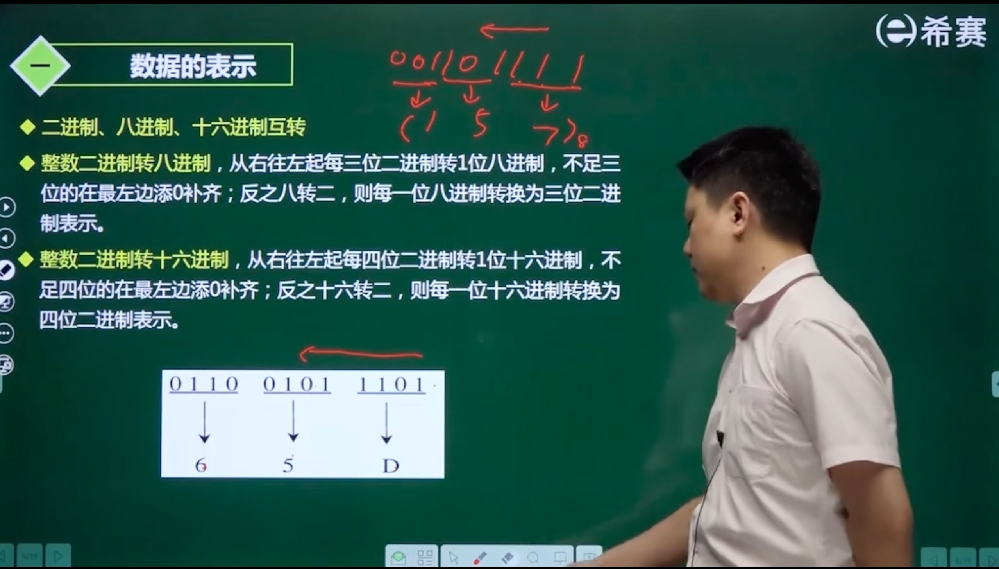

##### 计算机中的原码、反码和补码

|      | 数值1     | 数值-1    | 1+(-1)    |
| ---- | --------- | --------- | --------- |
| 原码 | 0 0000001 | 1 0000001 | 1 0000000 |
| 反码 | 0 0000001 | 1 1111110 | 1 1111111 |
| 补码 | 0 0000001 | 1 1111111 | 0 0000000 |

补码在表示负数时，是在原码取反(反码)的基础上+1

取值范围

|      | 定点整数                               | 定点小数 |
| ---- | -------------------------------------- | -------- |
| 原码 | -(2<sup>n-1</sup>-1)~2<sup>n-1</sup>-1 | -1<X<1   |
| 反码 | -(2<sup>n-1</sup>-1)~2<sup>n-1</sup>-1 | -1<X<1   |
| 补码 | -(2<sup>n-1</sup>)~2<sup>n-1</sup>-1   | -1≤X<1   |

#### 逻辑运算

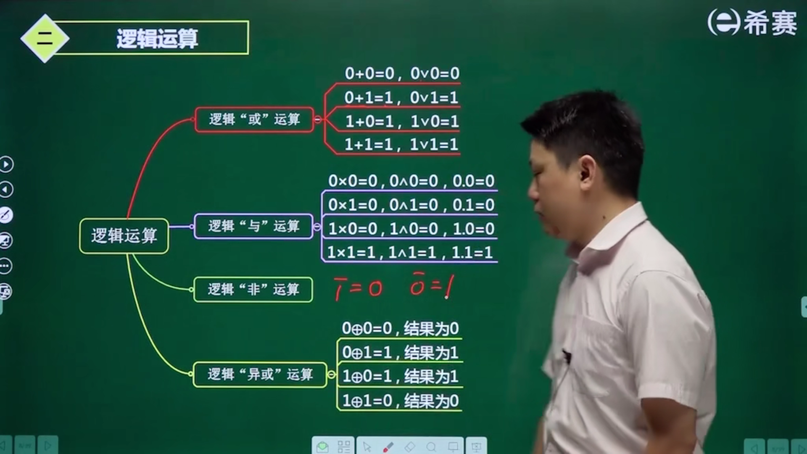

### 计算机系统的组成与体系结构

#### 计算机的结构


#### 指令系统的基础—寻址方式（寻找操作数）

指令：操作码（加减乘除）+ 地址码（对哪个地址进行操作）（操作数的地址）

寻址方式：（2，3，4方式的地址都放在主存（内存））

1. 立即寻址 （速度最快，但是会受到范围的限制，限制大，没有广泛使用）
2. 变址寻址 （有变址寄存器，基址+偏移）
3. 直接寻址
4. 间接寻址（多了一次缓存，访问的是地址的地址）
5. 寄存器寻址
6. 寄存器间接寻址


#### CISC与RISC

| 指令系统类型 |                             指令                             | 寻址方式   | 实现方式                                             | 其他                       |
| ------------ | :----------------------------------------------------------: | ---------- | ---------------------------------------------------- | -------------------------- |
| CISC（复杂） |              数量多，使用频率差别大，可变长格式              | 支持多种   | 微程序控制技术                                       |                            |
| RISC（精简） | 数量少，使用频率接近，定长格式，大部分为单周期指令，操作寄存器，只有Load/Store操作内存 | 支持方式少 | 增加了通用寄存器；硬布线逻辑控制为主；适合采用流水线 | 优化编译，有效支持高级语言 |

#### 流水线

运行时间的计算

#### 

技术指标的计算

n：指令系数	Tk：流水线时间

吞吐率：Tp=n/Tk   上题例子：Tp = 100 / 203

(理论最大吞吐率：Tp=1/T，周期的倒数，上题例子：Tp=1/2)

加速比：S=Ts/Tk （Ts:未使用流水线的时间，上题例子：S=500/203）

效率

### 存储系统

#### 存储系统结构

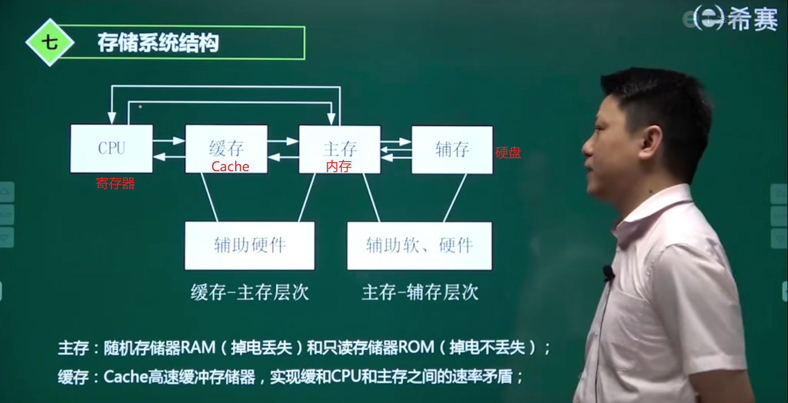

#### 存储系统的存取方式

- 顺序存取（磁带）

- 直接存取（硬盘）

- 随机存取（内存）

- 相连存取（Cache）

#### 主存储器基础—组成

- 实际的存储器总容量，是由一片或多片存储芯片配以控制电路构成的。其容量为 W × B，W是存储单元（word，即字）的数量，B表示每个word由多少 bit（位）组成。
  如：某一芯片规格为 w×b，则组成 WxB 的存储器需要（W/w）×（B/b）个芯片。


- 主存储器（内存）采用：随机存取方式存储，需对每个存储单元进行编址。而在主存储器中，通常以word为单位进行标识，即每个字一个地址，通常采用16进制表示。

- 例如，按字节编址，地址从A4000H—CBFFFH，则表示有（CBFFF-A4000)+1个字节，即28000H个字节，也就是163840个字节，等于160KB。
  $$
  计算字节数：CBFFF+1=CC000\\ \ CC000-A4000 = 28000\\
  
  十六进制转二进制：0010 1000 0000 0000 0000\\
  
  因为 2^{10} = 1024 = 1K \ 所以去掉 10 个 0\\
  
  变成 \ 10 1000 00\\
  
  二进制转十进制：1×2^7+1×2^5 = 128 + 32 = 160 \ KB\\
  $$

  - 假设芯片容量 32k × 8 bit

    160k × 8 bit / 32k × 8 bit = 5 块

- 表示存储容量相关术语：
  位：用bit表示，一个二进制表示1bit
  字节：用B表示，1B=8bit
  字：实际表示CPU一次处理的二进制的位数，通常为字节的整数倍
  对应的字长有：8/16/32/64bit

#### Cache

​	如果Cache的访问命中率为h，而Cache的访问周期时间是t1，主存储器的访问周期时间是t2，则整个系统的平均访存时间就应该是：命中时间+未命中的时间
$$
t3 = h \times t1 + (1 - h) \times t2
$$

- Cache 淘汰算法

  - 先进先出算法

  - 最近最少使用算法

  - 随机算法

#### 磁盘

​	磁盘

1. SATA
2. SCSI
3. SAS（串行SCSI）
4. SSD


#### RAID 技术

- RAID 0	写入速度块，利用率最高-100%，可靠性最差

- RAID 1	使用 Disk Mirror （硬盘镜像技术），具备备份和容错能力，效率不高但可靠性高，利用率-50%

- RAID 3	提供奇偶校验盘，具备数据容错能力，单盘失效时，产生奇偶盘I/O瓶颈效应，硬盘利用率=（n-1）/n

- RAID 5	采用分布式奇偶校验的数据分段技术，将用于奇偶校验的数据存放在各个硬盘中，具有数据容错能力，可靠性好；有较好的性能，硬盘利用率=（n-1）/n

- RAID 6	私有级RAID级别标准，全称是“带有两个独立分布式校验方案的独立数据磁盘”；从功能上讲，能实现两个磁盘掉线容错的，都叫RAID6；磁盘利用率（n-2）/n

- RAID 10	先做RAID1再做RAID0，先镜像再条带化

- RAID 01	先做RAID0再做RAID1

#### RAID 2.0优势

- 快速重构
- 自动负载均衡
- 系统性能提升
- 自愈合  

### 系统的可靠性

#### 串联系统
假设一个系统由n个子系统组成，当且仅当所有的子系统都能正常工作时，系统才能正常工作，这种系统称为串联系统。


设系统各个子系统的可靠性分别用$R_1、R_2，...,R_n$表示，则系统的可靠性$R=R_1\times R_2\times...\times R_n$

如果系统的各个子系统的失效率分别用$\lambda_1,\lambda_2,...\lambda_n$来表示，则系统的失效率为$\lambda=\lambda_1+\lambda_2+...\lambda_n$

#### 并联系统

假如一个系统由n个子系统组成，只要有一个子系统能够正常工作，系统就能正常工作，如下图所示。


设系统各个子系统的可靠性分别用$R_1、R_2，...,R_n$表示，则系统的可靠性

$R=1-(1-R_1)\times(1-R_2)\times...\times(1-R_n)$

### 操作系统

#### 操作系统概述


#### 进程管理

##### 进程的状态

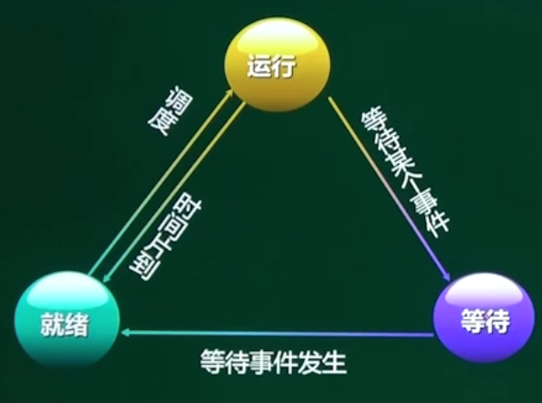

##### 死锁问题

​	进程管理是操作系统的核心，但如果设计不当，就会出现死锁的问题。一个进程再等待一个不可能发生的事，则进程就死锁了。而如果一个或多个进程产生死锁，就会造成系统死锁。

​	死锁产生的四个条件：1.互斥 2.保持和等待 3.不剥夺 4.环路等待

​	解决死锁的措施：1.死锁预防 2.死锁避免—银行家算法 3.死锁检测 4.死锁解除

##### 银行家算法—分配资源的原则

- 当一个进程对资源的最大需求量不超过系统中的资源数时可以接纳该进程。
- 进程可以分期请求资源，但请求的总数不能超过最大需求量。
- 当系统现有的资源不能满足进程尚需资源数时，对进程的请求可以推迟分配，但总能使进程在有限的时间里得到资源。

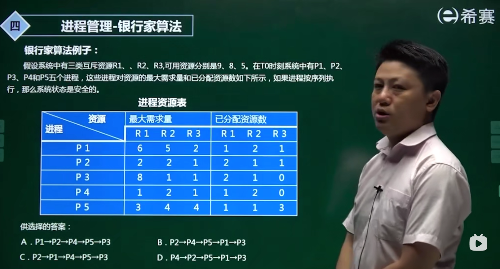

##### 进程的互斥和同步

....

##### PV操作-用来解决互斥和同步的问题

临界区：每个进程中访问临界资源的那段代码成为临界区

信号量：一种特殊的变量，计数器

PV操作：用来解决互斥和同步的问题。

PV操作是分开来看的：

​	P操作：使S=S-1，若S>=0，则该进程继续执行，否则该进程排入等待队列

​	V操作：使S=S+1，若S<=0，唤醒等待队列中的一个进程

#### 存储管理

##### 页式存储

分页存储管理的思想：把内存分为一个个相等的小分区，再按照分区大小把进程拆分成一个个小部分。

##### 页面置换算法

1. 先进先出 FIFO
2. 最佳置换法 OPT  (理想算法)
3. 最近最少使用置换法 LRU

#### 文件管理—树形目录结构

.....

#### 设备管理

数据传输控制方式

1. 程序控制方式：CPU与外设间的数据传送是在程序的控制下完成的一种数据传送方式
2. 程序中断方式：程序中断是指计算机执行现行程序的过程中，出现某些急需处理的异常情况和特殊请求，CPU暂时终止现行程序，而转去对随机发生的更紧迫的事件进行处理，在处理完毕后，CPU将自动返回原来的程序继续执行。
3. DMA方式：DMA是l/O设备与主存之间由硬件组成的直接数据通路，主要用于高速I／O设备与主存之间的成组数据传送。

### 数据通信基础


### 计算机网络技术

